# Git & GitHub Essentials

If you skip this section, you'll create **noise instead of value**. Version control is the universal language of open source.

## Why This Matters


**35% of PR rejections** come from poor Git practices: messy commits, merge conflicts, wrong branches.

## What You'll Learn

| Topic | Why It Matters | Time |
|-------|----------------|------|
| [Git Basics](basics) | Foundation for everything | 30 min |
| [Branching Strategy](branching) | Organize your work | 20 min |
| [Commit Messages](commits) | Communication through code | 15 min |
| [Syncing Fork](syncing) | Stay up-to-date | 15 min |
| [Merge Conflicts](conflicts) | Handle the inevitable | 25 min |
| [Rewriting History](rewriting-history) | Clean up your work | 20 min |
| [Force Push](force-push) | Know the dangers | 10 min |

## The Git Mental Model


## Key Concepts Overview

### Repository Structure

```
your-project/
├── .git/                 # Git metadata (don't touch!)
│   ├── config            # Remote URLs, settings
│   ├── HEAD              # Current branch pointer
│   ├── objects/          # All commits, files
│   └── refs/             # Branch pointers
├── src/                  # Your code
└── README.md
```

### The Three States of Files


| State | Meaning | Command to Move |
|-------|---------|-----------------|
| **Untracked** | Git doesn't know about it | `git add` |
| **Staged** | Ready to be committed | `git commit` |
| **Committed** | Saved in history | (edit file) |
| **Modified** | Changed since last commit | `git add` |

## Essential Commands Cheat Sheet

### Daily Workflow
```bash
git status              # What's changed?
git add .               # Stage everything
git commit -m "msg"     # Save changes
git push                # Upload to GitHub
git pull                # Download updates
```

### Branching
```bash
git branch              # List branches
git checkout -b name    # Create & switch
git checkout main       # Switch to main
git merge branch        # Merge branch
```

### Syncing
```bash
git fetch upstream      # Get upstream changes
git merge upstream/main # Merge them
git push origin main    # Update your fork
```

## Common Mistakes to Avoid

### ❌ Don't Do This

```bash
# Committing to main directly
git checkout main
git commit -m "my feature"  # ❌ NO!

# Force pushing to shared branches
git push --force origin main  # ❌ DANGEROUS!

# Giant commits with everything
git add .
git commit -m "stuff"  # ❌ Meaningless
```

### ✅ Do This Instead

```bash
# Work on feature branches
git checkout -b feature/add-login
git commit -m "feat: add login form"  # ✅

# Only force push YOUR feature branches
git push --force origin feature/my-branch  # ✅ OK

# Atomic, meaningful commits
git add src/login.js
git commit -m "feat(auth): add login form validation"  # ✅
```

## Self-Assessment

Before proceeding, you should know:

- [ ] How to clone a repository
- [ ] How to create a branch
- [ ] How to commit changes
- [ ] How to push to remote
- [ ] What a merge conflict is

**Score yourself:**
- 5/5 → Skip to [Syncing Fork](syncing)
- 3-4/5 → Start with [Git Basics](basics)
- 0-2/5 → Read everything carefully

## Tools to Help

### GUI Clients
| Tool | Platform | Best For |
|------|----------|----------|
| GitHub Desktop | Win/Mac | Beginners |
| GitKraken | All | Visual learners |
| VS Code Git | All | Editor integration |
| Sourcetree | Win/Mac | Advanced users |

### Terminal Enhancements
```bash
# Oh My Zsh git plugin
alias gs="git status"
alias gc="git commit"
alias gp="git push"
alias gl="git log --oneline"
```

## Learning Path


**Estimated total time:** ~2.5 hours

## Quick Reference Card

### Creating a PR Workflow

```mermaid
sequenceDiagram
    participant Y as You
    participant F as Your Fork
    participant U as Upstream
    
    Y->>Y: git checkout -b feature
    Y->>Y: Make changes
    Y->>Y: git add & commit
    Y->>F: git push origin feature
    F->>U: Open Pull Request
    U-->>Y: Review feedback
    Y->>Y: Make fixes
    Y->>F: git push (updates PR)
    U->>U: Merge PR ✅
```



## Next Steps

Ready to dive in? Start with the first topic:

➡️ [Git Basics You Must Know →](basics)

---

> **Pro Tip:** Bookmark this page. You'll reference these commands hundreds of times in your open source journey.
