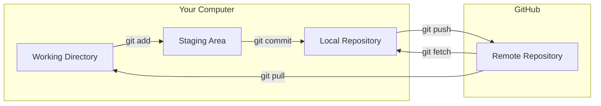
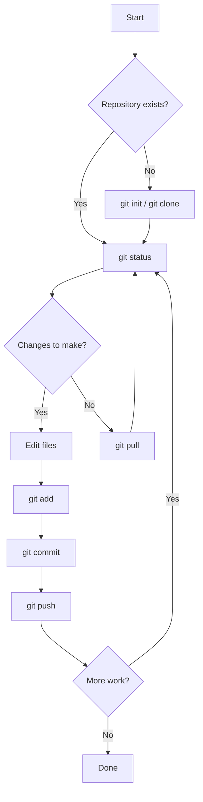
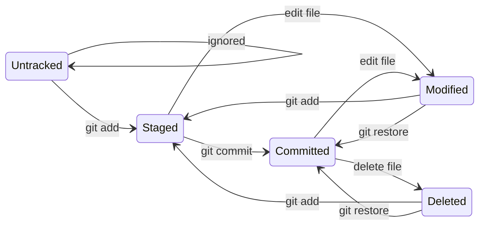

# Git Basics You Must Know

These commands are **non-negotiable**. You'll use them daily.

## The Big Picture



## Configuration (One-Time Setup)

```bash
# Set your identity
git config --global user.name "Your Name"
git config --global user.email "your.email@example.com"

# Set default branch name
git config --global init.defaultBranch main

# Enable color output
git config --global color.ui auto

# Set default editor
git config --global core.editor "code --wait"  # VS Code
# OR
git config --global core.editor "vim"          # Vim

# Verify configuration
git config --list
```

## Essential Commands

### 1. Getting a Repository

```bash
# Clone an existing repository
git clone https://github.com/username/repo.git

# Initialize a new repository
git init

# Clone specific branch
git clone -b branch-name https://github.com/username/repo.git
```

### 2. Checking Status

```bash
# See current state
git status

# Compact status
git status -s

# See what's different
git diff

# See staged changes
git diff --staged
```

**Status output explained:**

```
On branch main
Your branch is up to date with 'origin/main'.

Changes not staged for commit:
  modified:   src/app.js       ← Changed but not staged

Untracked files:
  new-file.txt                 ← Git doesn't know about this

Changes to be committed:
  new file:   staged-file.js   ← Ready to commit
```

### 3. Staging Changes

```bash
# Stage specific file
git add filename.js

# Stage all changes in current directory
git add .

# Stage all changes everywhere
git add -A

# Stage parts of a file interactively
git add -p filename.js

# Unstage a file
git restore --staged filename.js
```

### 4. Committing Changes

```bash
# Commit with message
git commit -m "Your commit message"

# Commit with detailed message (opens editor)
git commit

# Add all tracked files and commit
git commit -am "Message"

# Amend last commit
git commit --amend -m "New message"
```

### 5. Viewing History

```bash
# View commit history
git log

# Compact log
git log --oneline

# Log with graph
git log --oneline --graph --all

# Show specific commit
git show commit-hash

# Show changes in last 5 commits
git log -5 -p
```

**Sample log output:**

```
* a1b2c3d (HEAD -> main) feat: add user authentication
* d4e5f6g fix: resolve login bug
* g7h8i9j docs: update README
* j0k1l2m initial commit
```

### 6. Working with Remotes

```bash
# List remotes
git remote -v

# Add remote
git remote add origin https://github.com/you/repo.git
git remote add upstream https://github.com/original/repo.git

# Remove remote
git remote remove origin

# Change remote URL
git remote set-url origin new-url
```

### 7. Pushing and Pulling

```bash
# Push to remote
git push origin branch-name

# Push and set upstream
git push -u origin branch-name

# Pull changes
git pull origin main

# Fetch without merging
git fetch origin
```

## Command Flow Diagram



## File Lifecycle



## Understanding Output

### git status

| Symbol | Meaning |
|--------|---------|
| `M` | Modified |
| `A` | Added |
| `D` | Deleted |
| `R` | Renamed |
| `??` | Untracked |

### git log --oneline

```
a1b2c3d (HEAD -> feature, origin/feature) Latest commit
d4e5f6g Previous commit
g7h8i9j (origin/main, main) Older commit
```

- `HEAD` = Where you are now
- `origin/feature` = Remote branch position
- `main` = Local main branch

## Common Scenarios

### Scenario 1: Starting Fresh

```bash
# Fork on GitHub first, then:
git clone https://github.com/YOUR-USERNAME/project.git
cd project
git remote add upstream https://github.com/ORIGINAL/project.git
git checkout -b my-feature
```

### Scenario 2: Daily Workflow

```bash
# Start of day
git checkout main
git pull upstream main
git push origin main

# Start work
git checkout -b feature/new-thing

# Make changes, then:
git add .
git commit -m "feat: add new thing"
git push origin feature/new-thing
```

### Scenario 3: Oops, Wrong Branch

```bash
# Made changes on wrong branch?
git stash                    # Save changes
git checkout correct-branch  # Switch
git stash pop               # Restore changes
```

### Scenario 4: Undo Last Commit

```bash
# Keep changes, undo commit
git reset --soft HEAD~1

# Discard changes, undo commit
git reset --hard HEAD~1

# Already pushed? See rewriting-history
```

## Quick Reference Table

| Task | Command |
|------|---------|
| Clone repo | `git clone <url>` |
| Check status | `git status` |
| Stage files | `git add <file>` |
| Stage all | `git add .` |
| Commit | `git commit -m "msg"` |
| Push | `git push origin <branch>` |
| Pull | `git pull origin <branch>` |
| Create branch | `git checkout -b <name>` |
| Switch branch | `git checkout <name>` |
| View log | `git log --oneline` |
| View diff | `git diff` |
| Stash changes | `git stash` |
| Apply stash | `git stash pop` |

## .gitignore Basics

Create `.gitignore` to exclude files:

```gitignore
# Dependencies
node_modules/
vendor/
venv/

# Build outputs
dist/
build/
*.pyc

# Environment files
.env
.env.local

# IDE settings
.vscode/
.idea/

# OS files
.DS_Store
Thumbs.db

# Logs
*.log
logs/
```

## Practice Exercises

### Exercise 1: Basic Flow
```bash
mkdir git-practice && cd git-practice
git init
echo "# My Project" > README.md
git add README.md
git commit -m "Initial commit"
git log
```

### Exercise 2: Branching
```bash
git checkout -b feature
echo "New feature" > feature.txt
git add feature.txt
git commit -m "Add feature"
git checkout main
git merge feature
```

### Exercise 3: Remotes
```bash
# Create repo on GitHub first
git remote add origin https://github.com/you/repo.git
git push -u origin main
```

## Common Mistakes

### ❌ Mistakes to Avoid

```bash
# Committing without reviewing
git add . && git commit -m "stuff"  # ❌

# Not pulling before pushing
git push  # ❌ May cause conflicts

# Committing sensitive data
git add .env  # ❌ NEVER!
```

### ✅ Best Practices

```bash
# Review before committing
git status
git diff
git add specific-file.js
git commit -m "descriptive message"

# Always pull first
git pull origin main
git push origin main

# Use .gitignore
echo ".env" >> .gitignore
```

## Troubleshooting

### "fatal: not a git repository"
```bash
# You're not in a git repo
cd /path/to/your/repo
# OR initialize one
git init
```

### "error: failed to push"
```bash
# Remote has changes you don't
git pull origin branch-name
# Resolve any conflicts, then push
git push origin branch-name
```

### "Changes not staged for commit"
```bash
# Need to stage before committing
git add filename
git commit -m "message"
```

## Next Steps

Now that you know the basics:

➡️ [Branching Strategy →](branching)

---

> **Remember:** Practice these commands daily. Within a week, they'll become muscle memory.
