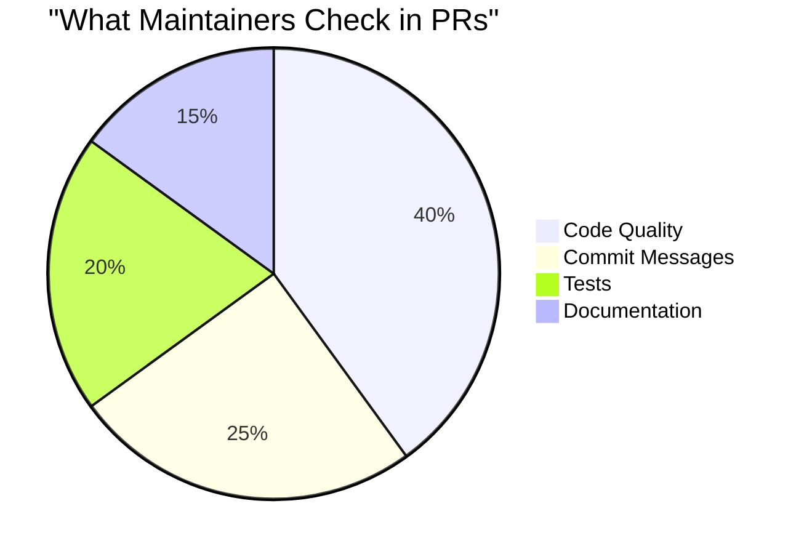
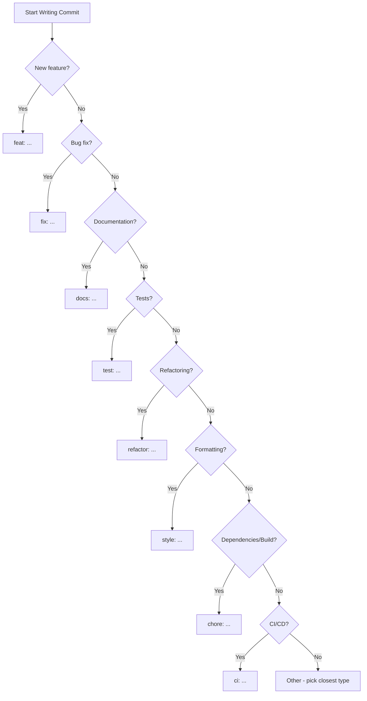

# Commit Messages

Your commit messages are **documentation**. They tell the story of your code.

## Why Commit Messages Matter



Bad commit messages signal:
- 🚩 Inexperienced contributor
- 🚩 Poor attention to detail
- 🚩 Hard to review changes
- 🚩 Difficult to debug later

## The Anatomy of a Good Commit

```
<type>(<scope>): <subject>
<BLANK LINE>
<body>
<BLANK LINE>
<footer>
```

### Example

```
feat(auth): add password reset functionality

Implement password reset flow with email verification.
Users can now request a reset link that expires in 24 hours.

- Add reset token generation
- Add email sending service
- Add reset confirmation page

Closes #234
```

## Commit Types

| Type | Description | Example |
|------|-------------|---------|
| `feat` | New feature | `feat: add dark mode` |
| `fix` | Bug fix | `fix: resolve login crash` |
| `docs` | Documentation | `docs: update API guide` |
| `style` | Formatting | `style: fix indentation` |
| `refactor` | Code restructure | `refactor: simplify auth logic` |
| `test` | Adding tests | `test: add user service tests` |
| `chore` | Maintenance | `chore: update dependencies` |
| `perf` | Performance | `perf: optimize image loading` |
| `ci` | CI/CD changes | `ci: add GitHub Actions` |
| `build` | Build system | `build: update webpack config` |

## Good vs Bad Examples

### ❌ Bad Commit Messages

```bash
# Too vague
git commit -m "fix bug"
git commit -m "update code"
git commit -m "changes"

# Not descriptive
git commit -m "asdf"
git commit -m "wip"
git commit -m "stuff"

# Too long in subject
git commit -m "Fixed the bug where users couldn't log in when they had special characters in their password and also updated the validation logic"

# No context
git commit -m "remove line 42"
```

### ✅ Good Commit Messages

```bash
# Clear and specific
git commit -m "fix(auth): resolve login failure with special characters"
git commit -m "feat(ui): add loading spinner to submit button"
git commit -m "docs: add API authentication examples"

# With body for complex changes
git commit -m "refactor(api): simplify error handling

Consolidate error handling into a single middleware.
This reduces code duplication across 15 route handlers.

- Create errorHandler middleware
- Remove try-catch from individual routes
- Add custom error classes"
```

## The 7 Rules of Great Commits

### 1. Separate subject from body with blank line

```bash
# Good
feat: add user search

Implement fuzzy search for user directory.
Supports partial name matching.

# Bad - no separation
feat: add user search
Implement fuzzy search for user directory.
```

### 2. Limit subject to 50 characters

```bash
# Good (43 chars)
feat(auth): add two-factor authentication

# Bad (78 chars)
feat(auth): add two-factor authentication with SMS and email verification options
```

### 3. Capitalize the subject line

```bash
# Good
Fix login button alignment

# Bad
fix login button alignment
```

### 4. Don't end subject with period

```bash
# Good
Add user profile page

# Bad
Add user profile page.
```

### 5. Use imperative mood

```bash
# Good (imperative - like giving an order)
Add feature
Fix bug
Update documentation

# Bad (descriptive)
Added feature
Fixes bug
Updated documentation
```

Think: "This commit will **{your message}**"

### 6. Wrap body at 72 characters

```bash
# Good
feat: implement caching layer

Add Redis-based caching for API responses. This significantly
reduces database load for frequently accessed endpoints.

The cache TTL is configurable per endpoint.
```

### 7. Use body to explain what and why, not how

```bash
# Good - explains why
fix: increase timeout for API calls

External API occasionally takes longer than 5s during peak hours.
Increasing to 15s prevents unnecessary failures for users.

# Bad - explains how (code already shows this)
fix: increase timeout for API calls

Changed the timeout value from 5000 to 15000 in the config file.
```

## Conventional Commits Flowchart



## Commit Scope

Scope provides context:

```bash
feat(auth): ...       # Authentication related
fix(api): ...         # API changes
docs(readme): ...     # README updates
test(unit): ...       # Unit tests
refactor(utils): ...  # Utility functions
```

### Common Scopes

| Scope | Area |
|-------|------|
| `auth` | Authentication |
| `api` | API endpoints |
| `ui` | User interface |
| `db` | Database |
| `core` | Core functionality |
| `config` | Configuration |
| `deps` | Dependencies |

## Referencing Issues

### Link to Issues

```bash
# In footer
feat(auth): add OAuth support

Implements Google and GitHub OAuth providers.

Closes #123
Fixes #456
Refs #789
```

### Keywords that Close Issues

| Keyword | Example |
|---------|---------|
| `close` | `close #123` |
| `closes` | `closes #123` |
| `fix` | `fix #123` |
| `fixes` | `fixes #123` |
| `resolve` | `resolve #123` |
| `resolves` | `resolves #123` |

## Breaking Changes

Use `!` for breaking changes:

```bash
# In subject
feat(api)!: change response format

# Or in footer
feat(api): change response format

BREAKING CHANGE: API now returns objects instead of arrays.
Clients need to update their parsing logic.
```

## Multi-line Commits

### Using Editor

```bash
# Opens your editor
git commit

# In editor:
feat(auth): add password strength indicator

Add real-time password strength feedback during registration.

- Shows strength as weak/medium/strong
- Displays improvement suggestions
- Blocks submission for weak passwords

Closes #567
```

### Using Multiple -m Flags

```bash
git commit -m "feat(auth): add password strength" -m "" -m "Add real-time feedback during registration."
```

## Atomic Commits

Each commit should be **one logical change**:

### ❌ Bad: Mixed Changes

```bash
# One commit with unrelated changes
git add .
git commit -m "fix bug and add feature and update docs"
```

### ✅ Good: Atomic Commits

```bash
# Separate commits for each change
git add src/auth.js
git commit -m "fix(auth): resolve session timeout issue"

git add src/feature.js
git commit -m "feat(api): add user search endpoint"

git add README.md
git commit -m "docs: update installation instructions"
```

## Commit Message Templates

### Set Up Template

```bash
# Create template file
cat > ~/.gitmessage << 'EOF'
# <type>(<scope>): <subject>
# |<----  Using a Maximum Of 50 Characters  ---->|

# Explain why this change is being made
# |<----   Try To Limit Each Line to a Maximum Of 72 Characters   ---->|

# Provide links or keys to any relevant tickets, articles or resources
# Example: Closes #23

# --- COMMIT END ---
# Type can be:
#   feat     (new feature)
#   fix      (bug fix)
#   refactor (refactoring code)
#   style    (formatting, missing semicolons, etc.)
#   docs     (documentation)
#   test     (adding or updating tests)
#   chore    (updating grunt tasks, etc.)
#   perf     (performance improvements)
#   ci       (CI/CD changes)
#   build    (build system changes)
# --------------------
EOF

# Set as default template
git config --global commit.template ~/.gitmessage
```

## Real-World Examples

### Feature Commit

```
feat(cart): add quantity adjustment in cart

Allow users to increase/decrease item quantity directly in cart.
Previously required removing and re-adding items.

- Add +/- buttons next to each item
- Update total price in real-time
- Validate against stock availability

Closes #892
```

### Bug Fix Commit

```
fix(checkout): prevent double payment submission

Users clicking "Pay" button rapidly could trigger multiple charges.
Add debouncing and disable button after first click.

Fixes #1023
```

### Documentation Commit

```
docs(api): add rate limiting documentation

Document the new rate limiting feature including:
- Rate limit headers
- Limit tiers by plan
- Handling 429 responses

Refs #845
```

## Commit Message Cheat Sheet

```
feat:     New feature
fix:      Bug fix
docs:     Documentation
style:    Formatting
refactor: Code restructure (no feature/fix)
test:     Tests
chore:    Maintenance
perf:     Performance
ci:       CI/CD
build:    Build system

Format:
<type>(<scope>): <imperative subject max 50 chars>

<body: explain what and why, wrap at 72>

<footer: references, breaking changes>
```

## Fixing Bad Commits

### Amend Last Commit

```bash
# Change message
git commit --amend -m "new message"

# Add forgotten file to last commit
git add forgotten-file.js
git commit --amend --no-edit
```

### Interactive Rebase (Multiple Commits)

```bash
# Edit last 3 commits
git rebase -i HEAD~3

# In editor, change 'pick' to:
# - reword: change message
# - squash: combine with previous
# - drop: remove commit
```

## Tools for Better Commits

### Commitlint

Validates commit messages:

```bash
npm install -g @commitlint/cli @commitlint/config-conventional

# commitlint.config.js
module.exports = {extends: ['@commitlint/config-conventional']};
```

### Commitizen

Interactive commit helper:

```bash
npm install -g commitizen
commitizen init cz-conventional-changelog --save-dev

# Use instead of git commit
git cz
```

## Next Steps

With great commit messages mastered:

➡️ [Syncing Fork with Upstream →](syncing)

---

> **Remember:** Every commit message is documentation for future you (and others). Write for the person debugging at 2 AM.
