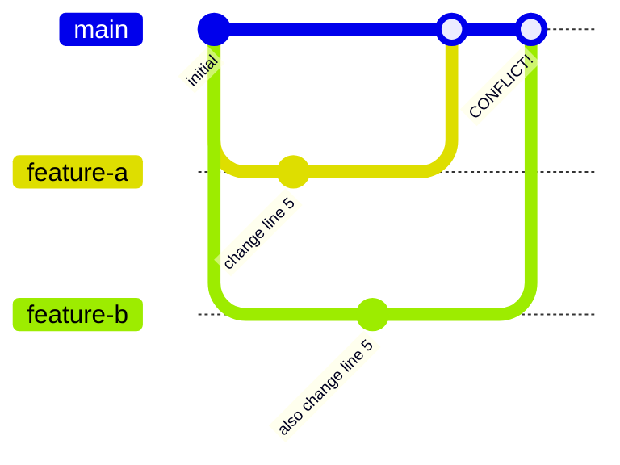
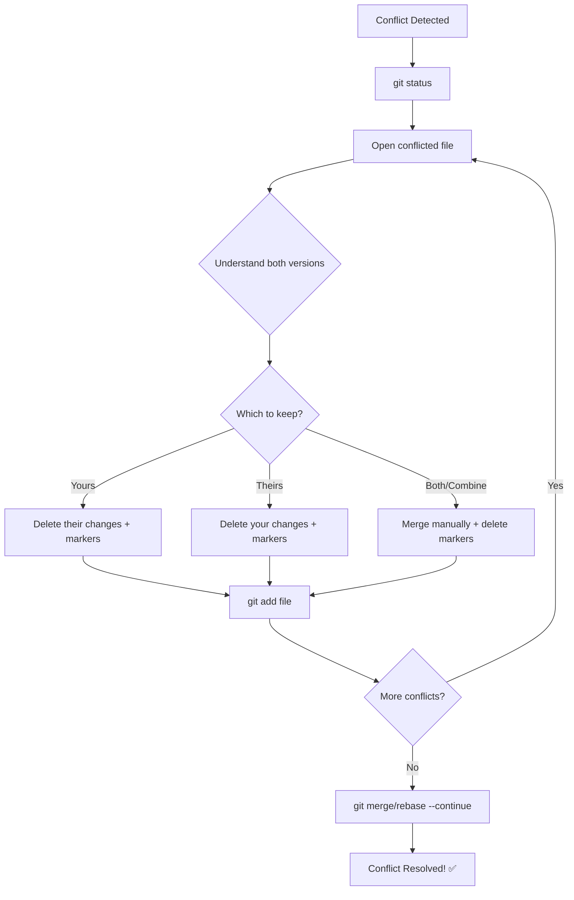
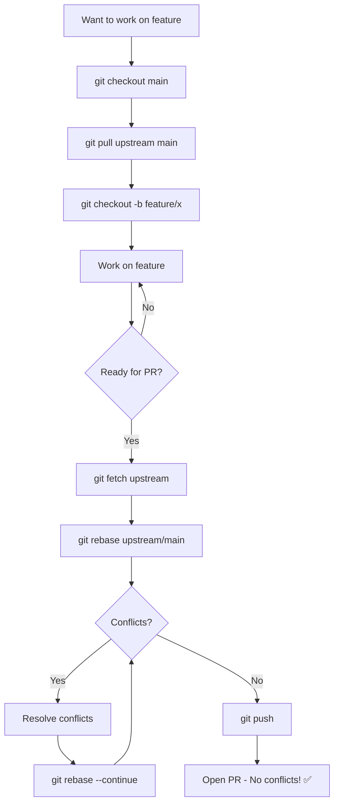

# Resolving Merge Conflicts

Merge conflicts are **inevitable**. They're not errors—they're Git asking for help when it can't automatically combine changes.

## What Causes Conflicts?



Conflicts happen when:
- Two people edit the **same line** in the same file
- One person deletes a file another edited
- Changes are made to adjacent lines that Git can't reconcile

## Anatomy of a Conflict

When a conflict occurs, Git marks the file:

```javascript
function greet(name) {
<<<<<<< HEAD
    return `Hello, ${name}!`;
=======
    return `Hi there, ${name}!`;
>>>>>>> feature/new-greeting
}
```

### Understanding the Markers

| Marker | Meaning |
|--------|---------|
| `<<<<<<< HEAD` | Start of YOUR current changes |
| `=======` | Separator between versions |
| `>>>>>>> branch-name` | End of INCOMING changes |

## Step-by-Step Resolution

### Step 1: Identify Conflicts

```bash
git status
```

Output:
```
Unmerged paths:
  both modified:   src/greeting.js
```

### Step 2: Open Conflicted Files

```bash
# Find all conflicts
git diff --name-only --diff-filter=U

# Or use your editor
code src/greeting.js
```

### Step 3: Choose Resolution

You have options:

**Option A: Keep YOUR version**
```javascript
function greet(name) {
    return `Hello, ${name}!`;
}
```

**Option B: Keep THEIR version**
```javascript
function greet(name) {
    return `Hi there, ${name}!`;
}
```

**Option C: Combine both**
```javascript
function greet(name, formal = true) {
    return formal ? `Hello, ${name}!` : `Hi there, ${name}!`;
}
```

### Step 4: Remove Conflict Markers

Delete ALL markers:
- `<<<<<<< HEAD`
- `=======`
- `>>>>>>> branch-name`

### Step 5: Stage and Continue

```bash
# Stage resolved file
git add src/greeting.js

# Continue the merge/rebase
git merge --continue
# OR
git rebase --continue
```

## The Resolution Flowchart



## Visual Merge Tools

### VS Code (Built-in)

VS Code shows conflicts with clickable options:

```
<<<<<<< HEAD (Current Change)
    your code here
=======
    their code here
>>>>>>> incoming (Incoming Change)

[Accept Current] [Accept Incoming] [Accept Both] [Compare]
```

### Configure a Merge Tool

```bash
# Set VS Code as merge tool
git config --global merge.tool vscode
git config --global mergetool.vscode.cmd 'code --wait $MERGED'

# Use it
git mergetool
```

### Other Tools

| Tool | Command | Platform |
|------|---------|----------|
| VS Code | `git mergetool` | All |
| Meld | `git mergetool` | Linux |
| P4Merge | `git mergetool` | All |
| GitKraken | GUI | All |
| Fork | GUI | Mac/Win |

## Types of Conflicts

### 1. Content Conflicts

Same lines edited differently:

```javascript
<<<<<<< HEAD
const MAX_USERS = 100;
=======
const MAX_USERS = 50;
>>>>>>> feature/limit-users
```

**Resolution:** Decide which value is correct.

### 2. Add/Add Conflicts

Both branches add different content at same location:

```javascript
<<<<<<< HEAD
import { newFeature } from './new';
=======
import { otherFeature } from './other';
>>>>>>> feature/other
```

**Resolution:** Usually keep both imports.

### 3. Modify/Delete Conflicts

One branch modifies, another deletes:

```bash
CONFLICT (modify/delete): file.js deleted in HEAD and modified in feature/x
```

**Resolution:** Decide if file should exist.

### 4. Rename Conflicts

Both branches rename same file differently:

```bash
CONFLICT (rename/rename): file.js renamed to new.js in HEAD and to other.js in feature
```

**Resolution:** Choose the correct name.

## Conflict Prevention

### Before Starting Work

```bash
# Always start from updated main
git checkout main
git pull upstream main
git checkout -b feature/my-work
```

### During Development

```bash
# Regularly sync with main
git fetch upstream
git rebase upstream/main
```

### Communication

- Check if others are working on same files
- Coordinate large refactors
- Split work into small PRs

## Common Scenarios

### Scenario 1: Merge Conflict

```bash
git merge feature-branch
# CONFLICT!

# Fix conflicts in editor
# ...

git add .
git commit -m "merge: resolve conflicts with feature-branch"
```

### Scenario 2: Rebase Conflict

```bash
git rebase main
# CONFLICT!

# Fix conflicts in editor
# ...

git add .
git rebase --continue

# May have multiple conflicts - repeat for each
```

### Scenario 3: Pull Conflict

```bash
git pull origin main
# CONFLICT!

# Fix conflicts
git add .
git commit -m "merge: sync with origin"
git push
```

### Scenario 4: Cherry-pick Conflict

```bash
git cherry-pick abc123
# CONFLICT!

# Fix conflicts
git add .
git cherry-pick --continue
```

## Abort! Abort!

Made a mess? Start over:

```bash
# Abort merge
git merge --abort

# Abort rebase
git rebase --abort

# Abort cherry-pick
git cherry-pick --abort

# Reset to before the attempt
git reset --hard HEAD
```

## Advanced Strategies

### Keep Ours/Theirs

For whole files (not specific lines):

```bash
# Keep YOUR version
git checkout --ours filename.js
git add filename.js

# Keep THEIR version
git checkout --theirs filename.js
git add filename.js
```

### Recursive Strategy Options

```bash
# Prefer our changes when possible
git merge -X ours feature-branch

# Prefer their changes when possible
git merge -X theirs feature-branch
```

### Rerere (Reuse Recorded Resolution)

Git remembers how you resolved conflicts:

```bash
# Enable rerere
git config --global rerere.enabled true

# Now Git will remember resolutions
# and apply them automatically next time
```

## Best Practices

### ✅ Do

```bash
# Pull/rebase frequently
git fetch upstream && git rebase upstream/main

# Make small, focused commits
git commit -m "feat: add one thing"

# Communicate with team
# "I'm refactoring auth.js this week"
```

### ❌ Don't

```bash
# Don't let branches get stale
# (weeks without syncing)

# Don't make huge changes across many files
# (high conflict potential)

# Don't just randomly pick versions
# (understand what the code does)
```

## Conflict Resolution Checklist

When you encounter a conflict:

- [ ] Identify all conflicted files (`git status`)
- [ ] Understand what each version is trying to do
- [ ] Decide on the correct resolution
- [ ] Remove ALL conflict markers
- [ ] Test the code still works
- [ ] Stage resolved files (`git add`)
- [ ] Continue the operation (`--continue`)
- [ ] Verify the result (`git log`, `git diff`)

## Testing After Resolution

Always verify your resolution:

```bash
# Run tests
npm test

# Build project
npm run build

# Manual verification
npm start
```

## Quick Reference

| Situation | Command |
|-----------|---------|
| See conflicts | `git status` |
| Abort merge | `git merge --abort` |
| Abort rebase | `git rebase --abort` |
| Keep ours | `git checkout --ours file` |
| Keep theirs | `git checkout --theirs file` |
| Mark resolved | `git add file` |
| Continue merge | `git merge --continue` |
| Continue rebase | `git rebase --continue` |

## Conflict-Free Workflow



## Next Steps

Now that you can handle conflicts:

➡️ [Rewriting History →](rewriting-history)

---

> **Pro Tip:** The best way to handle conflicts is to prevent them. Small PRs, frequent syncs, and good communication make conflicts rare and easy.
