# Rewriting History

Git lets you **rewrite history** to create clean, logical commits. Use this power responsibly.

## Why Rewrite History?

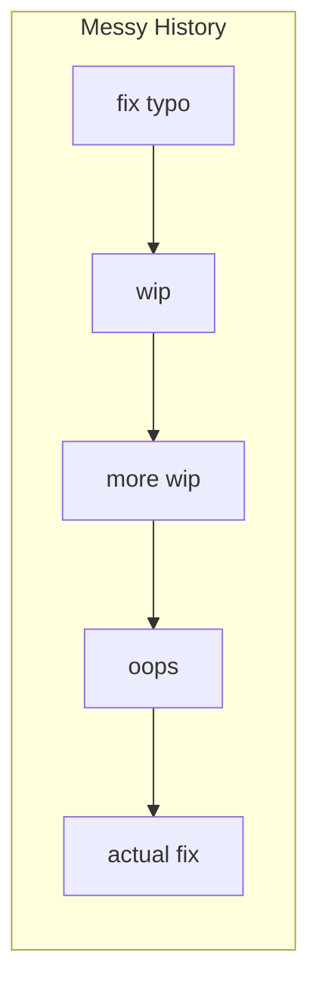

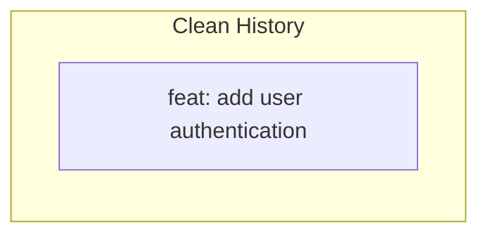

Clean history is:
- Easier to review
- Easier to understand
- Easier to bisect/debug
- More professional

## The Golden Rule

⚠️ **Never rewrite history that others have pulled.**

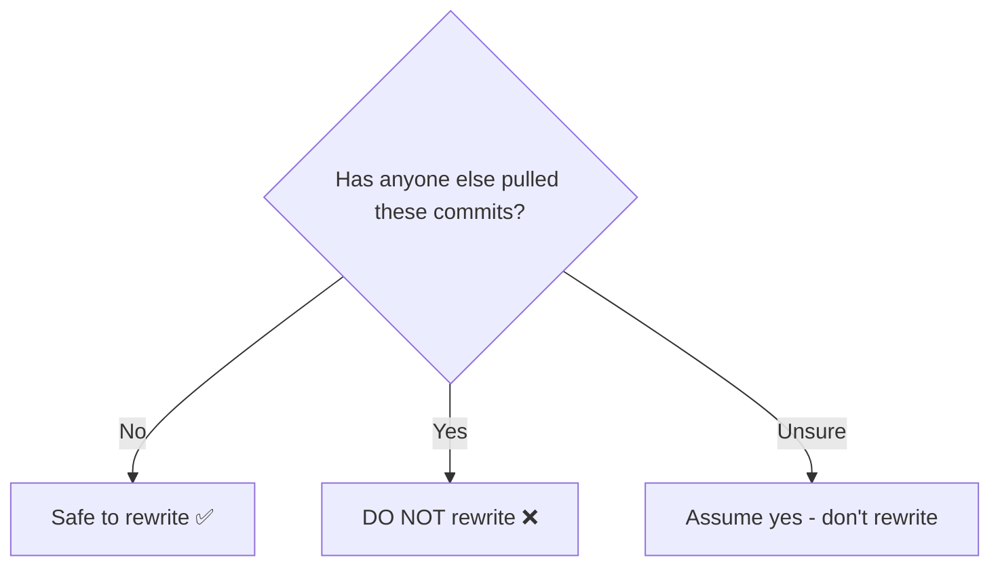

| Branch Type | Can Rewrite? |
|-------------|--------------|
| Your local branch | ✅ Yes |
| Your pushed feature branch | ✅ Yes (with force push) |
| Shared feature branch | ❌ Dangerous |
| main/master | ❌ Never |

## Amending Commits

### Amend the Last Commit

```bash
# Change the message
git commit --amend -m "feat: new message"

# Add forgotten files (keep message)
git add forgotten-file.js
git commit --amend --no-edit

# Add files AND change message
git add more-files.js
git commit --amend -m "feat: complete feature"
```

### What Amend Does

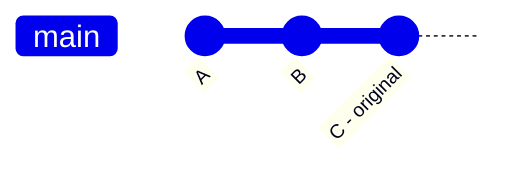

After `git commit --amend`:

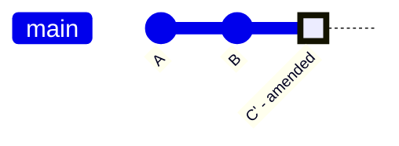

The commit hash changes because it's a new commit.

## Interactive Rebase

The most powerful history editing tool.

### Basic Usage

```bash
# Rebase last 3 commits
git rebase -i HEAD~3

# Rebase from specific commit
git rebase -i abc123

# Rebase onto another branch
git rebase -i main
```

### The Interactive Editor

```bash
pick abc123 First commit
pick def456 Second commit
pick ghi789 Third commit

# Commands:
# p, pick = use commit
# r, reword = use commit, but edit message
# e, edit = use commit, but stop for amending
# s, squash = meld into previous commit
# f, fixup = like squash, but discard message
# d, drop = remove commit
```

### Rebase Actions Visualized

#### Reword: Change Message

```
reword abc123 feat: original message
pick def456 Second commit
```

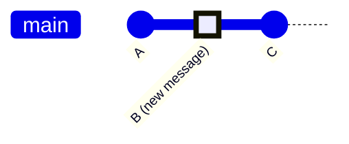

#### Squash: Combine Commits

```
pick abc123 First commit
squash def456 Second commit
squash ghi789 Third commit
```

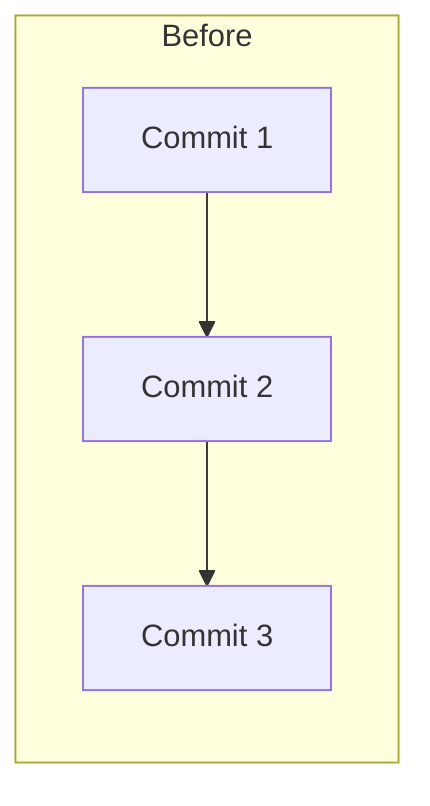

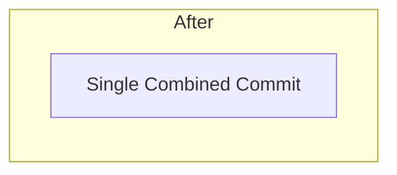

#### Fixup: Squash and Discard Message

```
pick abc123 feat: main feature
fixup def456 fix typo
fixup ghi789 forgot file
```

Result: One commit with first message.

#### Drop: Remove Commit

```
pick abc123 First commit
drop def456 Unwanted commit
pick ghi789 Third commit
```

#### Edit: Stop and Modify

```
edit abc123 Want to split this
pick def456 Second commit
```

Git stops at that commit for you to make changes.

## Common Rebase Workflows

### Workflow 1: Squash Before PR

```bash
# You have 5 messy commits
git log --oneline
# abc123 fix typo
# def456 wip
# ghi789 more wip
# jkl012 almost done
# mno345 initial feature

# Squash into one
git rebase -i HEAD~5

# Change to:
pick mno345 initial feature
squash jkl012 almost done
squash ghi789 more wip
squash def456 wip
squash abc123 fix typo

# Edit combined message
feat: add complete user authentication

# Force push
git push --force-with-lease origin feature/auth
```

### Workflow 2: Split a Commit

```bash
git rebase -i HEAD~3
# Change 'pick' to 'edit' for the commit to split

# Git stops at that commit
git reset HEAD~1  # Undo commit, keep changes

# Create multiple commits
git add file1.js
git commit -m "feat: first part"

git add file2.js
git commit -m "feat: second part"

# Continue rebase
git rebase --continue
```

### Workflow 3: Reorder Commits

```bash
git rebase -i HEAD~4

# Original order:
pick abc123 feat: A
pick def456 feat: B
pick ghi789 feat: C
pick jkl012 feat: D

# New order (just rearrange lines):
pick def456 feat: B
pick abc123 feat: A
pick jkl012 feat: D
pick ghi789 feat: C
```

### Workflow 4: Update Old Commit

```bash
# Make your fix
git add fixed-file.js

# Create fixup commit
git commit --fixup=abc123  # abc123 is the commit to fix

# Autosquash
git rebase -i --autosquash HEAD~5
# Git automatically moves fixup commits
```

## Rebase vs Merge

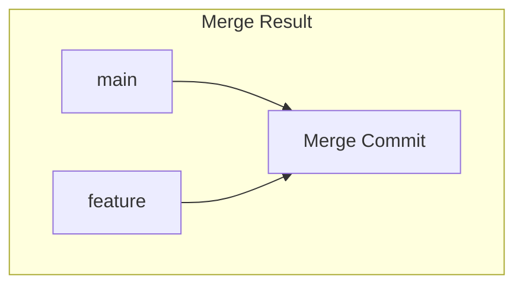

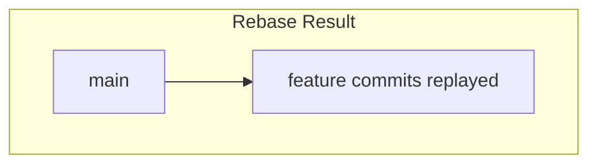

| Aspect | Merge | Rebase |
|--------|-------|--------|
| History | Preserves | Rewrites |
| Merge commits | Yes | No |
| Safer | Yes | No |
| Cleaner history | No | Yes |

## Undoing a Rebase

### If You Haven't Pushed

```bash
# Find the original HEAD
git reflog

# Output:
# abc123 HEAD@{0}: rebase finished
# def456 HEAD@{1}: rebase: checkout main
# ghi789 HEAD@{2}: commit: your last commit before rebase

# Reset to before rebase
git reset --hard ghi789
```

### If You Already Pushed

You can't easily undo. This is why we're careful about force pushing.

## Autosquash Workflow

Perfect for iterative development:

```bash
# Make initial commit
git commit -m "feat: add login"

# Later, find a bug in that commit
git add fix.js
git commit --fixup=HEAD~2  # Reference the commit to fix

# Before PR, clean up
git rebase -i --autosquash main

# Git automatically arranges fixup commits!
```

## Force Pushing

After rewriting history, regular push fails:

```bash
git push origin feature-branch
# ! [rejected] feature-branch -> feature-branch (non-fast-forward)
```

### Safe Force Push

```bash
# Recommended: checks if remote changed
git push --force-with-lease origin feature-branch

# Not recommended: overwrites everything
git push --force origin feature-branch
```

### Force-with-lease Explained

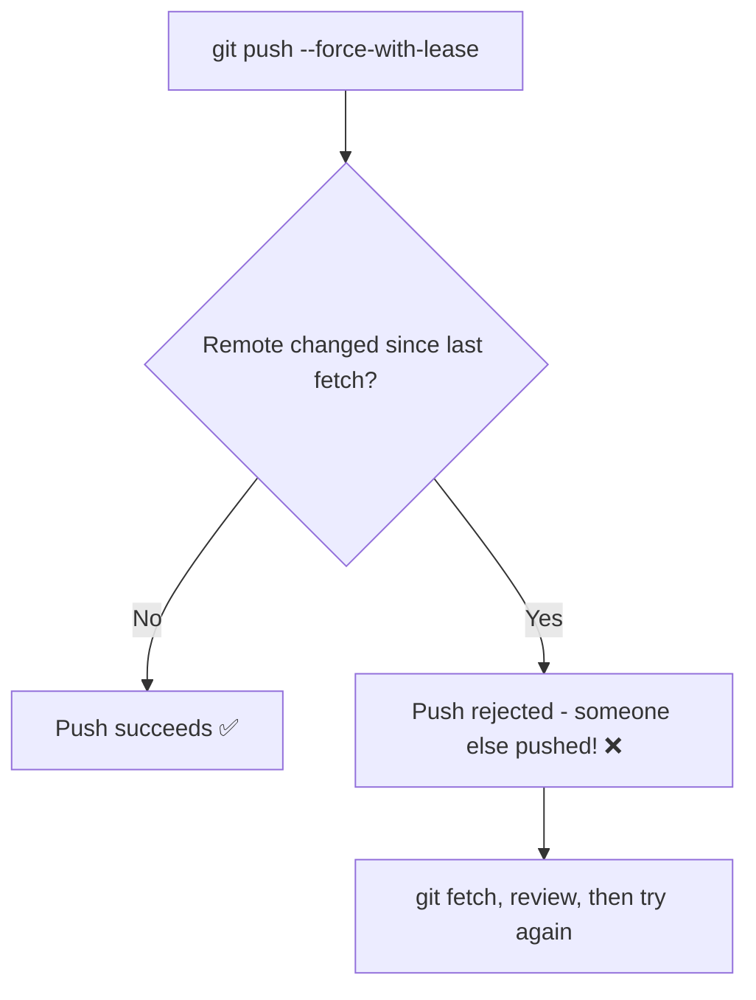

## Best Practices

### ✅ Do

- Squash WIP commits before PR
- Use meaningful commit messages after squash
- Rebase feature branches on main
- Use `--force-with-lease` not `--force`
- Rewrite your own unpushed commits freely

### ❌ Don't

- Rewrite commits others depend on
- Force push to main/shared branches
- Lose track of what you're rebasing
- Rebase during code review (unless asked)

## Rebase Checklist

Before rewriting history:

- [ ] Is this my own branch?
- [ ] Has anyone else pulled these commits?
- [ ] Do I have a backup/reflog?
- [ ] Have I tested after rewriting?
- [ ] Am I using `--force-with-lease`?

## Troubleshooting

### Rebase Conflict

```bash
git rebase -i main
# CONFLICT!

# Fix conflicts
git add resolved-file.js

# Continue
git rebase --continue

# Or abort
git rebase --abort
```

### Lost Commits

```bash
# Find them in reflog
git reflog

# Cherry-pick or reset to recover
git cherry-pick lost-commit-hash
```

### Accidentally Rewrote Shared History

```bash
# Others need to:
git fetch origin
git reset --hard origin/branch-name

# And you should communicate!
```

## Quick Reference

| Task | Command |
|------|---------|
| Amend last commit | `git commit --amend` |
| Interactive rebase | `git rebase -i HEAD~n` |
| Squash commits | Use `squash` in rebase |
| Reword message | Use `reword` in rebase |
| Delete commit | Use `drop` in rebase |
| Create fixup | `git commit --fixup=hash` |
| Autosquash | `git rebase -i --autosquash` |
| Safe force push | `git push --force-with-lease` |
| Undo rebase | `git reflog` + `git reset --hard` |

## Next Steps

Now that you can rewrite history:

➡️ [When Not to Force Push →](force-push)

---

> **Pro Tip:** Enable autosquash by default: `git config --global rebase.autosquash true`. It makes cleanup workflows much smoother.
