# Making Your First Contribution

You've learned Git, you've forked a repo, and you're ready. Now it's time to make your **first real contribution**.

## The Journey Map

```mermaid
flowchart LR
    A[Find Project] --> B[Find Issue]
    B --> C[Claim Issue]
    C --> D[Write Code]
    D --> E[Submit PR]
    E --> F[Get Reviewed]
    F --> G[Get Merged! 🎉]
```



## What Makes a Good First Contribution?

| Type | Difficulty | Merge Rate | Learning Value |
|------|------------|------------|----------------|
| Fix typos | ⭐ | Very High | Low |
| Update docs | ⭐⭐ | High | Medium |
| Add tests | ⭐⭐⭐ | High | High |
| Fix small bug | ⭐⭐⭐ | Medium | High |
| Add feature | ⭐⭐⭐⭐ | Low-Medium | Very High |

## Success Metrics


## What You'll Learn in This Section

### 1. [Finding Good First Issues](finding-issues)
- Where to look
- Spotting fake/abandoned issues
- Evaluating issue quality

### 2. [Picking Issues That Get Merged](picking-issues)
- Strategic selection
- Understanding maintainer priorities
- Avoiding common traps

### 3. [Asking Questions the Right Way](asking-questions)
- How to get help without being ignored
- The anatomy of a good question
- When to ask vs. when to research

### 4. [Claiming an Issue](claiming-issues)
- How to claim properly
- When NOT to claim
- Maintaining your claim

### 5. [Writing Clean Code](clean-code)
- Code that maintainers love
- Style guide compliance
- Making reviews easy

### 6. [Adding Tests](adding-tests)
- When tests are required
- Writing effective tests
- Understanding test frameworks

### 7. [Documentation Contributions](documentation)
- High-impact doc contributions
- Beyond typo fixes
- Documentation that matters

## The Mindset Shift

### ❌ Wrong Mindset
```
"I need to find the easiest issue to get a quick merge"
"I'll just add my name somewhere for a contribution"
"Any contribution counts the same"
```

### ✅ Right Mindset
```
"I want to provide real value to this project"
"I'll find an issue I can learn from and solve well"
"Quality matters more than quantity"
```

## First Contribution Checklist

Before you start, ensure you have:

- [ ] A forked and cloned repository
- [ ] A working local development environment
- [ ] Read the CONTRIBUTING.md file
- [ ] Understood the project's purpose
- [ ] Joined the community (Discord/Slack if available)

## Common First Contribution Paths


## Time Expectations

| Contribution Type | Time Investment | Learning Curve |
|-------------------|-----------------|----------------|
| Documentation fix | 1-2 hours | Low |
| Test addition | 2-4 hours | Medium |
| Small bug fix | 4-8 hours | Medium |
| Feature addition | 1-2 weeks | High |

## Real Examples

### Good First Contributions

```
✅ "Fixed broken link in installation guide"
   - Clear value
   - Easy to verify
   - Helps new users

✅ "Added missing unit tests for UserService"
   - Improves code coverage
   - Shows code understanding
   - Helps maintainability

✅ "Fixed null pointer exception in data parser"
   - Solves real problem
   - Has reproduction steps
   - Includes test case
```

### Bad First Contributions

```
❌ "Fixed typo in comment nobody reads"
   - Low value
   - Looks like padding

❌ "Refactored entire codebase to my style"
   - Too large
   - Uninvited changes
   - High review burden

❌ "Added feature nobody requested"
   - No demand
   - Maintenance burden
   - Likely rejected
```

## The Success Formula

```
Great First Contribution = 
    Clear Problem (issue exists and is active)
    + Right Scope (achievable in reasonable time)
    + Clean Solution (follows project conventions)
    + Good Communication (updates, questions, PR description)
    + Persistence (handle feedback, iterate)
```

## What Maintainers Look For


## Your First Week Plan

### Day 1-2: Research
- Find 3-5 potential projects
- Read their READMEs and CONTRIBUTING guides
- Join their communities

### Day 3-4: Select
- Choose 1 project
- Find 2-3 potential issues
- Read existing discussions

### Day 5-6: Engage
- Ask questions if unclear
- Claim one issue
- Set up local environment

### Day 7+: Build
- Start working on your issue
- Make regular commits
- Keep issue updated with progress

## Ready to Start?

Let's find your first issue:

➡️ [Finding Good First Issues →](finding-issues)

---

> **Remember:** Everyone's first contribution felt intimidating. The open source community is more welcoming than you think. Just be respectful, be curious, and be persistent.
