# Picking Issues That Get Merged

Finding issues is easy. Picking ones that **actually get merged** is the skill.

## The Merge Probability Formula


## Strategic Issue Selection

### The CAMP Framework

**C**larity - Is the issue well-defined?
**A**ctivity - Is someone paying attention?
**M**anageability - Can you handle the scope?
**P**riority - Does the project need this?

```mermaid
flowchart TD
    A[Evaluate Issue] --> B{Clear?}
    B -->|No| C[❌ Skip]
    B -->|Yes| D{Active?}
    D -->|No| C
    D -->|Yes| E{Manageable?}
    E -->|No| C
    E -->|Yes| F{Priority?}
    F -->|No| C
    F -->|Yes| G[✅ Pick This One]
```



### Scoring Issues

Rate 1-5 for each CAMP factor:

| Issue | Clarity | Activity | Manageable | Priority | Total | Decision |
|-------|---------|----------|------------|----------|-------|----------|
| Issue A | 5 | 4 | 4 | 5 | 18 | ✅ Pick |
| Issue B | 3 | 5 | 2 | 4 | 14 | ⚠️ Risky |
| Issue C | 2 | 2 | 5 | 3 | 12 | ❌ Skip |

**Score meanings:**
- 18-20: Excellent chance of merge
- 14-17: Good chance, some risk
- 10-13: Proceed with caution
- Below 10: Look elsewhere

## Issues That Get Merged Fast

### High-Priority Issues

```mermaid
flowchart LR
    A[High Priority] --> B[Blocking releases]
    A --> C[Security fixes]
    A --> D[Breaking bugs]
    A --> E[Documentation for release]
    
    B --> F[Fast Review ⚡]
    C --> F
    D --> F
    E --> F
```



### Maintainer-Requested Issues

Look for issues where maintainers:
- Created the issue themselves
- Said "We need this"
- Mentioned timeline/urgency
- Offered to help

**Example signals:**
```
"We'd love help with this before v3.0"
"This is blocking our next release"
"Happy to mentor someone on this"
```

## Issues to Avoid (for First Contributions)

### 🚩 Competition Issues

```
Issue: "Add dark mode"
Comments: 
  - @user1: "I'll work on this"
  - @user2: "Started a PR"
  - @user3: "Me too!"
```

**Problem:** Too many people, likely someone faster than you.

### 🚩 Political Issues

```
Issue: "Rename function X to Y"
Comments: 50+ debating the name
```

**Problem:** Bikeshedding, no clear resolution.

### 🚩 Moving Target Issues

```
Issue: "Improve error messages"
Comment 1: "Also improve X"
Comment 2: "Don't forget Y"
Comment 3: "We should also Z"
```

**Problem:** Scope keeps expanding.

### 🚩 Dependency Hell Issues

```
Issue: "Fix bug X"
Reality: Requires updating 5 dependencies, 
         each with breaking changes
```

**Problem:** Rabbit hole, weeks of work.

## The Sweet Spot


**Target the upper-left quadrant**: Good impact, reasonable effort.

## Due Diligence Checklist

Before committing to an issue:

### Check the Issue

- [ ] Clear problem statement
- [ ] Defined acceptance criteria
- [ ] Maintainer has commented
- [ ] Not stale (< 3 months old)
- [ ] Unassigned or abandoned

### Check the Project

- [ ] Recent commits (< 30 days)
- [ ] PRs are being merged
- [ ] Maintainers are responsive
- [ ] CONTRIBUTING guide exists
- [ ] License is clear

### Check Yourself

- [ ] You understand the problem
- [ ] You can set up the environment
- [ ] You have time to complete it
- [ ] You're willing to iterate on feedback

## Reading Between the Lines

### What Maintainers Say vs Mean

| They Say | They Mean |
|----------|-----------|
| "Nice to have" | Low priority, might sit |
| "We've been meaning to..." | Want it but busy |
| "Looking for help!" | High chance of review |
| "Feel free to..." | Come and go as you please |
| "Beginner-friendly" | Actually is (usually) |
| "Should be straightforward" | For them, not necessarily you |
| "Needs discussion first" | Don't start coding yet |

### Priority Signals


## Your Issue Selection Workflow

### Step 1: Create Shortlist

```
1. Search with your criteria
2. Open 10-15 issues in tabs
3. Spend 2 min on each
4. Close tabs that fail quick checks
5. Keep 3-5 candidates
```

### Step 2: Deep Evaluation

For each candidate:

```bash
# Time investment: 15-30 min per issue

1. Read entire issue thread
2. Find related code (grep, search)
3. Estimate complexity (LOC changes)
4. Check similar merged PRs
5. Assess your ability
```

### Step 3: Final Selection


## Competitive Analysis

Before claiming, check if others are working:

```bash
# Check existing PRs
# GitHub UI: Pull Requests → Search issue number

# Check comments
# Look for "I'll work on this" or "Started PR"

# Check forks
# Insights → Forks → Sort by recent
# Are there commits on this issue?
```

### If Competition Exists

| Situation | Action |
|-----------|--------|
| PR open but stale (30+ days) | Comment asking status |
| Someone claimed but no PR (14+ days) | Ask if you can take over |
| Active PR being reviewed | Wait or find another issue |
| Multiple abandoned attempts | Ask maintainer for guidance |

## Example: Issue Selection Process

### Candidate Issues

**Issue #123: Fix date formatting in US locale**
- Clarity: 5 (specific bug, steps to reproduce)
- Activity: 4 (maintainer commented 3 days ago)
- Manageable: 5 (single function change)
- Priority: 4 (labeled "bug")
- **CAMP Score: 18** ✅

**Issue #456: Improve mobile responsiveness**
- Clarity: 2 (vague, "make it better")
- Activity: 5 (hotly discussed)
- Manageable: 3 (multiple pages)
- Priority: 4 (user complaints)
- **CAMP Score: 14** ⚠️

**Issue #789: Add support for new API version**
- Clarity: 4 (API docs available)
- Activity: 2 (last comment 2 months ago)
- Manageable: 2 (affects many files)
- Priority: 3 (not urgent)
- **CAMP Score: 11** ❌

**Winner: Issue #123**

## After Picking Your Issue

1. **Comment expressing interest** (don't start coding silently)
2. **Ask clarifying questions** if any
3. **Wait for acknowledgment** before heavy work
4. **Set a personal deadline** (1-2 weeks max)

## Common Mistakes

### ❌ Picking by Label Only

```
"It says 'good first issue' so it must be good"
# Reality: Many are mislabeled
```

### ❌ Ignoring the Thread

```
"The issue is old but still open"
# Reality: Might be abandoned or blocked
```

### ❌ Underestimating Scope

```
"How hard can adding a feature be?"
# Reality: Interconnected with many systems
```

### ❌ Starting Without Claiming

```
"I'll just submit a PR"
# Reality: Someone else might already be working
```

## Next Steps

Ready to claim your issue? Learn the right way:

➡️ [Asking Questions the Right Way →](asking-questions)

---

> **Remember:** The goal isn't to find the easiest issue—it's to find the most strategic one. An issue that teaches you something AND provides value is ideal.
