# Claiming an Issue

Claiming an issue is a **social contract**. You're saying "I'll handle this." Don't take it lightly.

## Why Claiming Matters

```mermaid
flowchart LR
    subgraph With Claiming
        A2[You claim issue] --> B2[Others see you're on it]
        B2 --> C2[No duplicates]
        C2 --> D2[Your PR gets reviewed]
        D2 --> E2[Merged! ✅]
    end
```




## How to Claim Properly

### The Simple Claim

```markdown
Hi, I'd like to work on this issue. 

I've read the requirements and believe I understand the scope.
I should have a PR ready within [timeframe].

Please assign this to me if it's available.
```

### The Detailed Claim

```markdown
Hi, I'd like to take on this issue.

**My understanding:**
The goal is to [describe what needs to be done].

**My approach:**
I'm planning to:
1. [Step 1]
2. [Step 2]
3. [Step 3]

**Timeline:**
I can have a draft PR within [X days] and a complete
PR within [Y days].

**Questions (if any):**
- [Any clarifying questions]

Could I be assigned to this?
```

## Claiming Decision Tree


## What to Say

### First-Time Contributor

```markdown
Hi! I'm new to open source and this project looks great.

I'd like to work on this issue as my first contribution. 
I've:
- ✅ Set up my local environment
- ✅ Read CONTRIBUTING.md
- ✅ Understand the codebase basics

Is this issue available for a beginner? Happy to ask 
questions if I get stuck.
```

### Experienced Contributor

```markdown
I can take this. Will have a PR up by [date].
```

### Returning Contributor

```markdown
Hey, back for another contribution!

I'd like to work on this. My approach would be to 
[brief description]. Should have a draft by [date].
```

## Timeline Commitments

### Be Realistic

| Issue Type | Reasonable Timeline |
|------------|---------------------|
| Typo fix | 1-2 days |
| Doc improvement | 3-5 days |
| Small bug fix | 1 week |
| Test addition | 1 week |
| Feature addition | 2-3 weeks |

### Building in Buffer

```
Your estimate: 3 days
What you say: 5-7 days

Your estimate: 1 week
What you say: 2 weeks

Why: Life happens. Under-promise, over-deliver.
```

## When NOT to Claim

### ❌ Don't Claim If:

**1. You don't have time**
```
"I'll do this when I'm free next month"
# Don't - claim when ready to start
```

**2. You don't understand the issue**
```
"I have no idea what this means but I'll figure it out"
# Don't - ask questions first
```

**3. You're already working on multiple issues**
```
"I have 3 other PRs open but I'll add this too"
# Don't - finish what you started
```

**4. You just want credit**
```
"I'll claim this and maybe get to it someday"
# Don't - this blocks others
```

**5. It's way beyond your skill**
```
"I've never used this language but how hard can it be?"
# Don't - you'll likely give up
```

## Maintaining Your Claim

### Update Regularly


### Progress Update Template

```markdown
Update on this issue:

**Progress:**
- ✅ Set up environment
- ✅ Located relevant code
- 🔄 Implementing solution (50% done)
- ⬜ Writing tests
- ⬜ Updating docs

**ETA for PR:** 2-3 more days

**Blockers (if any):**
None currently.
```

### If You're Stuck

```markdown
Update: I'm stuck on [specific problem].

I've tried:
- [Approach 1]
- [Approach 2]

Could someone point me in the right direction?
If I can't figure it out by [date], I'm happy to 
unassign myself so someone else can try.
```

### If You Need to Abandon

```markdown
Hi, unfortunately I need to step away from this issue 
due to [reason - optional].

**Progress so far:**
- [What you did]
- [What's left]

**My partial work:** [link to branch if applicable]

Feel free to unassign me. Happy to hand off notes 
to the next person.
```

## Handling Competition

### Someone Else Wants the Same Issue

**If they claimed first:**
```markdown
Saw @username already claimed this. I'll find another 
issue. Good luck with it!
```

**If you're not sure who claimed first:**
```markdown
@maintainer, both @other and I are interested in this. 
Who would you like to take it?
```

**If someone claims after you:**
```markdown
Hey @other, I've already started work on this. Check 
out my branch at [link]. Would be happy to have you 
review when I submit the PR!
```

### Someone Submitted PR While You Were Working


Response:
```markdown
Oh, I was also working on this! I had claimed it on [date].

I'm at [X%] complete with [link to branch].

@maintainer, happy to defer if @other's solution is ready, 
or I can finish mine - whichever is easier for the project.
```

## What Maintainers Think

### 🟢 Good Signs from Contributors

- Claims with clear understanding
- Provides timeline
- Updates regularly
- Asks good questions
- Delivers as promised

### 🔴 Red Flags from Contributors

- Claims without understanding
- Goes silent after claiming
- Claims multiple issues at once
- Misses deadlines without communication
- Abandons without notice

## The Claiming Etiquette Checklist

Before claiming:
- [ ] I understand the issue completely
- [ ] I have time to work on this now (not "someday")
- [ ] I've checked no one else is working on it
- [ ] I'm not hoarding (1-2 active claims max)
- [ ] I know my realistic timeline

After claiming:
- [ ] Start work within 2-3 days
- [ ] Post updates at least weekly
- [ ] Communicate if blocked or delayed
- [ ] Submit draft PR when partially done
- [ ] Gracefully hand off if needed

## Claim Limits

### Recommended Limits

| Experience Level | Max Active Claims |
|------------------|-------------------|
| First contribution | 1 |
| Beginner (1-5 PRs) | 1-2 |
| Intermediate (5-15 PRs) | 2-3 |
| Regular contributor | 3+ (project-dependent) |

### Why Limits Matter


## Quick Reference

### Claiming Message Template

```markdown
Hi, I'd like to work on this.

I understand the scope and have [X hours/days] to dedicate.
Will have a PR ready within [timeframe].

[Brief approach if relevant]
```

### Progress Update Template

```markdown
Quick update:
- Done: [list]
- In progress: [list]  
- Next: [list]
- ETA: [date]
```

### Unassign Request Template

```markdown
Need to step away from this. Here's what I've done so far: 
[summary]. Branch: [link]. Please unassign me.
```

## Next Steps

You've claimed an issue! Time to write the code:

➡️ [Writing Clean Code →](clean-code)

---

> **Remember:** Claiming is a promise. Only promise what you can deliver. It's better to claim fewer issues and complete them well than to claim many and disappear.
