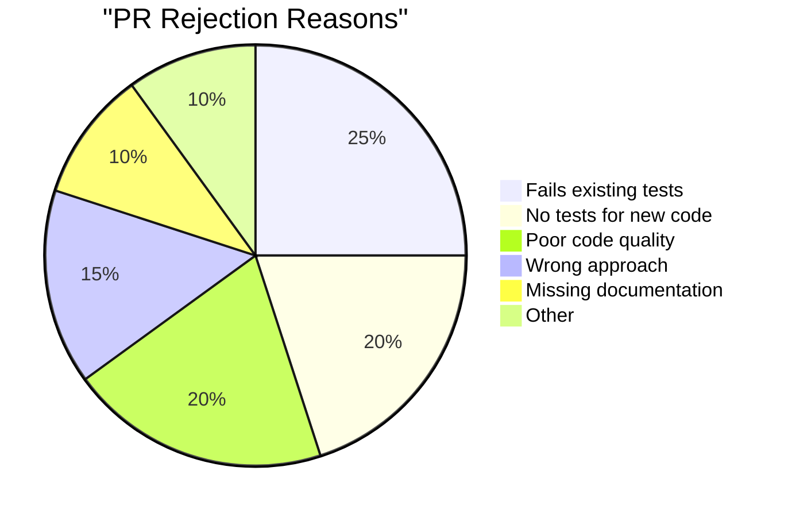
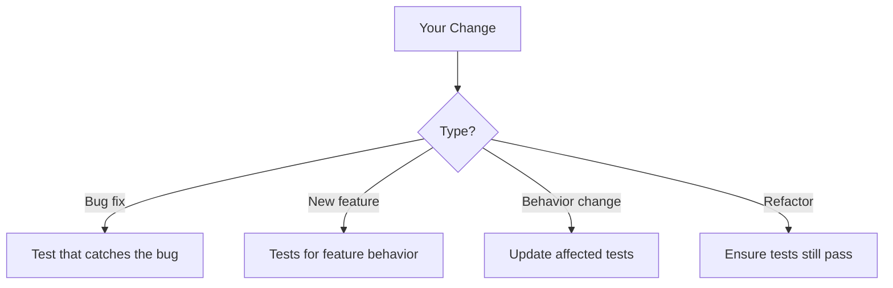
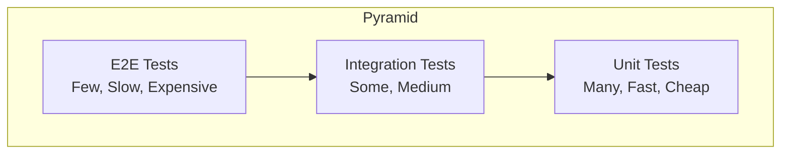
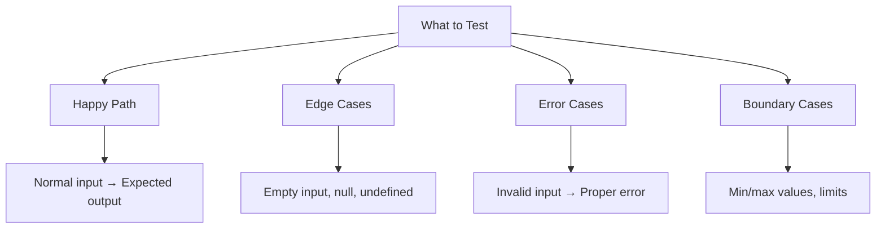
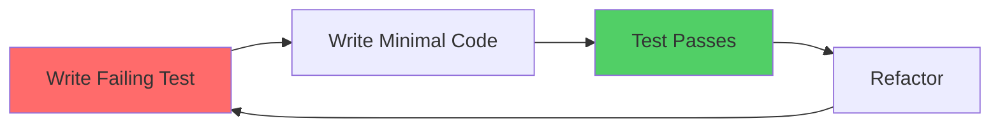

# Adding Tests

Tests prove your code works. They also show maintainers you're serious about quality.

## Why Tests Matter



**45% of rejections** are test-related!

## When Tests Are Required

### Always Required



### Usually Required

| Contribution Type | Test Requirement |
|-------------------|------------------|
| Bug fix | Regression test (proves bug is fixed) |
| New feature | Unit + integration tests |
| API change | Unit + integration tests |
| Performance fix | Benchmark test |
| Security fix | Security test |

### Usually Not Required

| Contribution Type | Why No Test |
|-------------------|-------------|
| Documentation only | Can't test docs |
| Typo fixes | Self-evident |
| Config changes | May be tested in CI |
| Comments only | No behavior change |

## Types of Tests

### The Testing Pyramid



### Unit Tests

Test individual functions/components in isolation.

```javascript
// Function to test
function add(a, b) {
    return a + b;
}

// Unit test
describe('add', () => {
    it('should add two positive numbers', () => {
        expect(add(2, 3)).toBe(5);
    });
    
    it('should handle negative numbers', () => {
        expect(add(-1, 1)).toBe(0);
    });
    
    it('should handle zero', () => {
        expect(add(0, 5)).toBe(5);
    });
});
```

### Integration Tests

Test how components work together.

```javascript
// Integration test
describe('UserService', () => {
    it('should create user and send welcome email', async () => {
        const user = await UserService.create({
            email: 'test@example.com',
            name: 'Test User'
        });
        
        expect(user.id).toBeDefined();
        expect(EmailService.sent).toContain('test@example.com');
    });
});
```

### End-to-End Tests

Test complete user flows.

```javascript
// E2E test
describe('Login Flow', () => {
    it('should allow user to log in', async () => {
        await page.goto('/login');
        await page.fill('#email', 'user@example.com');
        await page.fill('#password', 'password123');
        await page.click('#submit');
        
        await expect(page).toHaveURL('/dashboard');
        await expect(page.locator('.welcome')).toContainText('Welcome');
    });
});
```

## Finding the Test Framework

```bash
# Check package.json for test script
cat package.json | grep -A5 '"scripts"'

# Common test commands
npm test
npm run test
yarn test
pytest
go test ./...
cargo test
```

### Common Test Frameworks

| Language | Frameworks |
|----------|------------|
| JavaScript | Jest, Mocha, Vitest, Playwright |
| TypeScript | Jest, Vitest |
| Python | pytest, unittest |
| Go | testing (built-in) |
| Java | JUnit, TestNG |
| Ruby | RSpec, Minitest |
| Rust | built-in |

## Writing Good Tests

### Test Structure: AAA Pattern

```javascript
it('should calculate discount for premium users', () => {
    // Arrange: Set up test data
    const user = { isPremium: true, yearsActive: 3 };
    
    // Act: Call the function
    const discount = calculateDiscount(user);
    
    // Assert: Check the result
    expect(discount).toBe(0.2);
});
```

### Test Naming

```javascript
// ❌ Bad names
it('test1', () => {});
it('works', () => {});
it('discount', () => {});

// ✅ Good names
it('should return 0 discount for non-premium users', () => {});
it('should throw error when user is null', () => {});
it('should apply 20% discount for premium users with 2+ years', () => {});
```

### What to Test



### Example: Complete Test Suite

```javascript
describe('formatPrice', () => {
    // Happy path
    it('should format positive price with currency', () => {
        expect(formatPrice(9.99, 'USD')).toBe('$9.99');
    });
    
    // Edge cases
    it('should handle zero price', () => {
        expect(formatPrice(0, 'USD')).toBe('$0.00');
    });
    
    it('should round to 2 decimal places', () => {
        expect(formatPrice(9.999, 'USD')).toBe('$10.00');
    });
    
    // Error cases
    it('should throw for negative price', () => {
        expect(() => formatPrice(-5, 'USD')).toThrow('Price cannot be negative');
    });
    
    it('should throw for invalid currency', () => {
        expect(() => formatPrice(10, 'INVALID')).toThrow('Unknown currency');
    });
    
    // Boundary cases
    it('should handle very large numbers', () => {
        expect(formatPrice(999999999.99, 'USD')).toBe('$999,999,999.99');
    });
});
```

## Test-Driven Development (TDD)

### The TDD Cycle



### TDD for Bug Fixes

```javascript
// 1. First, write test that exposes the bug
it('should handle special characters in password', () => {
    const result = login('user@example.com', 'Pass#123!');
    expect(result.success).toBe(true);
});

// 2. Run test - it fails (proving bug exists)
// 3. Fix the code
// 4. Run test - it passes (proving bug is fixed)
// 5. The test prevents regression forever
```

## Adding Tests to Existing Code

### Where to Put Tests

```
# Mirror source structure
src/
  utils/
    format.js
  services/
    userService.js
tests/
  utils/
    format.test.js
  services/
    userService.test.js

# Or co-located
src/
  utils/
    format.js
    format.test.js
```

**Follow the project's existing pattern!**

### Running Tests

```bash
# Run all tests
npm test

# Run specific test file
npm test -- format.test.js

# Run tests matching pattern
npm test -- --grep "discount"

# Run with coverage
npm test -- --coverage
```

## Test Coverage

### What Coverage Measures

| Metric | What It Means |
|--------|---------------|
| Line coverage | % of lines executed |
| Branch coverage | % of if/else paths tested |
| Function coverage | % of functions called |
| Statement coverage | % of statements executed |

### Checking Coverage

```bash
# Generate coverage report
npm test -- --coverage

# Output example
----------|---------|----------|---------|---------|
File      | % Stmts | % Branch | % Funcs | % Lines |
----------|---------|----------|---------|---------|
All files |   85.5  |    72.3  |   90.0  |   85.5  |
 utils.js |   100   |    100   |   100   |   100   |
 auth.js  |    75   |     50   |    80   |    75   |
----------|---------|----------|---------|---------|
```

### Coverage Goals

| Level | Coverage | Good For |
|-------|----------|----------|
| Minimal | 60-70% | Legacy code |
| Good | 70-80% | Most projects |
| High | 80-90% | Critical systems |
| Very High | 90%+ | Financial, security |

**Check project requirements - some require minimum coverage.**

## Common Testing Patterns

### Mocking Dependencies

```javascript
// Mock external service
jest.mock('../services/emailService', () => ({
    sendEmail: jest.fn().mockResolvedValue(true)
}));

it('should send welcome email on signup', async () => {
    await userService.signup({ email: 'test@example.com' });
    
    expect(emailService.sendEmail).toHaveBeenCalledWith(
        'test@example.com',
        'Welcome!',
        expect.any(String)
    );
});
```

### Testing Async Code

```javascript
// Async/await
it('should fetch user data', async () => {
    const user = await userService.getUser(123);
    expect(user.name).toBe('John');
});

// Promises
it('should reject for invalid user', () => {
    return expect(userService.getUser(-1)).rejects.toThrow('Invalid ID');
});
```

### Testing Error Cases

```javascript
it('should throw for null input', () => {
    expect(() => processData(null)).toThrow('Data cannot be null');
});

it('should return error result for invalid data', async () => {
    const result = await processData({ invalid: true });
    expect(result.success).toBe(false);
    expect(result.error).toContain('validation failed');
});
```

## PR Test Checklist

Before submitting:

- [ ] All existing tests pass
- [ ] Added tests for new functionality
- [ ] Added regression test for bug fixes
- [ ] Tests cover happy path
- [ ] Tests cover edge cases
- [ ] Tests cover error cases
- [ ] Coverage didn't decrease
- [ ] Tests are readable and well-named

## If Project Has No Tests

### Starting Point

```javascript
// Start with critical paths
describe('AuthService', () => {
    it('should allow login with valid credentials', async () => {
        // Test core functionality
    });
    
    it('should reject invalid password', async () => {
        // Test security case
    });
});
```

### Proposing Test Infrastructure

If project needs tests, open a discussion:

```markdown
## Proposal: Add Testing Infrastructure

I noticed the project doesn't have tests yet. I'd like to help add them.

**Proposed approach:**
1. Add Jest/pytest/etc. with basic configuration
2. Start with tests for core functionality
3. Add tests incrementally with new PRs

**Benefits:**
- Catch regressions early
- Easier onboarding for contributors
- More confident refactoring

Would maintainers be open to this? Happy to start small.
```

## Quick Reference

### Test Template

```javascript
describe('[Component/Function Name]', () => {
    // Setup (if needed)
    beforeEach(() => {
        // Reset state
    });
    
    describe('[method or scenario]', () => {
        it('should [expected behavior] when [condition]', () => {
            // Arrange
            // Act
            // Assert
        });
    });
});
```

### Common Assertions

| Jest | What It Checks |
|------|----------------|
| `toBe(x)` | Exact equality |
| `toEqual(x)` | Deep equality |
| `toBeTruthy()` | True-ish value |
| `toBeNull()` | Is null |
| `toContain(x)` | Array/string contains |
| `toThrow()` | Throws error |
| `toHaveBeenCalled()` | Mock was called |

## Next Steps

Your code is tested! Complete your contribution:

➡️ [Documentation Contributions →](documentation)

---

> **Remember:** Tests aren't extra work—they're proof that your code works. Maintainers trust tested code more and merge it faster.
