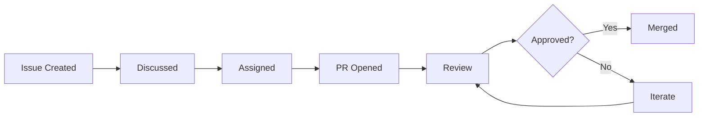
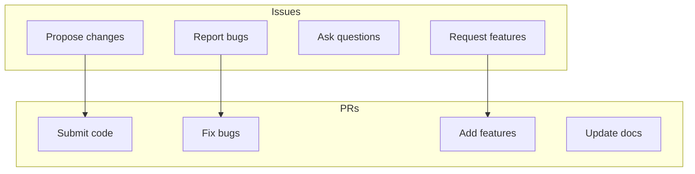
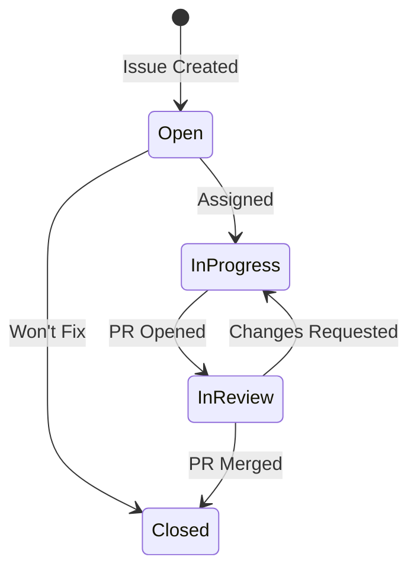
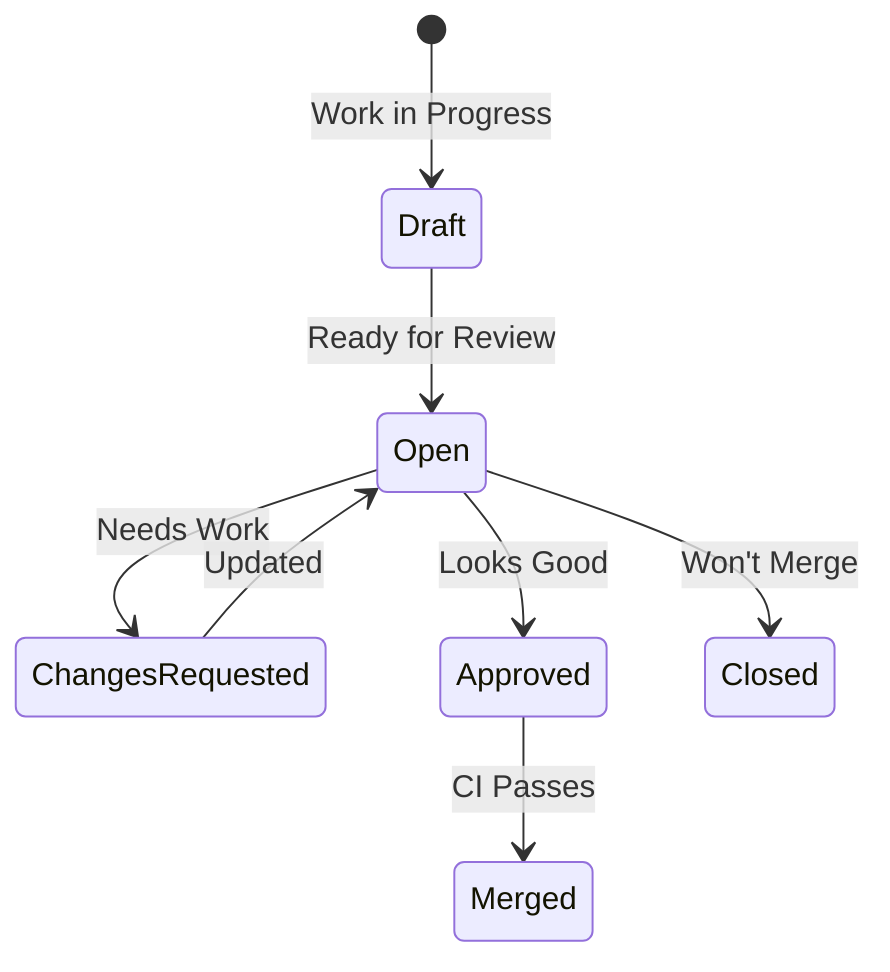
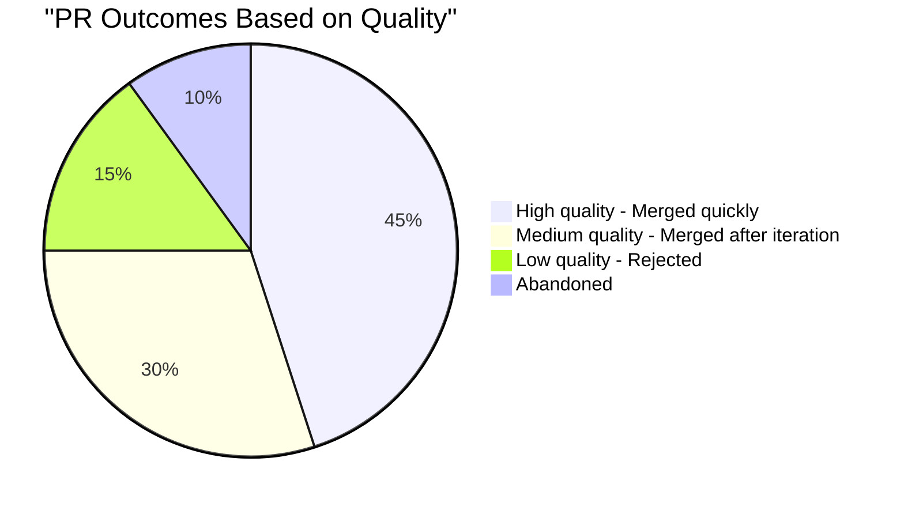

# Issues & Pull Requests

Master the two fundamental units of open source collaboration: issues and pull requests.

## The GitHub Workflow

## What You'll Learn

This section covers everything about issues and PRs:

| Topic | What You'll Master |
|-------|-------------------|
| [Raising Issues](raising-issues) | Creating issues that get attention |
| [Issue Types](issue-types) | Bug reports vs feature requests |
| [Writing PRs](writing-prs) | PRs that maintainers love |
| [PR Templates](pr-template) | What to include in descriptions |
| [Code Reviews](code-reviews) | Handling feedback professionally |
| [Handling Rejection](handling-rejection) | Learning from "no" |
| [Iterating](iterating-feedback) | Improving based on feedback |
| [Closing PRs](closing-prs) | Clean up properly |

## Issues vs Pull Requests

### When to Open an Issue

- You found a bug
- You want a new feature
- You need clarification
- You want to propose a change
- You want to discuss before coding

### When to Open a PR

- You have working code to contribute
- You've fixed a bug
- You've implemented a feature
- You've updated documentation

## The Lifecycle

### Issue Lifecycle

### PR Lifecycle

## Quality Matters

**75%** of quality PRs get merged!

## Common Mistakes

| Mistake | Impact | Solution |
|---------|--------|----------|
| Vague issue title | Gets ignored | Be specific |
| No reproduction steps | Can't fix | Always include steps |
| Massive PR | Hard to review | Keep PRs small |
| No tests | May break things | Add tests |
| Ignoring feedback | Gets closed | Respond promptly |

## Success Metrics

Track your progress:

- **Response time** - How fast maintainers respond
- **Merge rate** - % of PRs that get merged
- **Iteration count** - Reviews needed before merge
- **Issue resolution** - % of issues you close

## Section Navigation

Start mastering the workflow:

1. **[Raising Issues →](raising-issues)** - Create issues that get attention
2. **[Issue Types →](issue-types)** - Bug reports vs feature requests
3. **[Writing PRs →](writing-prs)** - PRs that get merged
4. **[PR Templates →](pr-template)** - What maintainers expect
5. **[Code Reviews →](code-reviews)** - Handle feedback gracefully
6. **[Handling Rejection →](handling-rejection)** - Without burning bridges
7. **[Iterating →](iterating-feedback)** - Improve efficiently
8. **[Closing PRs →](closing-prs)** - Clean up after yourself

---

> **Key insight:** Issues and PRs are not just technical artifacts—they're communication tools. Clear, well-structured issues and PRs show respect for maintainers' time.
