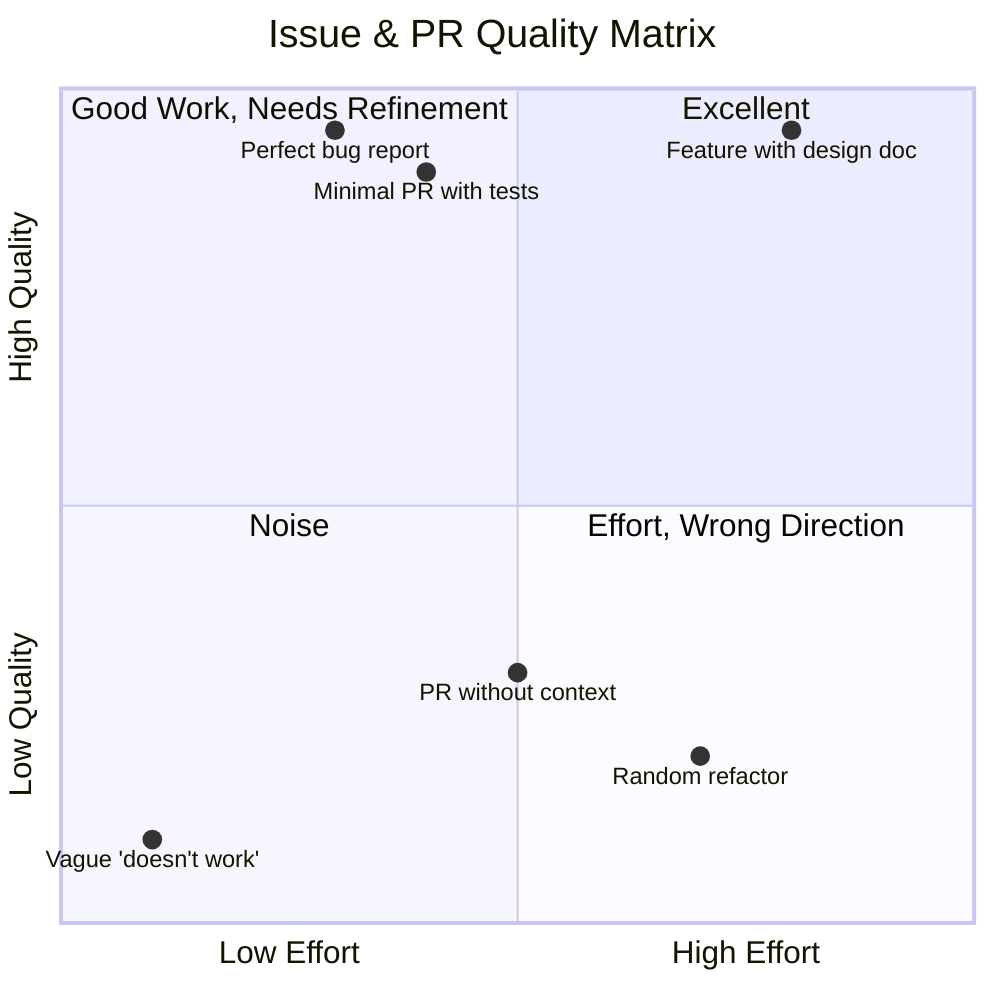

# Issues & Pull Requests

import { GitPullRequest, GitIssue, MessageSquare, CheckCircle, XCircle, AlertCircle } from 'lucide-react'

<Callout type="info" title="The Core Workflow">
Issues and PRs are the primary communication mechanisms in open source. Master them, and you master open source contribution.
</Callout>

## The Complete Cycle

```mermaid
flowchart TD
    A[Spot Problem] --> B[Search Existing Issues]
    B --> C{Already Reported?}
    C -->|Yes| D[Comment/Subscribe]
    C -->|No| E[Create Issue]
    E --> F{Got Assignment?}
    F -->|Yes| G[Fork & Branch]
    F -->|No| H[Wait for Feedback]
    H --> G
    G --> I[Write Code]
    I --> J[Create PR]
    J --> K[Code Review]
    K --> L{Approved?}
    L -->|No| M[Address Feedback]
    M --> K
    L -->|Yes| N[Merged! 🎉]
```



## The Two Pillars

<CardGrid>
<Card title="Issues" icon={<GitIssue className="h-5 w-5" />}>
**Communication tool** for problems, features, and questions. Good issues get triage fast; bad ones get closed or ignored.
</Card>

<Card title="Pull Requests" icon={<GitPullRequest className="h-5 w-5" />}>
**Code delivery mechanism**. Small, focused PRs with tests and good descriptions get merged. Large, unclear PRs die in review.
</Card>
</CardGrid>

---

## Issue & PR Lifecycle

```
┌─────────────────────────────────────────────────────────────────────────────┐
│                        ISSUE → PR → MERGE TIMELINE                          │
├─────────────────────────────────────────────────────────────────────────────┤
│                                                                             │
│  Day 0        Day 1-3       Day 3-7         Day 7-14        Day 14-30       │
│  ═════        ════════       ═══════         ═════════       ═════════       │
│   │              │              │                │               │          │
│   │ Issue        │ Triage &     │ Development    │ Code Review   │ Merge    │
│   │ Created      │ Assignment   │ & Testing      │ & Iteration   │ or Close │
│   │              │              │                │               │          │
│   ▼              ▼              ▼                ▼               ▼          │
│  Open      Acknowledged    PR Opened       Changes Made     Resolution     │
│                                                                             │
│  ◄──────────────── Typical: 2-4 weeks for first contribution ─────────────►│
│                                                                             │
└─────────────────────────────────────────────────────────────────────────────┘
```

---

## Success Metrics

### What Makes Issues Get Addressed

| Factor | Impact | Why It Matters |
|--------|--------|----------------|
| **Clear reproduction steps** | 🔥🔥🔥 | Makes the problem actionable |
| **Recent activity** | 🔥🔥 | Shows it's still relevant |
| **Affects many users** | 🔥🔥🔥 | Higher priority |
| **Has error logs** | 🔥🔥 | Easier to debug |
| **Respectful tone** | 🔥 | People want to help |

### What Makes PRs Get Merged

| Factor | Impact | Why It Matters |
|--------|--------|----------------|
| **Small scope** | 🔥🔥🔥 | Easier to review |
| **Tests included** | 🔥🔥🔥 | Reduces risk |
| **Good description** | 🔥🔥 | Context for reviewers |
| **Follows conventions** | 🔥🔥 | Maintainable code |
| **Responsive to feedback** | 🔥🔥🔥 | Shows professionalism |

---

## Quality Spectrum



---

## Section Overview

<Steps>
<Step number={1} title="Raising Good Issues">
Learn to write bug reports and feature requests that maintainers actually want to read
</Step>

<Step number={2} title="Bug vs Feature">
Know the difference and use the right template for each
</Step>

<Step number={3} title="Writing High-Quality PRs">
Small, focused, tested changes that reviewers love
</Step>

<Step number={4} title="PR Templates">
The anatomy of a perfect PR description
</Step>

<Step number={5} title="Code Review Response">
How to handle feedback professionally and efficiently
</Step>

<Step number={6} title="Handling Rejection">
Not all PRs merge. Learn to fail gracefully and improve
</Step>

<Step number={7} title="Iterating on Feedback">
Speed up the review cycle with smart responses
</Step>

<Step number={8} title="Closing PRs">
How to clean up and move forward
</Step>
</Steps>

---

## Common Mistakes

### Issue Mistakes

<Warning title="These Get Issues Closed Without Action">
- "It doesn't work" (no details)
- Asking for ETAs or demanding fixes
- Not checking if already reported
- Missing reproduction steps
- Opening issues that belong in discussions
</Warning>

### PR Mistakes

<Warning title="These Get PRs Ignored or Rejected">
- No description or "small fix" without context
- Massive diffs touching unrelated files
- No tests when tests are expected
- Ignoring CI failures
- Being defensive about feedback
</Warning>

---

## Time Expectations

```mermaid
gantt
    title Typical Issue→PR→Merge Timeline
    dateFormat YYYY-MM-DD
    section Issue Phase
    Issue opened           :2024-01-01, 1d
    Maintainer responds    :2024-01-02, 2d
    Assignment             :2024-01-03, 1d
    section Development
    Local development      :2024-01-04, 4d
    Testing               :2024-01-07, 1d
    section PR Phase
    PR opened             :2024-01-08, 1d
    First review          :2024-01-10, 2d
    Address feedback      :2024-01-12, 2d
    Second review         :2024-01-14, 2d
    Merge                 :2024-01-16, 1d
```



**Reality check:**
- First response to issue: 1-3 days (sometimes 1-2 weeks)
- First PR review: 2-7 days (sometimes longer)
- Total time to merge first PR: 2-6 weeks average

---

## The Mindset Shift

### ❌ Wrong Mindset

```
"I'll open an issue and get an immediate response"
"My PR is perfect, reviewers are nitpicking"
"I'll make one huge PR with all my changes"
"If my PR doesn't merge, the maintainers are biased"
```

### ✅ Right Mindset

```
"I'll provide all the info maintainers need upfront"
"Reviews improve my code and teach me conventions"
"I'll make small PRs that are easy to review"
"If my PR doesn't merge, I'll learn why and improve"
```

---

## Quick Reference

### Issue Checklist

<Checklist>
<ChecklistItem>Searched for existing issues</ChecklistItem>
<ChecklistItem>Clear, descriptive title</ChecklistItem>
<ChecklistItem>Reproducible steps provided</ChecklistItem>
<ChecklistItem>Environment details included</ChecklistItem>
<ChecklistItem>Logs/screenshots attached</ChecklistItem>
<ChecklistItem>Respectful, professional tone</ChecklistItem>
</Checklist>

### PR Checklist

<Checklist>
<ChecklistItem>Linked to an issue</ChecklistItem>
<ChecklistItem>Small, focused changes</ChecklistItem>
<ChecklistItem>Tests added/updated</ChecklistItem>
<ChecklistItem>CI passing</ChecklistItem>
<ChecklistItem>Good PR description</ChecklistItem>
<ChecklistItem>Follows project conventions</ChecklistItem>
</Checklist>

---

## Ready to Master the Workflow?

Let's start with the foundation:

➡️ [How to Raise a Good Issue →](raising-issues)

---

> **Remember:** Issues and PRs are conversations, not transactions. Approach them with respect, clarity, and patience.
