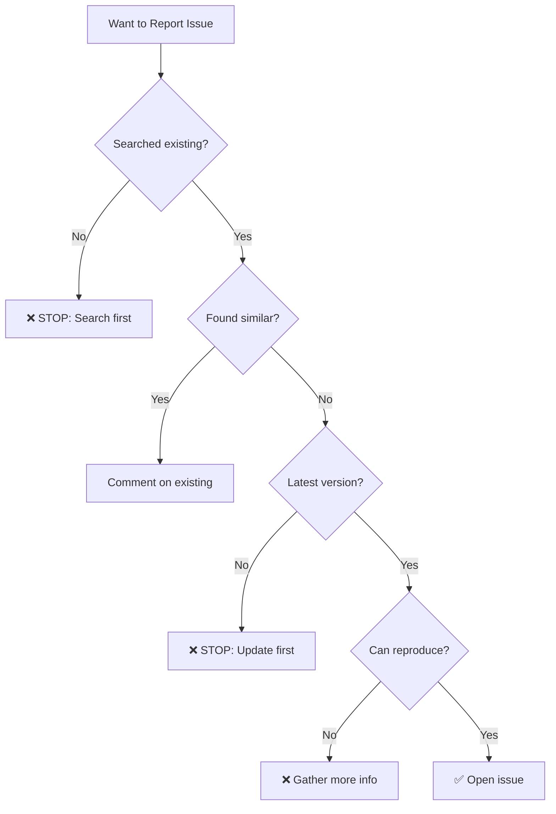
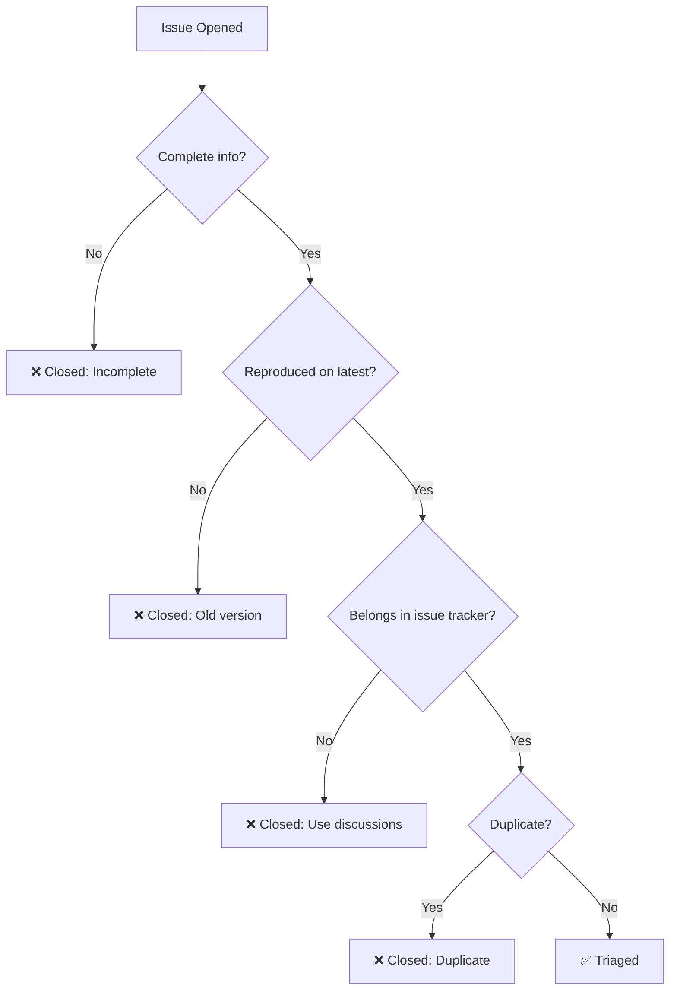

# How to Raise a Good Issue

import { Search, FileText, Bug, CheckCircle, XCircle } from 'lucide-react'

Good issues save maintainer time and get triaged fast. Bad issues get closed or ignored.

<Callout type="warning" title="The 5-Minute Rule">
If a maintainer can't understand and reproduce your issue in 5 minutes, it's not a good issue.
</Callout>

## Pre-Issue Checklist

**ALWAYS do this before opening an issue:**

<Checklist>
<ChecklistItem>Search existing issues (open AND closed)</ChecklistItem>
<ChecklistItem>Check discussions and FAQ</ChecklistItem>
<ChecklistItem>Search recent PRs (might be fixed, not yet released)</ChecklistItem>
<ChecklistItem>Reproduce on latest version/commit</ChecklistItem>
<ChecklistItem>Read CONTRIBUTING.md for issue guidelines</ChecklistItem>
</Checklist>



---

## The Anatomy of a Great Issue

```
┌─────────────────────────────────────────────────────────────────────────────┐
│                        PERFECT ISSUE STRUCTURE                              │
├─────────────────────────────────────────────────────────────────────────────┤
│                                                                             │
│  1. TITLE (50-60 chars)                                                     │
│     ├─ Component: [API]                                                     │
│     ├─ Symptom: "500 error"                                                 │
│     └─ Context: "on POST /users with empty email"                           │
│                                                                             │
│  2. ENVIRONMENT                                                             │
│     ├─ Version/commit: v2.3.1 or commit abc123                              │
│     ├─ OS: Ubuntu 22.04, macOS 14, Windows 11                               │
│     ├─ Runtime: Node 20.x, Python 3.11, etc                                 │
│     └─ Browser (if web): Chrome 120, Firefox 121                            │
│                                                                             │
│  3. CURRENT BEHAVIOR                                                        │
│     └─ What actually happens (with evidence)                                │
│                                                                             │
│  4. EXPECTED BEHAVIOR                                                       │
│     └─ What should happen instead                                           │
│                                                                             │
│  5. REPRODUCTION STEPS                                                      │
│     ├─ Step 1: Clone repo                                                   │
│     ├─ Step 2: Run command X                                                │
│     ├─ Step 3: Observe result Y                                             │
│     └─ Result: Error Z occurs                                               │
│                                                                             │
│  6. EVIDENCE                                                                │
│     ├─ Error logs (trimmed, formatted)                                      │
│     ├─ Screenshots (if UI)                                                  │
│     └─ Network traces (if API)                                              │
│                                                                             │
│  7. ADDITIONAL CONTEXT                                                      │
│     ├─ Frequency: always/sometimes/rare                                     │
│     ├─ User impact: blocks X users                                          │
│     └─ Workarounds tried (if any)                                           │
│                                                                             │
└─────────────────────────────────────────────────────────────────────────────┘
```

---

## Title Examples

### ✅ Good Titles

| Title | Why It's Good |
|-------|---------------|
| `[API] 500 error on POST /users with null email` | Component + symptom + trigger |
| `[UI] Button click fails on mobile Safari iOS 17` | Platform-specific + clear |
| `[Docs] Broken link in installation guide section 3` | Location + specific |
| `[Build] TypeScript compilation fails with strict mode` | Build stage + condition |

### ❌ Bad Titles

| Title | Why It's Bad | Fix |
|-------|--------------|-----|
| `It doesn't work` | No information | Specify what doesn't work |
| `Bug` | Useless | Describe the bug |
| `Help needed` | Not descriptive | Explain what you need |
| `Is this a bug?` | Uncertain | Investigate first |
| `URGENT!!!` | Noise | Just describe it |

---

## Reproduction Steps Template

```markdown
## Steps to Reproduce

1. Clone the repo
   ```bash
   git clone https://github.com/org/repo
   cd repo
   ```

2. Install dependencies
   ```bash
   npm install
   ```

3. Run the application
   ```bash
   npm run dev
   ```

4. Navigate to http://localhost:3000

5. Click the "Submit" button

**Expected:** Form submits successfully
**Actual:** Console shows TypeError: Cannot read property 'value' of null
```

**Why this works:**
- Copy-paste ready commands
- Numbered steps
- Clear expected vs actual
- Environment implicitly shown (npm = Node.js project)

---

## Environment Information

### Minimal Example

```markdown
## Environment

- **Version:** v1.2.3 (commit abc1234)
- **OS:** Ubuntu 22.04
- **Node:** 20.10.0
- **npm:** 10.2.3
```

### Comprehensive Example (when needed)

```markdown
## Environment

- **Project Version:** v2.5.0
- **Commit Hash:** `a1b2c3d4e5f6`
- **OS:** macOS 14.2 (23C64)
- **Architecture:** arm64 (M2)
- **Runtime:** Node.js 20.10.0
- **Package Manager:** pnpm 8.14.0
- **Browser:** Chrome 120.0.6099.129
- **Extensions:** React DevTools, Redux DevTools
```

---

## Evidence Pack

### Logs

**❌ Don't do this:**
```
[giant wall of unformatted logs with 500 lines]
```

**✅ Do this:**
```markdown
## Error Log

```bash
Error: Cannot find module 'missing-package'
    at Function.Module._resolveFilename (node:internal/modules/cjs/loader:1077:15)
    at Function.Module._load (node:internal/modules/cjs/loader:922:27)
    at Module.require (node:internal/modules/cjs/loader:1143:19)
```

<details>
<summary>Full log (click to expand)</summary>

```
[full log here]
```

</details>
```

### Screenshots

**For UI issues:**
- Annotate screenshots with arrows/highlights
- Include browser console if relevant
- Show both expected vs actual if possible

**Example structure:**
```markdown
## Screenshots

### Current (Broken)


### Expected

```

---

## Frequency & Impact

Help maintainers prioritize:

| Frequency | Impact | Priority Example |
|-----------|--------|------------------|
| **Always** | Critical | Can't deploy to production |
| **Always** | Major | Blocks common workflow |
| **Sometimes** | Critical | Data loss for some users |
| **Sometimes** | Minor | Cosmetic glitch |
| **Rare** | Critical | Edge case crashes system |
| **Rare** | Minor | Typo in rarely-seen error |

```markdown
## Impact

- **Frequency:** Happens every time on Chrome 120+
- **User Impact:** Blocks checkout flow for ~30% of users
- **Workaround:** Users can switch to Firefox (not ideal)
```

---

## Tone & Communication

<CardGrid>
<Card title="Be Specific" icon={<FileText className="h-5 w-5" />}>
"The button doesn't work" → "Submit button on /checkout page returns 400 error"
</Card>

<Card title="Be Humble" icon={<CheckCircle className="h-5 w-5" />}>
"This is broken" → "I'm experiencing unexpected behavior"
</Card>

<Card title="Be Helpful" icon={<Search className="h-5 w-5" />}>
Include what you've already tried. Saves back-and-forth.
</Card>
</CardGrid>

---

## Fast Rejections to Avoid



**Common rejection reasons:**

| Reason | Fix |
|--------|-----|
| Can't reproduce | Provide complete steps |
| Incomplete template | Fill out all sections |
| Already reported | Search first, comment on existing |
| Not a bug | Ask in discussions first |
| Unmaintained version | Test on latest |
| Support question | Use forums/Discord/Stack Overflow |

---

## Real Examples

### ✅ Excellent Issue

```markdown
Title: [API] POST /api/users returns 500 when email contains + character

## Environment
- Version: v1.5.2
- OS: Ubuntu 22.04
- Node: 20.10.0

## Current Behavior
Creating a user with an email containing a + character (e.g., user+test@example.com) 
results in a 500 Internal Server Error.

## Expected Behavior
Should create the user successfully, as + is valid in email addresses (RFC 5322).

## Steps to Reproduce
1. Start the server: `npm run dev`
2. Send POST request:
   ```bash
   curl -X POST http://localhost:3000/api/users \
     -H "Content-Type: application/json" \
     -d '{"email": "user+test@example.com", "name": "Test User"}'
   ```
3. Observe 500 error

## Error Log
```
Error: Invalid email format
    at validateEmail (src/utils/validation.js:15:11)
    at createUser (src/controllers/users.js:42:5)
```

## Impact
- Affects users with + in email (common for Gmail aliases)
- Frequency: 100% reproducible
- Workaround: None

## Possible Cause
Email validation regex in `src/utils/validation.js` line 15 doesn't allow + character.
```

**Why this is perfect:**
- Clear, specific title
- Complete environment
- Copy-paste reproduction
- Impact assessment
- Even suggests where the bug might be

---

### ❌ Poor Issue

```markdown
Title: Email bug

It doesn't work when I try to create a user. Please fix ASAP!!!
```

**Why this fails:**
- Vague title
- No details
- No reproduction steps
- Demanding tone
- No environment info

---

## Issue Templates

Most projects provide templates. **USE THEM.**

```markdown
**Don't skip sections or write "N/A" everywhere.**

If a section truly doesn't apply:
✅ "N/A - This is a documentation issue, no code changes"
❌ "N/A" (with no explanation)
```

---

## After Opening the Issue

<Steps>
<Step number={1} title="Monitor">
Watch for maintainer questions. Respond quickly.
</Step>

<Step number={2} title="Be Patient">
Maintainers are often volunteers. 1-3 days response time is normal.
</Step>

<Step number={3} title="Update">
If you find new information, add it to the issue.
</Step>

<Step number={4} title="Don't Bump">
Avoid "any update?" comments within first week.
</Step>
</Steps>

---

## Checklist Before Submitting

<Checklist>
<ChecklistItem>Searched for duplicates</ChecklistItem>
<ChecklistItem>Tested on latest version</ChecklistItem>
<ChecklistItem>Clear, descriptive title (50-60 chars)</ChecklistItem>
<ChecklistItem>Environment details provided</ChecklistItem>
<ChecklistItem>Reproduction steps are copy-paste ready</ChecklistItem>
<ChecklistItem>Expected vs actual behavior stated</ChecklistItem>
<ChecklistItem>Logs/screenshots included (trimmed)</ChecklistItem>
<ChecklistItem>Impact and frequency mentioned</ChecklistItem>
<ChecklistItem>Professional, respectful tone</ChecklistItem>
<ChecklistItem>Template filled out completely</ChecklistItem>
</Checklist>

---

## Next Steps

Now that you can write great issues, learn the difference between bug reports and feature requests:

➡️ [Bug Reports vs Feature Requests →](issue-types)

---

> **Remember:** A well-written issue is half the solution. Invest 20 minutes writing a good issue to save hours of back-and-forth.
