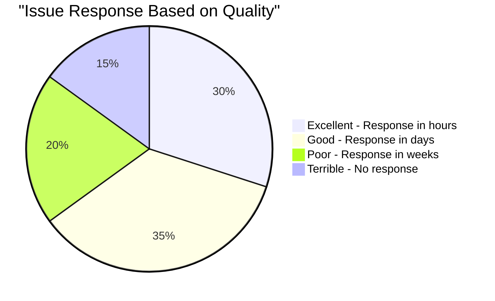
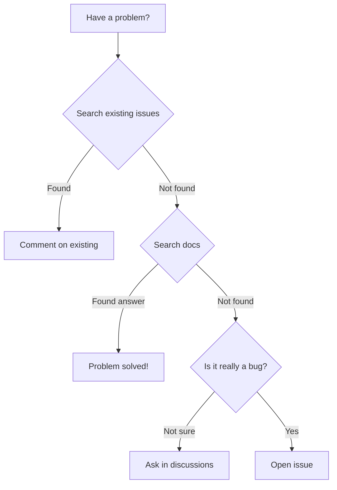
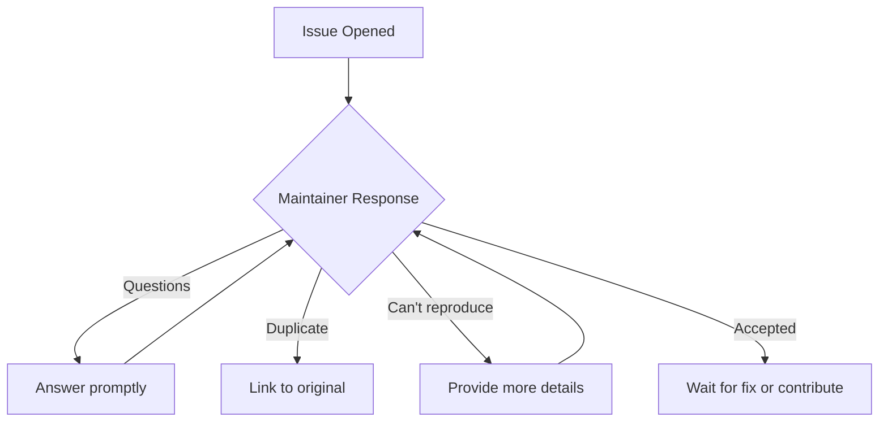

# How to Raise a Good Issue

A well-written issue gets attention. A poorly-written one gets ignored.

## Why Issue Quality Matters



**65%** of well-written issues get quick responses!

## Before You Open an Issue



### Pre-Issue Checklist

- [ ] Searched existing issues (open AND closed)
- [ ] Checked the documentation
- [ ] Checked FAQ/troubleshooting
- [ ] Using latest version
- [ ] Can reproduce consistently

## Anatomy of a Great Issue

### Title

```markdown
❌ Bad: "It's broken"
❌ Bad: "Help please"
❌ Bad: "Bug"

✅ Good: "[Bug] Login fails with special characters in password"
✅ Good: "[Feature] Add dark mode support"
✅ Good: "TypeError when processing empty array in v2.3.1"
```

### Body Structure

```markdown
## Description

[Clear, one-paragraph explanation of the issue]

## Steps to Reproduce

1. Go to '...'
2. Click on '...'
3. Enter '...'
4. See error

## Expected Behavior

[What should happen]

## Actual Behavior

[What actually happens]

## Environment

- OS: [e.g., Ubuntu 22.04]
- Browser: [if relevant]
- Version: [e.g., v2.3.1]
- Node.js: [if relevant]

## Additional Context

[Screenshots, logs, related issues]
```

## Issue Template Examples

### Bug Report

```markdown
## 🐛 Bug Report

### Description
The login form crashes when the password contains the "#" character.

### Steps to Reproduce
1. Go to /login
2. Enter any email
3. Enter password: "Test#123"
4. Click "Login"
5. App crashes with white screen

### Expected Behavior
Login should succeed or show validation error.

### Actual Behavior
App crashes. Console shows:
```
TypeError: Cannot read property 'split' of undefined
    at validatePassword (auth.js:45)
```

### Environment
- OS: macOS Ventura 13.4
- Browser: Chrome 115.0.5790.170
- App Version: 2.3.1

### Additional Context
Works fine without special characters. First noticed after updating to 2.3.1.

### Possible Fix
Line 45 in auth.js doesn't handle undefined input.
```

### Feature Request

```markdown
## 💡 Feature Request

### Description
Add ability to export data as CSV file.

### Use Case
As a user, I want to export my transaction history so I can analyze it in Excel.

### Proposed Solution
Add an "Export CSV" button in the transaction list header that downloads all visible transactions.

### Alternatives Considered
1. Copy/paste to spreadsheet (tedious for large datasets)
2. Use API directly (requires technical knowledge)

### Additional Context
Many similar tools offer this (see competitor X, Y).

Would be happy to implement this if approach is approved.
```

## What to Include

### For Bugs

| Element | Why It's Important |
|---------|-------------------|
| Version number | Bug may be fixed in newer version |
| OS/environment | May be platform-specific |
| Steps to reproduce | Maintainer must recreate it |
| Error messages | Exact text, not paraphrased |
| Screenshots | Visual bugs need visual proof |
| Minimal example | Isolates the issue |

### For Features

| Element | Why It's Important |
|---------|-------------------|
| Use case | Why you need it |
| Proposed solution | Shows you've thought about it |
| Alternatives | Shows you've considered options |
| Willingness to help | Maintainers love contributors |

## Creating Minimal Reproductions

### What's a Minimal Reproduction?

The **smallest possible code** that demonstrates the issue.

```javascript
// ❌ Too much context (entire app)
// [500 lines of code]
// "The bug is somewhere in here"

// ✅ Minimal reproduction
const result = processData(null);
// Throws: TypeError: Cannot read property 'length' of null
```

### Online Reproduction Tools

| Language | Tool |
|----------|------|
| JavaScript | CodeSandbox, StackBlitz |
| React | CodeSandbox |
| Python | Replit |
| Go | Go Playground |
| Rust | Rust Playground |
| General | GitHub Gist |

### Reproduction Template

```markdown
## Reproduction

**CodeSandbox:** [link]

Or run locally:
```bash
git clone https://github.com/user/minimal-repro
cd minimal-repro
npm install
npm run demo  # See the error
```

## Formatting Tips

### Code Blocks

````markdown
Use language-specific syntax highlighting:

```javascript
const broken = someFunction(null);
```

Not just:
```
const broken = someFunction(null);
```
````

### Error Messages

```markdown
Full error with stack trace:

```
TypeError: Cannot read property 'map' of undefined
    at processItems (/src/utils.js:23:15)
    at handleData (/src/handlers.js:45:10)
    at async main (/src/index.js:12:5)
```
```

### Screenshots

```markdown


Use annotations to highlight the problem:

```

### Logs

```markdown
<details>
<summary>Full debug log (click to expand)</summary>

```
[2024-01-15 10:23:45] DEBUG: Starting process
[2024-01-15 10:23:46] ERROR: Connection failed
[2024-01-15 10:23:46] DEBUG: Retrying...
[... many more lines ...]
```

</details>
```

## Common Mistakes

### ❌ Mistake: Vague Description

```markdown
Bad: "It doesn't work"

Good: "The save button is disabled after entering valid data in all required fields"
```

### ❌ Mistake: Missing Steps

```markdown
Bad: "I clicked the button and it crashed"

Good:
1. Open settings page
2. Change language to Spanish
3. Click "Save"
4. App crashes with error: [error message]
```

### ❌ Mistake: No Version Info

```markdown
Bad: "Using latest version"

Good: "Version 2.3.1 (also tested on 2.3.0, same issue)"
```

### ❌ Mistake: Assumptions

```markdown
Bad: "The bug is in the database code"

Good: "Error occurs when saving data. Here's what I see: [actual evidence]"
```

## After Opening the Issue



### Be Responsive

- Answer questions within 24-48 hours
- Provide requested information
- Update if you find new details
- Close if you solved it yourself

### If No Response

Wait at least a week, then:

```markdown
@maintainer - Just checking if you need any additional information about this issue. Happy to provide more details or a minimal reproduction if helpful.
```

## Issue Etiquette

### Do

- ✅ Be patient (maintainers are busy)
- ✅ Be grateful (it's volunteer work)
- ✅ Be precise (save maintainer time)
- ✅ Offer to help (shows commitment)

### Don't

- ❌ Demand immediate fixes
- ❌ Use aggressive language
- ❌ Open duplicates
- ❌ Hijack other issues
- ❌ Ping maintainers repeatedly

## Quick Reference

### Issue Title Formats

| Type | Format |
|------|--------|
| Bug | `[Bug] Short description of the bug` |
| Feature | `[Feature] Proposed feature name` |
| Question | `[Question] What you need help with` |
| Docs | `[Docs] What's missing or wrong` |

### Minimum Required Info

For bugs:
1. Steps to reproduce
2. Expected vs actual behavior
3. Version/environment
4. Error message (if any)

For features:
1. What you want
2. Why you want it
3. How it might work

## Next Steps

Learn the difference between issue types:

➡️ [Bug Reports vs Feature Requests →](issue-types)

---

> **Remember:** A well-written issue isn't just about getting your problem solved—it's a contribution to the project. Future users with the same problem will benefit from your clear documentation.
