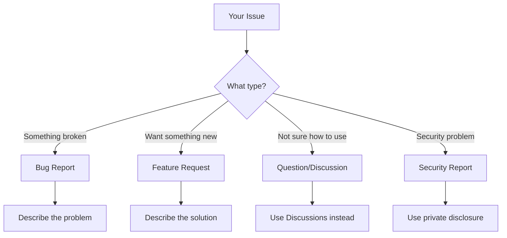
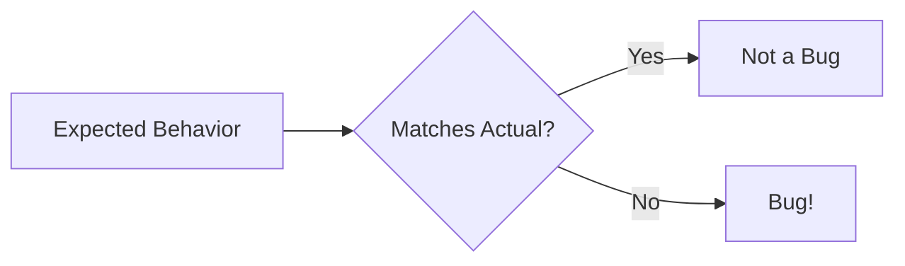
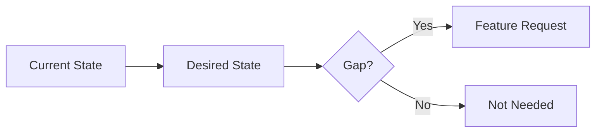
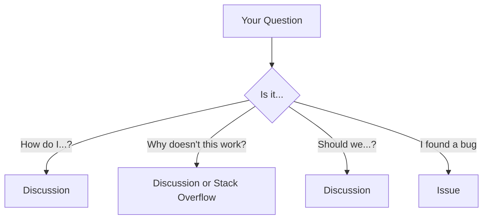
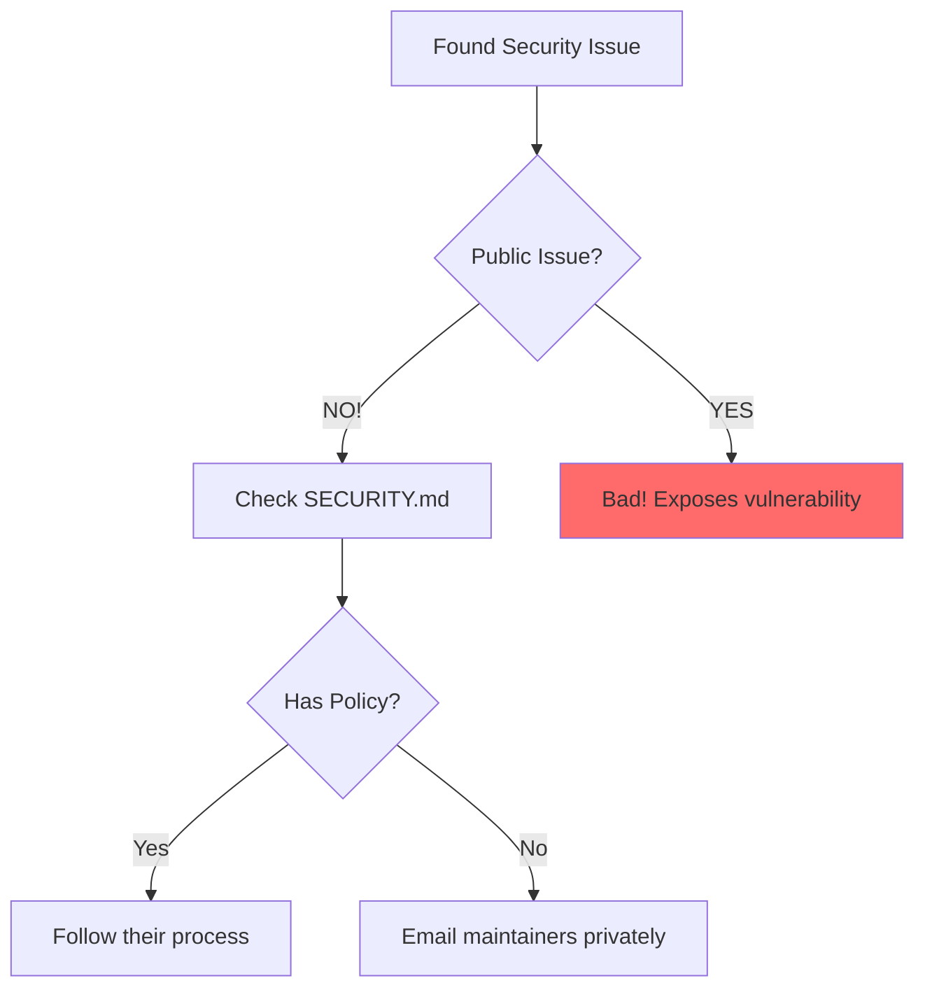
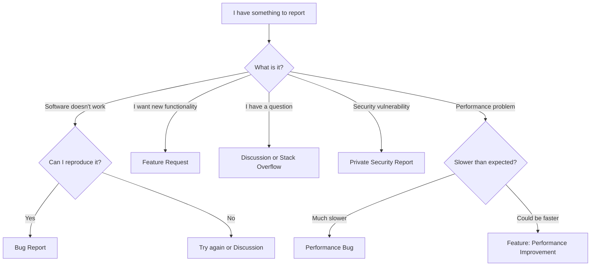

# Bug Reports vs Feature Requests

Different issues need different approaches. Using the wrong format leads to confusion.

## Quick Comparison



## When to File What

| Situation | Issue Type |
|-----------|-----------|
| App crashes | Bug Report |
| Feature doesn't work as documented | Bug Report |
| Want new functionality | Feature Request |
| Suggest improvement to existing feature | Feature Request |
| Performance issue | Bug Report or Performance Issue |
| Security vulnerability | Security Report (private) |
| Question about usage | Discussion (not issue) |
| Help with your code | Discussion or Stack Overflow |

## Bug Reports

### Definition

A bug is when the software **doesn't work as intended**.



### What Makes a Good Bug Report

| Component | Description | Required |
|-----------|-------------|----------|
| Title | Clear, specific summary | ✅ Yes |
| Steps to reproduce | Exact actions to see the bug | ✅ Yes |
| Expected behavior | What should happen | ✅ Yes |
| Actual behavior | What actually happens | ✅ Yes |
| Environment | OS, version, etc. | ✅ Yes |
| Error message | Exact error text | If applicable |
| Screenshots | Visual proof | If applicable |
| Workaround | Temporary fix you found | Optional |

### Bug Report Template

```markdown
## 🐛 Bug Report

### Summary
[One-line description of the bug]

### Steps to Reproduce
1. 
2. 
3. 

### Expected Behavior
[What should happen]

### Actual Behavior
[What actually happens]

### Error Message
```
[Paste exact error here]
```

### Environment
- **OS:** [e.g., Windows 11, macOS Ventura, Ubuntu 22.04]
- **Version:** [e.g., v2.3.1]
- **Browser:** [if web app]
- **Node.js:** [if relevant]

### Screenshots
[If applicable]

### Additional Context
[Any other relevant information]

### Possible Fix
[If you have ideas about what might be wrong]
```

### Bug Report Example

```markdown
## 🐛 Bug Report

### Summary
Password reset email contains broken link on production

### Steps to Reproduce
1. Go to /forgot-password
2. Enter email: test@example.com
3. Click "Reset Password"
4. Open email received
5. Click reset link in email

### Expected Behavior
Link should open password reset form at https://app.example.com/reset?token=xxx

### Actual Behavior
Link points to https://localhost:3000/reset?token=xxx (development URL)

### Error Message
No error, but link is incorrect

### Environment
- **OS:** N/A (server-side issue)
- **Version:** v2.3.1 (deployed Jan 15, 2024)
- **Email Provider:** SendGrid

### Screenshots


### Additional Context
Started happening after deploy on Jan 15. Previous version worked correctly.

### Possible Fix
BASE_URL environment variable might not be set in production.
```

## Feature Requests

### Definition

A feature request proposes **new functionality** or **improvements**.



### What Makes a Good Feature Request

| Component | Description | Required |
|-----------|-------------|----------|
| Title | Clear feature name | ✅ Yes |
| Problem/motivation | Why you need it | ✅ Yes |
| Proposed solution | What you want | ✅ Yes |
| Use cases | Specific examples | ✅ Yes |
| Alternatives | Other options you considered | Recommended |
| Mockups | Visual if UI-related | Optional |
| Implementation ideas | Technical suggestions | Optional |

### Feature Request Template

```markdown
## 💡 Feature Request

### Problem Statement
[What problem does this solve?]

### Proposed Solution
[Describe the feature you want]

### Use Cases
1. **As a [user type]**, I want to [action] so that [benefit]
2. 

### Alternatives Considered
1. [Alternative 1] - Why it doesn't work
2. [Alternative 2] - Why it doesn't work

### Additional Context
[Mockups, examples from other tools, etc.]

### Implementation
[If you have technical ideas]

### Contribution
- [ ] I'm willing to implement this feature
- [ ] I can help test this feature
- [ ] I can help document this feature
```

### Feature Request Example

```markdown
## 💡 Feature Request

### Problem Statement
Currently, users cannot export their data. This makes it difficult to:
- Migrate to other tools
- Create backups
- Analyze data in spreadsheets

### Proposed Solution
Add an "Export" button that downloads user data as CSV or JSON.

### Use Cases
1. **As a power user**, I want to export my transactions to analyze them in Excel
2. **As a business user**, I want to backup my data monthly for compliance
3. **As a developer**, I want to export as JSON to use in my own scripts

### Alternatives Considered
1. **Manual copy/paste** - Too tedious for large datasets
2. **API access** - Too technical for most users
3. **Third-party tools** - Privacy concerns

### Additional Context
Similar tools offer this feature:
- Competitor A: CSV export
- Competitor B: CSV + JSON + PDF

### Implementation
Possible approach:
1. Add export button to toolbar
2. Modal to select format (CSV/JSON)
3. Generate file on client or server
4. Trigger download

### Contribution
- [x] I'm willing to implement this feature
- [x] I can help test this feature
- [x] I can help document this feature
```

## Not Issues: Questions & Discussions

### When to Use Discussions



### Questions That Belong in Discussions

- "How do I configure X?"
- "What's the best practice for Y?"
- "Can this library do Z?"
- "Help with my code"
- "General feedback"

### Example: Wrong (Issue) vs Right (Discussion)

```markdown
❌ ISSUE: "How do I use the API?"

✅ DISCUSSION:
## Question: API Authentication Best Practices

I'm trying to integrate your API into my app. The docs show basic auth, 
but I'm wondering:

1. Is there an OAuth option?
2. What's the recommended approach for mobile apps?
3. Any rate limit considerations?

Thanks in advance!
```

## Security Reports

### Never Public!



### How to Report Security Issues

1. Check for `SECURITY.md` in repository
2. Look for security email in README
3. Use GitHub's private vulnerability reporting
4. Never describe the vulnerability publicly

### Security Report Template (Private)

```markdown
Subject: Security Vulnerability in [Component]

## Summary
[Brief description without technical details]

## Affected Versions
[Which versions are affected]

## Severity Assessment
[Your assessment: Critical/High/Medium/Low]

## Technical Details
[Detailed description - this is private]

## Proof of Concept
[Minimal code to reproduce - this is private]

## Suggested Fix
[If you have ideas]

## Disclosure Timeline
I'm happy to follow responsible disclosure. 
Please let me know your preferred timeline.
```

## Comparison Table

| Aspect | Bug Report | Feature Request | Security Report |
|--------|-----------|----------------|-----------------|
| **Purpose** | Fix broken thing | Add new thing | Report vulnerability |
| **Visibility** | Public | Public | Private |
| **Required info** | Reproduction steps | Use cases | Proof of concept |
| **Urgency** | Depends on severity | Usually low | High |
| **Who responds** | Any maintainer | Usually leads | Security team |

## Labels to Watch For

| Label | Meaning |
|-------|---------|
| `bug` | Confirmed bug |
| `feature` / `enhancement` | Feature request |
| `question` | Should be discussion |
| `duplicate` | Already exists |
| `wontfix` | Won't be addressed |
| `good first issue` | Great for beginners |
| `help wanted` | Contributions welcome |
| `needs-triage` | Not yet reviewed |

## Decision Flowchart



## Quick Reference

### Issue Type Keywords

| If you're saying... | Issue Type |
|--------------------|-----------|
| "X is broken" | Bug |
| "X crashes when..." | Bug |
| "X should do Y" | Feature |
| "Would be nice if X" | Feature |
| "How do I X?" | Discussion |
| "Security issue in X" | Private Report |

## Next Steps

Learn how to write PRs that get merged:

➡️ [Writing a High-Quality PR →](writing-prs)

---

> **Remember:** Choosing the right issue type isn't just about following rules—it helps maintainers triage and respond faster, which means your issue gets resolved faster.
