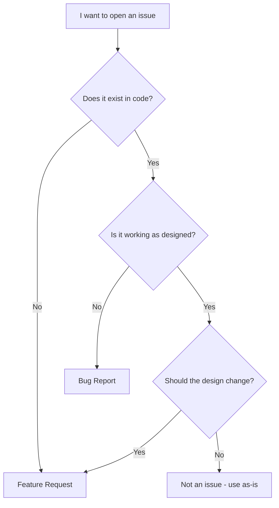
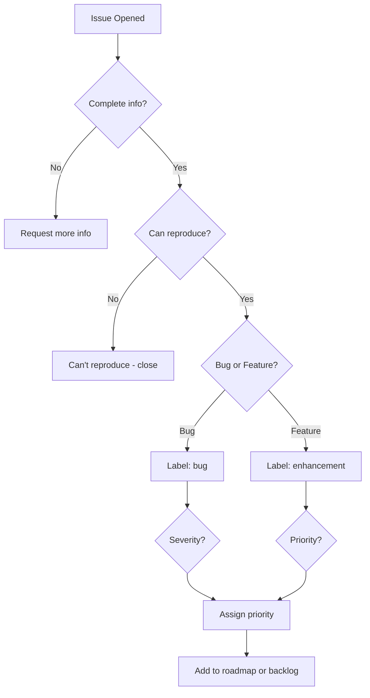

# Bug Reports vs Feature Requests

import { Bug, Lightbulb, Target, AlertTriangle } from 'lucide-react'

Different types of issues require different approaches. Use the right template for faster triage.

<Callout type="info" title="The Core Distinction">
**Bug:** Something broken that should work
**Feature:** Something new that doesn't exist yet
</Callout>

## Decision Tree



---

## Bug Reports

### When to File a Bug

<Checklist>
<ChecklistItem>Something that worked now doesn't</ChecklistItem>
<ChecklistItem>Error messages or crashes</ChecklistItem>
<ChecklistItem>Unexpected behavior vs documentation</ChecklistItem>
<ChecklistItem>Security vulnerability</ChecklistItem>
<ChecklistItem>Performance regression</ChecklistItem>
</Checklist>

### Bug Report Template

```markdown
## Bug Description
[Clear one-liner]

## Environment
- Version/commit:
- OS:
- Runtime:
- Browser (if applicable):

## Current Behavior
[What actually happens]

## Expected Behavior
[What should happen]

## Steps to Reproduce
1. 
2. 
3. 

## Error Logs
```
[Trimmed, relevant logs]
```

## Impact
- Frequency: always / sometimes / rare
- Severity: blocks users / annoying / minor
- Affected users: % or count

## Possible Regression
- Last known working version:
- Possibly related PR/commit:
```

### Bug Severity Levels

| Level | Description | Example | Response Time |
|-------|-------------|---------|---------------|
| **S1 - Critical** | Production down, data loss | Database corruption | Hours |
| **S2 - Major** | Core feature broken | Login fails for all users | 1-3 days |
| **S3 - Minor** | Edge case, has workaround | Typo in error message | 1-2 weeks |
| **S4 - Trivial** | Cosmetic, no impact | CSS alignment off by 1px | Backlog |

---

## Feature Requests

### When to File a Feature Request

<Checklist>
<ChecklistItem>New capability you need</ChecklistItem>
<ChecklistItem>Improvement to existing workflow</ChecklistItem>
<ChecklistItem>API expansion</ChecklistItem>
<ChecklistItem>Performance optimization idea</ChecklistItem>
</Checklist>

### Feature Request Template

```markdown
## Problem Statement
[What user problem does this solve? NOT the solution.]

## Current Workaround
[How do users handle this today?]

## Proposed Solution
[Your idea - be open to alternatives]

## Alternatives Considered
- Option A: [pros/cons]
- Option B: [pros/cons]

## Impact
- Who benefits: [user personas]
- How often used: [daily/weekly/rarely]
- Priority: [must-have / nice-to-have]

## Implementation Notes (Optional)
- Estimated complexity:
- Affected components:
- Breaking changes:

## Open Questions
- [ ] Question 1
- [ ] Question 2
```

### Feature Priority Matrix

```mermaid
quadrantChart
    title Feature Request Evaluation
    x-axis Low Effort --> High Effort
    y-axis Low Impact --> High Impact
    quadrant-1 High Priority (Do First)
    quadrant-2 Plan & Design
    quadrant-3 Low Priority
    quadrant-4 Probably Not
    "API endpoint": [0.3, 0.8]
    "Export to CSV": [0.4, 0.6]
    "Dark mode": [0.6, 0.7]
    "Rewrite in Rust": [0.95, 0.5]
    "Config option": [0.2, 0.4]
```

---

## Comparison

```
┌─────────────────────────────────────────────────────────────────────────────┐
│                       BUG REPORT VS FEATURE REQUEST                         │
├─────────────────────────────────────────────────────────────────────────────┤
│                                                                             │
│   Aspect           │  Bug Report              │  Feature Request           │
│   ════════         │  ═══════════             │  ════════════              │
│                    │                          │                            │
│   Focus            │  What's broken           │  What's missing            │
│                    │                          │                            │
│   Tone             │  "This should work"      │  "This would be nice"      │
│                    │                          │                            │
│   Urgency          │  Often immediate         │  Can be backlogged         │
│                    │                          │                            │
│   Repro Steps      │  Essential               │  N/A                       │
│                    │                          │                            │
│   Solution         │  Fix the code            │  Design → implement        │
│                    │                          │                            │
│   Timeline         │  Days to weeks           │  Weeks to months           │
│                    │                          │                            │
│   Maintainer Q     │  "Can you reproduce?"    │  "Why do you need this?"   │
│                    │                          │                            │
└─────────────────────────────────────────────────────────────────────────────┘
```

---

## Examples

### ✅ Good Bug Report

```markdown
Title: [Auth] User session expires immediately after login on Safari 17

## Bug Description
After successful login, users are immediately logged out on Safari 17 on iOS.

## Environment
- Version: v2.1.0
- Browser: Safari 17.2 on iOS 17.2
- Device: iPhone 14 Pro

## Current Behavior
1. User logs in with correct credentials
2. Redirect to dashboard succeeds
3. Within 1-2 seconds, user is logged out
4. Forced to login again (infinite loop)

## Expected Behavior
User should remain logged in for 7 days (as per session config)

## Steps to Reproduce
1. Open app on Safari iOS
2. Login with test@example.com / password123
3. Watch session expire immediately

## Error Logs
```
Console: "Cookie 'session_token' set with SameSite=None but Secure flag missing"
```

## Impact
- Frequency: 100% on Safari iOS
- Affects ~15% of user base (iOS users)
- No workaround (can't login)

## Possible Cause
Safari 17 enforces stricter SameSite cookie policies. Session cookie likely missing Secure flag.
```

---

### ✅ Good Feature Request

```markdown
Title: [API] Add pagination to /api/users endpoint

## Problem Statement
The /api/users endpoint returns all users (10,000+) in a single response, causing:
- Slow page loads (3-5 seconds)
- Memory issues on mobile
- Wasted bandwidth

## Current Workaround
We fetch all users and paginate client-side, which is inefficient.

## Proposed Solution
Add pagination params to /api/users:
```
GET /api/users?page=1&per_page=50
```

Response:
```json
{
  "data": [...],
  "page": 1,
  "per_page": 50,
  "total": 10000,
  "total_pages": 200
}
```

## Alternatives Considered
1. **Cursor-based pagination**: More scalable but requires sorting column
2. **Offset/limit**: Simple but can be slow on large datasets

## Impact
- Who benefits: All API consumers
- Frequency: Every page load (critical path)
- Priority: High - performance blocker

## Implementation Notes
- Estimated effort: Medium (backend + tests)
- Affected endpoints: /api/users, potentially /api/posts
- Breaking change: No (default behavior stays same)

## Open Questions
- Should we default to paginated if no params provided?
- Max per_page limit to prevent abuse?
```

---

### ❌ Bad Examples

**Bad Bug Report:**
```
Title: It's broken

Login doesn't work. Fix it please.
```
- No details
- No reproduction
- No environment
- Useless

**Bad Feature Request:**
```
Title: Add AI

You should add AI to make the app better.
```
- Vague
- No problem statement
- No specifics
- Buzzword soup

---

## Special Cases

### Security Vulnerabilities

<Warning title="Don't Open Public Issues">
**NEVER report security issues publicly.**

Instead:
1. Check SECURITY.md for responsible disclosure process
2. Email security@project.org (usually listed in SECURITY.md)
3. Use GitHub Security Advisories (if available)
4. Give maintainers time to fix before public disclosure
</Warning>

### Documentation Issues

Can be filed as bugs if docs are wrong, or feature requests if docs are missing:

```markdown
Title: [Docs] Installation guide missing Node.js version requirement

Type: Bug (documentation is incorrect/incomplete)

Current: Docs don't mention Node version
Expected: Should state "Requires Node.js 18+"
Impact: New users can't install (Node 16 not supported)
```

---

## Triage Process (What Maintainers Do)



---

## Increasing Acceptance Chances

<CardGrid>
<Card title="For Bugs" icon={<Bug className="h-5 w-5" />}>
**Provide perfect reproduction steps.** If a maintainer can reproduce in 5 minutes, you're 10x more likely to get a fix.
</Card>

<Card title="For Features" icon={<Lightbulb className="h-5 w-5" />}>
**Focus on the problem, not your solution.** Maintainers might have better ideas. Explain the "why" clearly.
</Card>

<Card title="For Both" icon={<Target className="h-5 w-5" />}>
**Show community interest.** Link to forum discussions, tweets, or similar requests. Demonstrates real demand.
</Card>
</CardGrid>

---

## When NOT to Open an Issue

Use **Discussions** or **Forums** instead if:

- Asking "how do I...?" questions
- Seeking debugging help for your code
- Proposing major architecture changes (needs discussion first)
- Sharing ideas without clear requirements
- Requesting support for unsupported environments

---

## Next Steps

Now learn how to translate issues into mergeable pull requests:

➡️ [Writing a High-Quality PR →](writing-prs)

---

> **Remember:** Bugs need evidence. Features need justification. Both need clarity.
