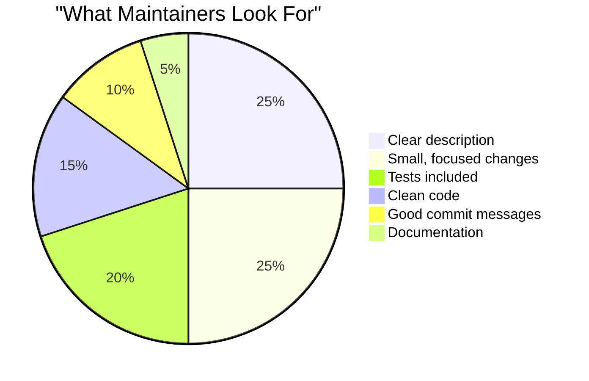
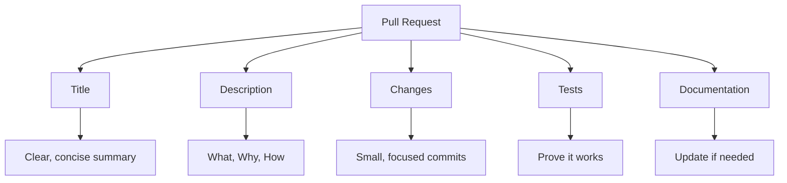
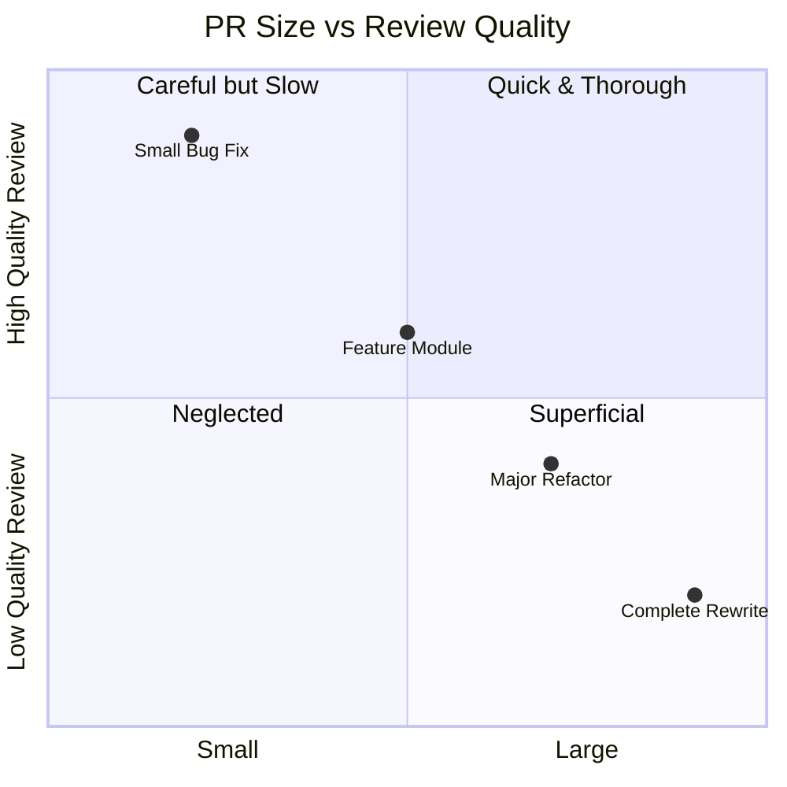
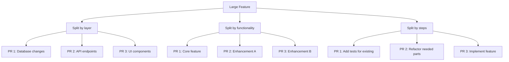
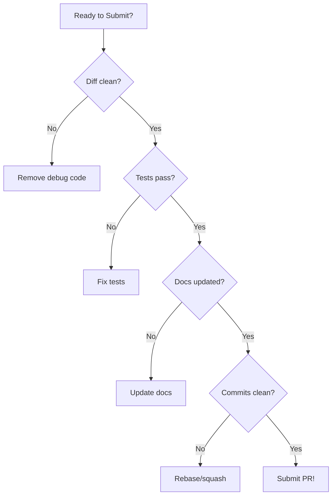
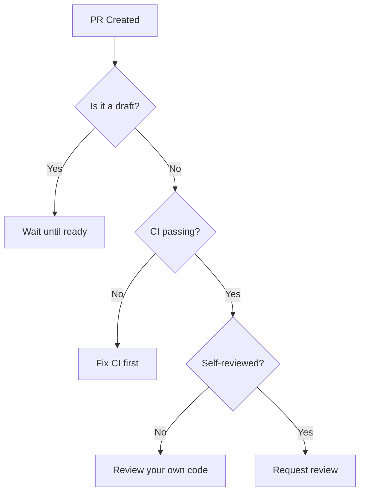

# Writing a High-Quality PR

A high-quality PR is a gift to maintainers. It's easy to review, easy to merge, and easy to maintain.

## The Ideal PR



## PR Anatomy



## Before You Start

### Pre-PR Checklist

- [ ] Issue exists (or create one)
- [ ] Approach discussed with maintainers
- [ ] Fork is up to date with upstream
- [ ] New branch created from main/master
- [ ] Contributing guidelines read

### Branch Naming

```bash
# Convention: type/description
feature/add-dark-mode
fix/login-crash-special-chars
docs/update-installation-guide
refactor/simplify-auth-logic
```

## Writing the PR Title

### Format

```
type(scope): brief description

# Examples
feat(auth): add password strength indicator
fix(api): handle null response from server
docs(readme): add Windows installation steps
test(utils): add tests for date formatting
refactor(db): simplify connection pooling
```

### Title Types

| Type | When to Use |
|------|------------|
| `feat` | New feature |
| `fix` | Bug fix |
| `docs` | Documentation only |
| `style` | Formatting, no logic change |
| `refactor` | Code restructuring |
| `test` | Adding tests |
| `chore` | Maintenance tasks |
| `perf` | Performance improvements |

### Good vs Bad Titles

```markdown
❌ Bad:
- "Fixed stuff"
- "Updates"
- "WIP"
- "Please merge"

✅ Good:
- "fix(auth): prevent XSS in login form"
- "feat(api): add pagination to user endpoint"
- "docs: add troubleshooting section for Linux"
```

## Writing the Description

### The Template

```markdown
## Summary

[One paragraph explaining what this PR does]

## Related Issue

Fixes #123
Closes #456
Related to #789

## Changes

- [Change 1]
- [Change 2]
- [Change 3]

## Type of Change

- [ ] Bug fix (non-breaking change that fixes an issue)
- [ ] New feature (non-breaking change that adds functionality)
- [ ] Breaking change (fix or feature that would cause existing functionality to change)
- [ ] Documentation update

## How Has This Been Tested?

[Describe testing approach]

- [ ] Unit tests
- [ ] Integration tests
- [ ] Manual testing

## Screenshots (if applicable)

[Before/after screenshots for UI changes]

## Checklist

- [ ] My code follows the project's style guidelines
- [ ] I have performed a self-review
- [ ] I have commented hard-to-understand code
- [ ] I have updated documentation
- [ ] My changes generate no new warnings
- [ ] I have added tests
- [ ] All tests pass locally
```

### Example: Complete PR Description

```markdown
## Summary

This PR adds a password strength indicator to the signup form. 
Users can now see real-time feedback about their password security.

## Related Issue

Fixes #234 - Users want to know if their password is strong enough

## Changes

- Added `PasswordStrength` component with visual indicator
- Integrated zxcvbn library for password analysis
- Added strength requirements tooltip
- Added unit tests for the component
- Updated signup form documentation

## Type of Change

- [ ] Bug fix
- [x] New feature
- [ ] Breaking change
- [ ] Documentation update

## How Has This Been Tested?

- [x] Unit tests for PasswordStrength component
- [x] Integration test for signup flow
- [x] Manual testing on Chrome, Firefox, Safari
- [x] Accessibility testing with VoiceOver

## Screenshots

### Before


### After


## Checklist

- [x] My code follows the project's style guidelines
- [x] I have performed a self-review
- [x] I have commented hard-to-understand code
- [x] I have updated documentation
- [x] My changes generate no new warnings
- [x] I have added tests
- [x] All tests pass locally
```

## Keeping PRs Small

### Why Size Matters



### Size Guidelines

| PR Size | Lines Changed | Review Time | Quality |
|---------|---------------|-------------|---------|
| Tiny | < 50 | Minutes | Excellent |
| Small | 50-200 | Hours | Good |
| Medium | 200-500 | Days | Moderate |
| Large | 500+ | Weeks | Poor |

### How to Keep PRs Small



### Stacked PRs

For large features:

```
main
  └── feature/user-auth-base (PR #1)
       └── feature/user-auth-api (PR #2)
            └── feature/user-auth-ui (PR #3)
```

## Commit Structure

### One Logical Change Per Commit

```bash
# ❌ Bad: Everything in one commit
git add .
git commit -m "Add feature"

# ✅ Good: Logical commits
git add src/components/Button.tsx
git commit -m "feat(ui): add Button component"

git add src/components/Button.test.tsx
git commit -m "test(ui): add Button component tests"

git add docs/components.md
git commit -m "docs: add Button documentation"
```

### Clean Up Before PR

```bash
# Squash/fixup messy commits
git rebase -i HEAD~5

# Choose commits to squash:
# pick abc123 feat: add user auth
# fixup def456 fix typo
# fixup ghi789 fix another typo
# fixup jkl012 oops forgot file
```

## Self-Review

Before requesting review:



### Self-Review Checklist

- [ ] No console.log or debug statements
- [ ] No commented-out code
- [ ] No unrelated changes
- [ ] No merge conflicts
- [ ] Tests pass locally
- [ ] Linting passes
- [ ] Types are correct (if TypeScript)

## Draft PRs

### When to Use Drafts

- Work in progress, need feedback
- Sharing approach before finishing
- CI setup to run on PR
- Blocking on external dependency

### Draft PR Template

```markdown
## 🚧 Work in Progress

This PR is not ready for review yet.

## What's Done
- [x] Basic implementation
- [x] Happy path works

## What's Left
- [ ] Error handling
- [ ] Tests
- [ ] Documentation

## Questions for Maintainers
1. Is this the right approach for X?
2. Should I use library A or B?

## When Ready
I'll mark this as "Ready for Review" when complete.
```

## Linking Issues

### How to Link

```markdown
# Keywords that close issues when PR is merged:
Fixes #123
Closes #123
Resolves #123

# Reference without closing:
Related to #123
See #123
Part of #123
```

### Multiple Issues

```markdown
## Related Issues

Fixes #123 - Main bug this addresses
Fixes #124 - Related issue also fixed
Related to #100 - Parent epic
```

## Requesting Review

### When to Request



### How to Request

```markdown
@maintainer - This PR is ready for review. 
It implements #123 as discussed. 
Happy to make any changes you suggest.
```

## Common Mistakes

### ❌ Too Large

```markdown
PR: "Refactor entire codebase"
Changed files: 150
Lines changed: 10,000+

# This will never get proper review
```

### ❌ Poor Description

```markdown
Title: "Fix"
Description: "Fixed the bug"

# No one knows what this does
```

### ❌ Unrelated Changes

```markdown
PR: "Fix login bug"
Also includes:
- Updated eslint config
- Renamed variables throughout
- Added new feature

# Should be 3 separate PRs
```

### ❌ Broken CI

```markdown
CI Status: ❌ Failing
Requesting: "Please review"

# Fix CI before asking for review
```

## Quick Reference

### PR Title Formula

```
type(scope): imperative description

Examples:
feat(api): add user search endpoint
fix(auth): handle expired tokens gracefully
docs: update API reference
```

### Minimum PR Description

```markdown
## Summary
[What and why]

## Related Issue
Fixes #XXX

## Changes
- [List key changes]

## Testing
[How you tested]
```

## Next Steps

Use the complete PR template:

➡️ [PR Description Template →](pr-template)

---

> **Remember:** Your PR isn't just code—it's a communication. Make it easy to understand, and maintainers will be happy to review it.
