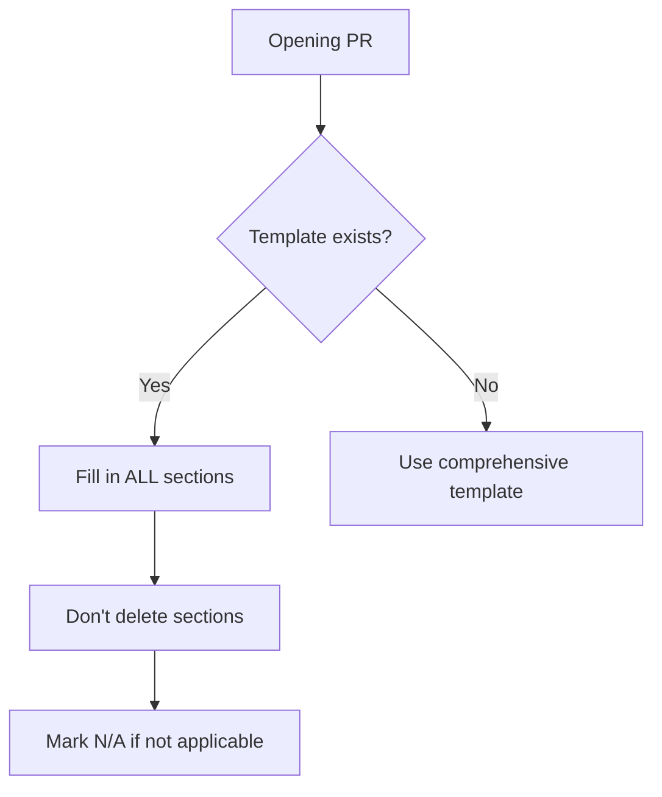

# PR Description Template

A well-structured PR description is a gift to reviewers. Here's exactly what to include.

## The Complete Template

```markdown
## Summary

<!-- One paragraph explaining what this PR does and why -->

## Related Issue

<!-- Link to related issues -->
Fixes #
Related to #

## Motivation and Context

<!-- Why is this change needed? What problem does it solve? -->

## Changes Made

<!-- Bullet list of changes -->
- 
- 
- 

## Type of Change

<!-- Check the relevant option -->
- [ ] 🐛 Bug fix (non-breaking change that fixes an issue)
- [ ] ✨ New feature (non-breaking change that adds functionality)
- [ ] 💥 Breaking change (fix or feature that would cause existing functionality to change)
- [ ] 📝 Documentation update
- [ ] 🎨 Style/formatting (no functional changes)
- [ ] ♻️ Refactoring (no functional changes)
- [ ] ⚡ Performance improvement
- [ ] 🧪 Test update

## How Has This Been Tested?

<!-- Describe testing approach -->
- [ ] Unit tests
- [ ] Integration tests
- [ ] E2E tests
- [ ] Manual testing

### Test Configuration
- OS: 
- Browser (if applicable): 
- Version: 

## Screenshots/Recordings

<!-- For UI changes, add before/after screenshots -->
### Before
<!-- Screenshot -->

### After
<!-- Screenshot -->

## Checklist

<!-- Verify you've completed these items -->
- [ ] My code follows the project's coding standards
- [ ] I have performed a self-review of my code
- [ ] I have commented my code, particularly in hard-to-understand areas
- [ ] I have made corresponding changes to the documentation
- [ ] My changes generate no new warnings
- [ ] I have added tests that prove my fix is effective or my feature works
- [ ] New and existing unit tests pass locally with my changes
- [ ] Any dependent changes have been merged and published

## Additional Notes

<!-- Any other information reviewers should know -->
```

## Template Breakdown

### Summary Section

```markdown
## Summary

This PR implements automatic session timeout for security compliance.
When a user is inactive for 15 minutes, they are automatically logged out
and redirected to the login page with an explanatory message.
```

**What to include:**
- What the PR does (not how)
- Why it's needed
- Key behavior change

**What NOT to include:**
- Implementation details (that's in the code)
- The entire issue description (link to it)

### Related Issues

```markdown
## Related Issue

Fixes #234 - Session timeout for security compliance
Fixes #235 - Users stay logged in forever (security risk)
Related to #100 - Security improvements epic
See also #256 - Similar feature for admin panel
```

**Keywords that close issues:**
- `Fixes #123`
- `Closes #123`
- `Resolves #123`

**Keywords that just reference:**
- `Related to #123`
- `See #123`
- `Part of #123`

### Motivation and Context

```markdown
## Motivation and Context

Our security audit identified that users can remain logged in indefinitely,
which is a compliance violation for SOC 2. This PR implements automatic
session timeout after 15 minutes of inactivity.

Without this change:
- Sessions never expire
- Shared computers pose security risk
- We fail compliance requirements

With this change:
- Sessions auto-expire after 15 min
- Users see clear message explaining logout
- We meet SOC 2 requirement 8.1.4
```

### Changes Made

```markdown
## Changes Made

### Added
- `SessionTimeoutProvider` component to track activity
- `useIdleTimer` hook for detecting inactivity
- Session timeout warning modal (shows at 14 min)
- Automatic logout at 15 min of inactivity

### Changed
- `AuthContext` now includes `lastActivity` timestamp
- Login page shows "session expired" message when applicable

### Removed
- Removed legacy `keepAlive` ping (no longer needed)

### Fixed
- Fixed race condition in logout flow
```

**Use semantic categories:**
- Added
- Changed
- Deprecated
- Removed
- Fixed
- Security

### Type of Change

```markdown
## Type of Change

- [ ] 🐛 Bug fix (non-breaking change that fixes an issue)
- [x] ✨ New feature (non-breaking change that adds functionality)
- [ ] 💥 Breaking change (fix or feature that would cause existing functionality to change)
- [ ] 📝 Documentation update
```

**Multiple types are okay:**

```markdown
- [x] ✨ New feature
- [x] 📝 Documentation update
```

### Testing Section

```markdown
## How Has This Been Tested?

### Automated Tests
- [x] Unit tests for `useIdleTimer` hook
- [x] Unit tests for `SessionTimeoutProvider`
- [x] Integration test for complete timeout flow
- [x] E2E test simulating 15-min timeout

### Manual Testing
- [x] Verified timeout works in Chrome, Firefox, Safari
- [x] Verified warning modal appears at 14 min
- [x] Verified logout at 15 min
- [x] Verified activity resets timer (mouse, keyboard)
- [x] Verified "session expired" message on login page

### Test Commands
```bash
npm test -- --grep "SessionTimeout"
npm run e2e -- --spec "session-timeout.spec.ts"
```

### Test Configuration
- OS: macOS Ventura, Ubuntu 22.04, Windows 11
- Browsers: Chrome 115, Firefox 116, Safari 16
- Node.js: 18.17.0
```

### Screenshots Section

```markdown
## Screenshots/Recordings

### Warning Modal (14 min)


### After Timeout


### Demo Recording
[Watch 30-second demo](link-to-video-or-gif)
```

**Tips:**
- Use before/after for changes
- Add annotations for clarity
- Keep images reasonably sized
- GIFs for interactions

### Checklist

```markdown
## Checklist

- [x] My code follows the project's coding standards
- [x] I have performed a self-review of my code
- [x] I have commented my code, particularly in hard-to-understand areas
- [x] I have made corresponding changes to the documentation
- [x] My changes generate no new warnings
- [x] I have added tests that prove my fix is effective
- [x] New and existing unit tests pass locally
- [x] Any dependent changes have been merged
```

### Additional Notes

```markdown
## Additional Notes

### Performance Considerations
Timer uses `setInterval` with 1-second resolution. This is intentional
as we need accurate timing for compliance. Battery impact is minimal
as modern browsers throttle intervals in background tabs.

### Migration Notes
Existing sessions will be logged out on first inactivity check after
deployment. Consider notifying users about the new security feature.

### Future Improvements
- Make timeout duration configurable (#300)
- Add "Remember me" option to extend timeout (#301)
```

## Simplified Templates

### For Small Bug Fixes

```markdown
## Summary

Fixes null pointer exception when user has no profile image.

## Related Issue

Fixes #234

## Changes

- Added null check in `UserAvatar` component
- Added test case for missing profile image

## Testing

- [x] Added unit test
- [x] Tested manually with test user
```

### For Documentation Only

```markdown
## Summary

Updates installation documentation for Windows users.

## Related Issue

Closes #456

## Changes

- Added PowerShell installation commands
- Added Windows-specific troubleshooting section
- Fixed broken links

## Checklist

- [x] Docs build without errors
- [x] Links verified
- [x] Spelling checked
```

### For Refactoring

```markdown
## Summary

Refactors authentication module to use async/await instead of callbacks.

## Motivation

- Improves code readability
- Enables better error handling
- Prepares for upcoming async features

## Changes

- Converted all callback-based auth functions to async/await
- No behavior changes
- All existing tests pass

## Testing

- [x] All existing tests pass
- [x] No new tests needed (behavior unchanged)

## Notes

This is a pure refactor. Functionality is identical.
```

## Project-Specific Templates

Many projects have their own templates. Always check:

```bash
# Template location
.github/PULL_REQUEST_TEMPLATE.md
.github/pull_request_template.md

# Multiple templates
.github/PULL_REQUEST_TEMPLATE/
├── bug_fix.md
├── feature.md
└── documentation.md
```

### If Project Has Template



## Common Mistakes

### ❌ Empty Template

```markdown
## Summary
<!-- Describe changes -->

## Related Issue
<!-- Link -->

## Changes
<!-- List -->
```

Fill it in! Don't leave placeholders.

### ❌ Too Brief

```markdown
## Summary
Fixed bug

## Changes
- Fixed it
```

Add detail! What bug? How fixed?

### ❌ Deleted Sections

```markdown
## Summary
Added feature X

<!-- Deleted everything else -->
```

Keep sections, mark N/A if not applicable.

### ❌ Wrong Checklist

```markdown
- [x] All items checked without actually checking
```

Only check what you actually did.

## Quick Reference

### Minimum Viable PR Description

```markdown
## Summary
[1-2 sentences: what and why]

## Related Issue
Fixes #XXX

## Changes
- [Key change 1]
- [Key change 2]

## Testing
- [x] [How you verified it works]
```

### Description Emojis

| Emoji | Meaning |
|-------|---------|
| 🐛 | Bug fix |
| ✨ | New feature |
| 💥 | Breaking change |
| 📝 | Documentation |
| 🎨 | Style/formatting |
| ♻️ | Refactoring |
| ⚡ | Performance |
| 🧪 | Tests |
| 🔒 | Security |
| 🗑️ | Deprecation |

## Next Steps

Learn how to respond when maintainers review your code:

➡️ [Responding to Code Reviews →](code-reviews)

---

> **Pro tip:** Write your PR description before you start coding. It helps clarify your thinking and keeps you focused on what matters.
