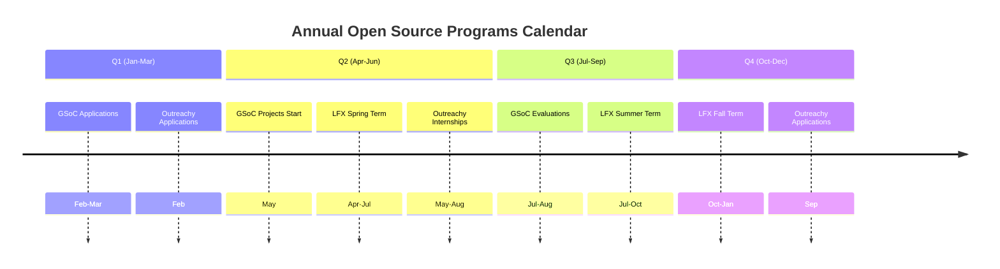

# Open Source Programs

Paid programs can accelerate your journey. This section prepares you, not just informs.

## Program Landscape 2026



## Major Programs Comparison

| Program | Stipend | Duration | Eligibility | Competition |
|---------|---------|----------|-------------|-------------|
| **GSoC** | $1,500-$6,600 | 10-22 weeks | Students 18+ | High |
| **LFX** | $3,000-$6,600 | 12 weeks | All | Medium |
| **Outreachy** | $7,000 | 13 weeks | Underrepresented groups | High |
| **C4GT** | ₹50,000-₹1,00,000 | 10-12 weeks | Indian residents | Medium |
| **SOB** | Varies | 3-4 months | Security focus | Low-Medium |

## Selection Reality Check

<Callout type="warning" title="Acceptance Rates">
- **GSoC**: ~15-20% acceptance rate
- **Outreachy**: ~5-10% acceptance rate
- **LFX**: ~25-30% acceptance rate
- **C4GT**: ~20-25% acceptance rate
</Callout>

## What Mentors Actually Look For

```
┌──────────────────────────────────────────────────────┐
│          SELECTION CRITERIA WEIGHT                   │
├──────────────────────────────────────────────────────┤
│                                                      │
│  Prior Contributions      ████████████████  40%     │
│  Proposal Quality         ████████████      30%     │
│  Technical Skills         ████████          20%     │
│  Communication           ████              10%     │
│                                                      │
└──────────────────────────────────────────────────────┘
```

<CardGrid>
<Card title="Prior Contributions" icon="📊">
At least 2-3 merged PRs in the target organization. Shows commitment and ability to deliver.
</Card>

<Card title="Proposal Clarity" icon="📝">
Clear problem statement, realistic timeline, concrete deliverables. No buzzwords.
</Card>

<Card title="Technical Depth" icon="⚙️">
Understanding of the codebase, architecture decisions, and implementation details.
</Card>

<Card title="Communication" icon="💬">
Responsive in community channels, asks good questions, keeps mentors updated.
</Card>
</CardGrid>

## Common Rejection Reasons

| Reason | Percentage | Fix |
|--------|------------|-----|
| Zero prior contributions | 35% | Start contributing 3-6 months before |
| Generic proposal | 25% | Customize for specific project |
| Unrealistic scope | 20% | Break into achievable milestones |
| Poor communication | 10% | Stay active in community |
| Weak technical skills | 10% | Build projects, contribute more |

## Strategic Timeline

### 6 Months Before Applications

<Steps>

<Step>**Choose Target Organizations**
Research 5-10 organizations that align with your interests and skills.
</Step>

<Step>**Make First Contributions**
Start with documentation and good first issues to understand the codebase.
</Step>

<Step>**Join Community Channels**
Be active in Slack/Discord. Introduce yourself, ask questions, help others.
</Step>

</Steps>

### 3 Months Before

<Steps>

<Step>**Increase Contribution Quality**
Move beyond simple issues. Fix bugs, add features, improve tests.
</Step>

<Step>**Identify Project Ideas**
Look at project idea lists. Discuss with mentors what they need.
</Step>

<Step>**Study Similar Proposals**
Read accepted proposals from previous years. Understand the format.
</Step>

</Steps>

### 1 Month Before

<Steps>

<Step>**Draft Your Proposal**
Write initial draft. Get feedback from mentors and past participants.
</Step>

<Step>**Iterate Based on Feedback**
Refine scope, timeline, deliverables. Make it crisp and realistic.
</Step>

<Step>**Final Polish**
Proofread, add diagrams, ensure all sections are complete.
</Step>

</Steps>

## Program-Specific Advantages

### GSoC
- **Best For**: Students wanting global recognition
- **Advantage**: Prestigious, great for resume
- **Challenge**: Very competitive

### LFX
- **Best For**: Learning enterprise open source
- **Advantage**: Year-round opportunities
- **Challenge**: Fewer slots per project

### Outreachy
- **Best For**: Underrepresented groups in tech
- **Advantage**: Strong support system
- **Challenge**: Strict eligibility criteria

### C4GT
- **Best For**: Indian students interested in civic tech
- **Advantage**: Focus on government projects
- **Challenge**: India-specific

## Success Metrics

What defines a successful program participation:

<Checklist>
<ChecklistItem>**All milestones delivered** on time</ChecklistItem>
<ChecklistItem>**Code merged** into main branch</ChecklistItem>
<ChecklistItem>**Documentation updated** for your work</ChecklistItem>
<ChecklistItem>**Continued contributions** after program ends</ChecklistItem>
<ChecklistItem>**Positive mentor evaluation** and recommendation</ChecklistItem>
</Checklist>

## Red Flags to Avoid

<Warning title="Program Shopping">
Don't apply to 10+ programs with copy-paste proposals. Quality over quantity. Mentors can tell.
</Warning>

## Next Steps

<NextSteps>

<Step href="/docs/programs/gsoc">
**Deep Dive: Google Summer of Code**
Comprehensive guide with timeline, tips, and proposal templates.
</Step>

<Step href="/docs/programs/lfx">
**Deep Dive: Linux Foundation Mentorship**
Enterprise open source opportunities explained.
</Step>

<Step href="/docs/programs/comparison">
**Side-by-Side Comparison**
Detailed comparison table to choose the right program.
</Step>

</NextSteps>

---

> **Reality Check**: Programs are competitive. Start early, contribute consistently, communicate well. The stipend is nice, but the real value is skills and network.
