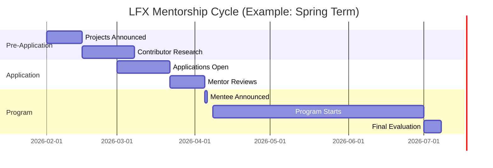
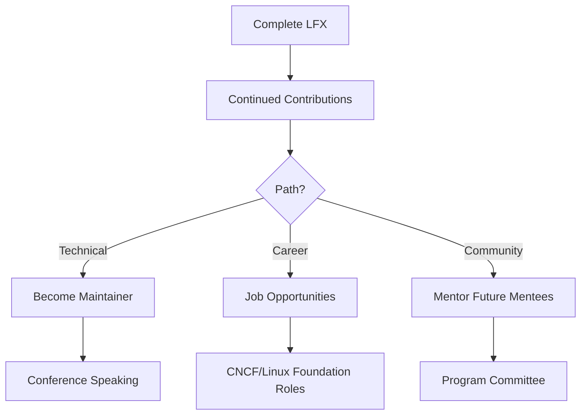

---
title: "Linux Foundation Mentorship (LFX)"
description: "Enterprise open source"
---

# Linux Foundation Mentorship (LFX)

Year-round opportunities in enterprise open source projects. More flexible than GSoC, focus on production systems.

## Program Structure

<CardGrid>
<Card title="Terms Per Year" icon="📅">
Spring (Apr-Jul), Summer (Jul-Oct), Fall (Oct-Jan) - choose your timing
</Card>

<Card title="Stipend" icon="💰">
$3,000-$6,600 depending on project duration (12-24 weeks) and your location
</Card>

<Card title="Eligibility" icon="👤">
No age limit - students, professionals, career changers all welcome globally
</Card>

<Card title="Focus" icon="🏢">
Enterprise & Cloud Native projects (Kubernetes, Linux Kernel, CNCF Stack, etc.)
</Card>
</CardGrid>

## Why Choose LFX Over GSoC?

```
GSoC vs LFX Comparison:

GSoC:
✓ More prestigious
✓ Happens once/year
✓ Broader project variety
✗ Only summer
✗ More competitive

LFX:
✓ 3 chances per year (Spring, Summer, Fall)
✓ Enterprise-grade projects
✓ No age limit
✓ More flexible
✓ Slightly less competitive
✗ Less prestige
✗ Harder projects
```

## LFX Reality

```
What you think: "I'll learn modern tech in a startup-like environment"

What actually happens:
- You work on infrastructure projects (Kubernetes, networking)
- Code reviews are THOROUGH (production-grade scrutiny)
- You learn how real companies build at scale
- Complexity is often 2-3x higher than GSoC
- But you end up with enterprise experience
- Which employers value HIGHLY
```


## How LFX Differs from GSoC

| Aspect | GSoC | LFX |
|--------|------|-----|
| **Frequency** | Once per year | 3 terms per year |
| **Eligibility** | Must be 18+ | No age limit |
| **Focus** | Broad open source | Enterprise/CNCF focus |
| **Duration** | 10-22 weeks | 12-24 weeks |
| **Org Count** | 200+ orgs | 50-100 projects |
| **Competition** | High | Medium |

## Project Categories

```
┌─────────────────────────────────────────────────────┐
│              LFX PROJECT CATEGORIES                 │
├─────────────────────────────────────────────────────┤
│                                                     │
│  Cloud Native        ████████████████  35%         │
│  Linux Kernel        ██████████        25%         │
│  Networking          ████████          20%         │
│  Security            ████              10%         │
│  Other               ████              10%         │
│                                                     │
└─────────────────────────────────────────────────────┘
```

### Popular LFX Organizations

<Checklist>
<ChecklistItem>**Kubernetes** - Container orchestration</ChecklistItem>
<ChecklistItem>**Prometheus** - Monitoring and alerting</ChecklistItem>
<ChecklistItem>**Envoy** - Cloud-native proxy</ChecklistItem>
<ChecklistItem>**Linux Kernel** - OS kernel development</ChecklistItem>
<ChecklistItem>**CNCF Projects** - Various cloud-native tools</ChecklistItem>
<ChecklistItem>**Hyperledger** - Blockchain frameworks</ChecklistItem>
</Checklist>

## Application Timeline



## Proposal Requirements

### Must-Have Sections

1. **Personal Introduction**
   - Background and experience
   - GitHub profile with activity
   - Relevant skills for the project

2. **Project Understanding**
   - Problem being solved
   - Current state of the codebase
   - Your proposed approach

3. **Implementation Plan**
   - Detailed milestones (bi-weekly)
   - Technical approach with diagrams
   - Testing and documentation strategy

4. **Timeline**
   - Week-by-week breakdown
   - Buffer for reviews and iterations
   - Integration and deployment plan

5. **Risk Management**
   - Potential blockers
   - Mitigation strategies
   - Fallback plans

## What Makes You Competitive

| Factor | Priority | How to Demonstrate |
|--------|----------|-------------------|
| **Prior Contributions** | Critical | 2-3 PRs in target org |
| **Technical Depth** | High | Detailed proposal, code samples |
| **Enterprise Experience** | Medium | Understanding of scale/reliability |
| **Communication** | High | Active in community channels |

## During the Program

### Evaluation Checkpoints

<Steps>

<Step>**Week 4: Initial Checkpoint**
- Core infrastructure setup complete
- First milestone 50% done
- No blockers on critical path
</Step>

<Step>**Week 8: Midterm Evaluation**
- 50% of deliverables complete and merged
- Documentation updated
- Mentor approval to continue
</Step>

<Step>**Week 12: Final Evaluation**
- 90%+ deliverables complete
- All code merged and documented
- Presentation or demo to community
</Step>

</Steps>

### Weekly Expectations

```
┌──────────────────────────────────────────────────┐
│           WEEKLY MENTEE OBLIGATIONS              │
├──────────────────────────────────────────────────┤
│                                                  │
│  ☐ 20-40 hours of project work                  │
│  ☐ Submit at least 1 PR or significant update   │
│  ☐ Weekly sync with mentor (30-60 min)          │
│  ☐ Update project tracker / GitHub project      │
│  ☐ Respond to review comments within 24-48h     │
│  ☐ Participate in community standups/meetings   │
│                                                  │
└──────────────────────────────────────────────────┘
```

## Advantages of LFX

<CardGrid>
<Card title="Multiple Chances" icon="🎯">
3 terms per year means more opportunities to apply
</Card>

<Card title="Enterprise Skills" icon="🏢">
Learn how large-scale production systems are built
</Card>

<Card title="Career Network" icon="🤝">
Connect with industry professionals and companies
</Card>

<Card title="Year-Round" icon="📅">
Flexible timing fits different schedules
</Card>
</CardGrid>

## Success Tips

<Warning title="LFX is Technical">
Projects often involve deep technical work: kernel programming, distributed systems, networking. Be ready for complexity.
</Warning>

### Standing Out

1. **Contribute Early**: Start 3-4 months before term begins
2. **Technical Depth**: Show you understand architecture, not just syntax
3. **Enterprise Mindset**: Think about scale, reliability, observability
4. **Active Engagement**: Join CNCF Slack, attend community meetings
5. **Portfolio**: Have side projects demonstrating relevant skills

## Common Pitfalls

| Pitfall | Impact | How to Avoid |
|---------|--------|--------------|
| Applying with zero contributions | Instant reject | Contribute 2-3 months before |
| Superficial proposal | Low ranking | Study codebase deeply, show understanding |
| Underestimating complexity | Failed evaluations | Talk to maintainers, be realistic |
| Poor communication | Mentor dissatisfaction | Over-communicate rather than under |

## Post-Program Opportunities



### Career Impact

- **Resume**: LFX on resume signals enterprise open source experience
- **Network**: Direct connection to companies like Google, Microsoft, Intel
- **Skills**: Production-grade system design and coding practices
- **References**: Mentor recommendations carry weight in industry

## Resources

<NextSteps>

<Step href="https://mentorship.lfx.linuxfoundation.org">
**Official LFX Platform**
Browse projects and apply
</Step>

<Step href="/docs/proposals">
**Proposal Writing Guide**
Craft a winning technical proposal
</Step>

<Step href="/docs/choosing-org">
**Choosing Projects**
How to evaluate LFX opportunities
</Step>

</NextSteps>

---

> **LFX Reality**: More technical than GSoC. Expect to work with complex systems, long review cycles, and high code quality standards. Perfect for those serious about infrastructure engineering.
