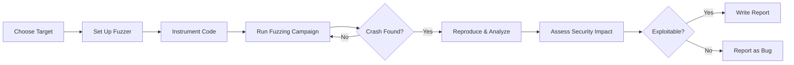

# Season of Bugs (SOB)

Security research meets open source. Find vulnerabilities, get recognized.

## Program Overview

Season of Bugs focuses on security testing, vulnerability discovery, and security improvements in open source projects.

<CardGrid>
<Card title="Focus" icon="🔒">
Security audits, vulnerability discovery, security tooling
</Card>

<Card title="Rewards" icon="🏆">
Varies by severity: $100-$5,000+ for critical vulnerabilities
</Card>

<Card title="Duration" icon="📅">
Typically 3-4 months, project-dependent
</Card>

<Card title="Skills Needed" icon="⚙️">
Security testing, code review, exploit development
</Card>
</CardGrid>

## What Makes SOB Different

| Aspect | Regular Contributions | SOB |
|--------|----------------------|-----|
| **Focus** | Features & bug fixes | Security vulnerabilities |
| **Skills** | General programming | Security research |
| **Mindset** | Building features | Breaking things safely |
| **Output** | New features/fixes | Vulnerability reports |
| **Recognition** | Contributor credit | CVE credits, hall of fame |

## Participating Organizations

Typically includes:

<Checklist>
<ChecklistItem>**OWASP Projects** - Web application security</ChecklistItem>
<ChecklistItem>**Linux Distributions** - OS security hardening</ChecklistItem>
<ChecklistItem>**Crypto Libraries** - OpenSSL, libsodium, etc.</ChecklistItem>
<ChecklistItem>**Web Frameworks** - Django, Rails, Express</ChecklistItem>
<ChecklistItem>**Cloud Tools** - Docker, Kubernetes security</ChecklistItem>
</Checklist>

## Types of Security Work

```
┌──────────────────────────────────────────────────┐
│         SOB CONTRIBUTION CATEGORIES              │
├──────────────────────────────────────────────────┤
│                                                  │
│  Vulnerability Discovery   ████████████  35%    │
│  Security Audits          ██████████     30%    │
│  Security Tool Dev        ████████       20%    │
│  Fuzzing & Testing        ████           10%    │
│  Security Docs            ██             5%     │
│                                                  │
└──────────────────────────────────────────────────┘
```

## Required Skills

### Technical Foundation

1. **Programming Languages**
   - C/C++ for low-level vulnerabilities
   - Python for security tooling
   - JavaScript for web security
   - Assembly for exploit development

2. **Security Knowledge**
   - Common vulnerability types (OWASP Top 10)
   - Exploitation techniques
   - Secure coding practices
   - Cryptography basics

3. **Tools**
   - Static analyzers (Coverity, SonarQube)
   - Dynamic testing (Valgrind, AddressSanitizer)
   - Fuzzers (AFL, libFuzzer)
   - Network tools (Wireshark, Burp Suite)

## Vulnerability Classification

| Severity | Bounty Range | Example |
|----------|--------------|---------|
| **Critical** | $2,000-$5,000+ | Remote code execution, auth bypass |
| **High** | $1,000-$2,000 | SQL injection, XSS with major impact |
| **Medium** | $500-$1,000 | CSRF, info disclosure |
| **Low** | $100-$500 | Minor info leak, config issues |

## Reporting Process

<Steps>

<Step>**Discover Vulnerability**
- Use fuzzing, code review, or dynamic testing
- Confirm reproducibility
- Assess impact and scope
</Step>

<Step>**Write Detailed Report**
- Clear description of vulnerability
- Step-by-step reproduction
- Proof-of-concept code/exploit
- Suggested fix
</Step>

<Step>**Responsible Disclosure**
- Report privately to security team
- Give time to patch (90 days standard)
- Don't publicize until fix is released
</Step>

<Step>**Follow Up**
- Answer questions from maintainers
- Test proposed patches
- Help with CVE assignment
</Step>

</Steps>

## Sample Vulnerability Report Template

```markdown
## Summary
Brief one-line description of the vulnerability

## Severity
[Critical/High/Medium/Low] + CVSS score if calculated

## Affected Components
- Package: [name and version]
- File: [filename]
- Function: [function name]
- Line: [line number]

## Vulnerability Details
Detailed technical explanation of the issue

## Reproduction Steps
1. Step one
2. Step two
3. Expected: [what should happen]
4. Actual: [what actually happens]

## Proof of Concept
```code
[PoC exploit code]
```

## Impact Assessment
- Who is affected
- What can attacker achieve
- Likelihood of exploitation

## Suggested Fix
Technical recommendations for patching

## Timeline
- Discovered: [date]
- Reported: [date]
- Acknowledged: [date]
- Expected Fix: [date]
```

## Common Vulnerability Types to Look For

<CardGrid>
<Card title="Memory Safety" icon="💾">
Buffer overflows, use-after-free, double-free in C/C++ code
</Card>

<Card title="Injection Attacks" icon="💉">
SQL injection, command injection, XSS in web applications
</Card>

<Card title="Authentication" icon="🔐">
Broken auth, session management issues, privilege escalation
</Card>

<Card title="Crypto Issues" icon="🔢">
Weak algorithms, improper key management, timing attacks
</Card>
</CardGrid>

## Fuzzing Strategy



## Ethics & Legal

<Warning title="Critical: Legal Boundaries">

**Always:**
- Get written permission before testing
- Test only in scope systems
- Follow responsible disclosure
- Don't access/modify production data

**Never:**
- Test production systems without permission
- Publicize vulnerabilities before patches
- Use found vulnerabilities maliciously
- Share exploits publicly before fixes

</Warning>

## Success Metrics

What defines successful SOB participation:

```
┌────────────────────────────────────────────────┐
│         SUCCESSFUL SOB CONTRIBUTOR             │
├────────────────────────────────────────────────┤
│                                                │
│  ✓ 2-5 verified vulnerabilities found         │
│  ✓ All reported through proper channels       │
│  ✓ Clear, reproducible reports                │
│  ✓ Suggested patches included                 │
│  ✓ CVE credits received                       │
│  ✓ Contributed security tools/tests           │
│                                                │
└────────────────────────────────────────────────┘
```

## Learning Path

### Beginner
- Start with OWASP Top 10 web vulnerabilities
- Practice on deliberately vulnerable apps (DVWA, WebGoat)
- Read security blogs and reports
- Learn basic fuzzing

### Intermediate
- Study CVE reports for patterns
- Set up fuzzing infrastructure
- Contribute security tests to projects
- Learn exploit development basics

### Advanced
- Find 0-days in production software
- Develop custom security tools
- Write exploits and patches
- Mentor others in security research

## Recognition Beyond Bounties

<Checklist>
<ChecklistItem>**CVE Credits** - Permanent record of discovery</ChecklistItem>
<ChecklistItem>**Hall of Fame** - Listed on project security pages</ChecklistItem>
<ChecklistItem>**Conference Talks** - Present findings at security cons</ChecklistItem>
<ChecklistItem>**Security Career** - Direct path to security roles</ChecklistItem>
<ChecklistItem>**Research Papers** - Publish novel techniques</ChecklistItem>
</Checklist>

## Tools to Learn

| Category | Tools | Purpose |
|----------|-------|---------|
| **Static Analysis** | Coverity, Clang Static Analyzer | Find bugs without running code |
| **Dynamic Analysis** | Valgrind, ASan, MSan | Detect runtime issues |
| **Fuzzing** | AFL, libFuzzer, Honggfuzz | Automated test case generation |
| **Web Security** | Burp Suite, OWASP ZAP | Web app vulnerability scanning |
| **Network** | Wireshark, tcpdump | Protocol analysis |
| **Reverse Engineering** | Ghidra, IDA Pro, radare2 | Binary analysis |

## Resources

<NextSteps>

<Step href="https://owasp.org">
**OWASP Resources**
Learn web application security fundamentals
</Step>

<Step href="/docs/tooling">
**Developer Tooling**
Set up your security testing environment
</Step>

<Step href="/docs/communication">
**Responsible Disclosure**
Learn proper vulnerability reporting
</Step>

</NextSteps>

---

> **SOB Reality**: Requires deeper technical skills than typical contributions. Not for beginners. If you enjoy breaking things (ethically) and understanding security, this is your path.
