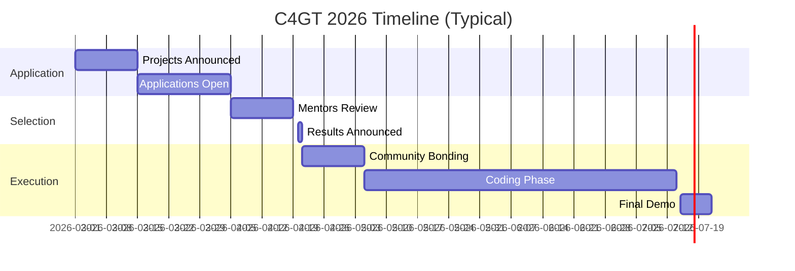
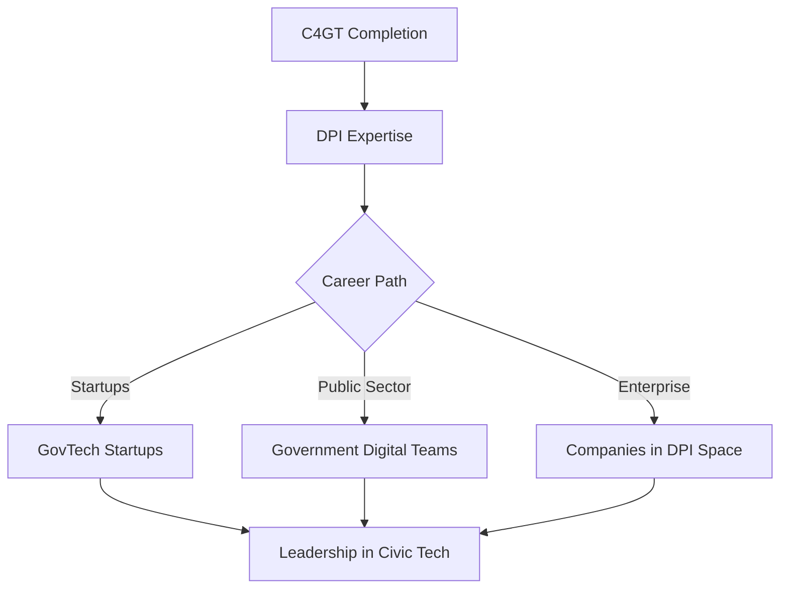
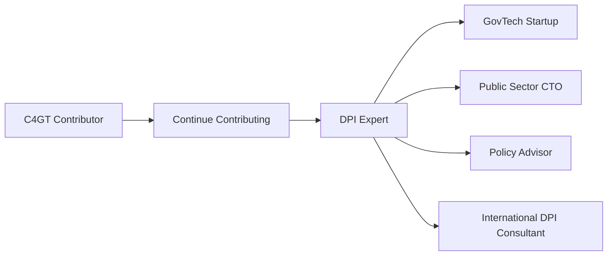

# Code for GovTech (C4GT)

Building digital public goods for India. Technology meets civic impact.

## Program Overview

<CardGrid>
<Card title="Focus" icon="🏛️">
Digital Public Infrastructure (DPI) and government technology
</Card>

<Card title="Stipend" icon="💰">
₹50,000-₹1,00,000 based on project complexity
</Card>

<Card title="Duration" icon="📅">
10-12 weeks during summer
</Card>

<Card title="Eligibility" icon="🇮🇳">
Indian residents, students and professionals
</Card>
</CardGrid>

## What Makes C4GT Unique

| Aspect | C4GT | Other Programs |
|--------|------|----------------|
| **Focus** | Civic tech, government projects | General open source |
| **Impact** | Millions of Indian citizens | Variable |
| **Eligibility** | India-specific | Global |
| **Domain** | Healthcare, education, governance | Tech-focused |
| **Mentorship** | Government + tech leaders | Tech maintainers |

## Project Categories

```
┌─────────────────────────────────────────────────┐
│           C4GT PROJECT DOMAINS                  │
├─────────────────────────────────────────────────┤
│                                                 │
│  Healthcare (ABDM)       ████████████  30%     │
│  Education (DIKSHA)      ██████████    25%     │
│  Financial Inclusion     ████████      20%     │
│  Urban Governance        ████          10%     │
│  Agriculture             ████          10%     │
│  Other DPI               ██            5%      │
│                                                 │
└─────────────────────────────────────────────────┘
```

### Example Projects

<Checklist>
<ChecklistItem>**ABDM (Ayushman Bharat)** - Healthcare data exchange</ChecklistItem>
<ChecklistItem>**DIKSHA** - Education platform for teachers</ChecklistItem>
<ChecklistItem>**Sunbird** - Building blocks for digital governance</ChecklistItem>
<ChecklistItem>**Beckn Protocol** - Decentralized commerce</ChecklistItem>
<ChecklistItem>**DIGIT** - Urban governance platform</ChecklistItem>
</Checklist>

## Timeline



## Why Participate in C4GT

### Impact at Scale

Your code affects real people:
- **Healthcare**: Improve patient data exchange across hospitals
- **Education**: Help millions of students access quality content
- **Governance**: Make citizen services more efficient
- **Inclusion**: Bridge digital divide

### Career Opportunities



### Network

Connect with:
- Government technology leaders
- Policy makers
- Civic tech ecosystem
- Social impact organizations

## Application Process

<Steps>

<Step>**Research Phase (Feb-Mar)**
- Understand Digital Public Infrastructure concepts
- Browse project repositories on GitHub
- Join community forums (Discord/Telegram)
- Study India Stack and DPI
</Step>

<Step>**Contribution Phase (Mar-Apr)**
- Make 2-3 contributions to target projects
- Understand the civic impact of the project
- Discuss project ideas with mentors
- Clarify doubts about implementation
</Step>

<Step>**Proposal Writing (Mid-Apr)**
- Focus on impact and accessibility
- Show understanding of government context
- Include realistic technical approach
- Address scalability and security
</Step>

<Step>**Selection (Late Apr)**
- Mentor evaluations based on contributions
- Interview/presentation may be required
- Results announced with assigned mentors
</Step>

</Steps>

## Proposal Template

### Section 1: Understanding the Problem

```markdown
## Problem Statement

### Current State
[What is the current situation? What pain points exist?]

### Who is Affected
- **Primary Users**: [Citizens, government officials, etc.]
- **Scale**: [How many people impacted]
- **Context**: [Urban/rural, language barriers, digital literacy]

### Why This Matters
[Social impact, efficiency gains, cost savings, accessibility]
```

### Section 2: Proposed Solution

```markdown
## Technical Solution

### Approach
[High-level technical approach]

### Architecture
[Diagrams showing how components interact]

### Key Features
1. **[Feature 1]**: Implementation details
2. **[Feature 2]**: Implementation details

### Accessibility Considerations
- Multi-language support
- Low-bandwidth optimization
- Mobile-first design
- Offline capabilities

### Security & Privacy
[How you'll handle sensitive government/citizen data]
```

### Section 3: Implementation Plan

```markdown
## Timeline (10 weeks)

### Week 1-2: Foundation
- Set up development environment
- Study existing codebase thoroughly
- Design detailed technical spec
- Get mentor approval on approach

### Week 3-5: Core Development
- Implement [Feature A]
- Unit and integration tests
- Accessibility testing
- **Milestone**: [Deliverable 1]

[Continue for all milestones...]

### Week 9-10: Finalization
- Documentation for government users
- Deployment guides
- Training materials
- Demo video
```

## What Mentors Look For

| Criteria | Weight | Evaluation |
|----------|--------|------------|
| **Understanding of Impact** | 30% | Do you grasp the civic context? |
| **Technical Skills** | 25% | Can you build robust, scalable solutions? |
| **Prior Contributions** | 25% | Have you contributed to the project? |
| **Accessibility Focus** | 10% | Do you design for all users? |
| **Communication** | 10% | Can you explain technical work to non-technical stakeholders? |

## Special Considerations for GovTech

<Warning title="Different from Commercial Tech">

**Government projects require:**
- **Security First**: Handling sensitive citizen data
- **Accessibility**: Support for multiple languages, low bandwidth
- **Documentation**: Clear guides for government officials
- **Compliance**: Following government IT policies and standards
- **Scale**: Millions of users, not thousands

</Warning>

### Technical Challenges

```
┌───────────────────────────────────────────────┐
│       GOVTECH UNIQUE CHALLENGES               │
├───────────────────────────────────────────────┤
│                                               │
│  Scale (100M+ users)         ████████████     │
│  Multi-language support      ██████████       │
│  Low bandwidth optimization  ████████         │
│  Legacy system integration   ████████         │
│  Regulatory compliance       ██████           │
│  Offline-first design        ████             │
│                                               │
└───────────────────────────────────────────────┘
```

## During the Program

### Weekly Expectations

<Checklist>
<ChecklistItem>**Code commits** with clear documentation</ChecklistItem>
<ChecklistItem>**Weekly sync** with mentor and government stakeholders</ChecklistItem>
<ChecklistItem>**Blog updates** on progress and learnings</ChecklistItem>
<ChecklistItem>**Accessibility testing** for all features</ChecklistItem>
<ChecklistItem>**Security reviews** with government IT teams</ChecklistItem>
</Checklist>

### Evaluation Milestones

| Milestone | Timeline | Deliverable |
|-----------|----------|-------------|
| **Midterm** | Week 5-6 | 50% features complete, documented |
| **Final** | Week 10-11 | 90%+ complete, deployed to staging |
| **Demo Day** | Week 12 | Public presentation of work |

## Impact Measurement

Unlike typical open source, C4GT measures real-world impact:

```
┌─────────────────────────────────────────────┐
│          SUCCESS METRICS                    │
├─────────────────────────────────────────────┤
│                                             │
│  Code Quality          ✓ Merged & deployed │
│  Accessibility         ✓ WCAG compliance   │
│  Documentation         ✓ User guides ready │
│  Performance           ✓ Load tested       │
│  Security              ✓ Audit passed      │
│  Real-world usage      ✓ Citizen feedback  │
│                                             │
└─────────────────────────────────────────────┘
```

## Post-Program Opportunities

### DPI Ecosystem

The Digital Public Infrastructure space is growing:

<CardGrid>
<Card title="Startups" icon="🚀">
Many startups building on DPI stacks (Beckn, ONDC, ABDM)
</Card>

<Card title="Government Roles" icon="🏛️">
Digital India, eGov foundation, state IT departments
</Card>

<Card title="Consulting" icon="💼">
Help governments and orgs adopt DPI
</Card>

<Card title="Global Impact" icon="🌍">
India's DPI model being adopted globally
</Card>
</CardGrid>

### Career Path



## Learning Resources

<NextSteps>

<Step href="https://www.codeforgovtech.in">
**Official C4GT Website**
Program details, project list, application info
</Step>

<Step href="https://www.indiastack.org">
**India Stack**
Learn about DPI architecture and philosophy
</Step>

<Step href="/docs/proposals">
**Proposal Writing**
Craft a compelling civic tech proposal
</Step>

</NextSteps>

---

> **C4GT Reality**: This is about impact, not just code. Your work will be used by millions. Expect government processes, security reviews, and stakeholder management. Hugely rewarding for those who want their code to matter.
