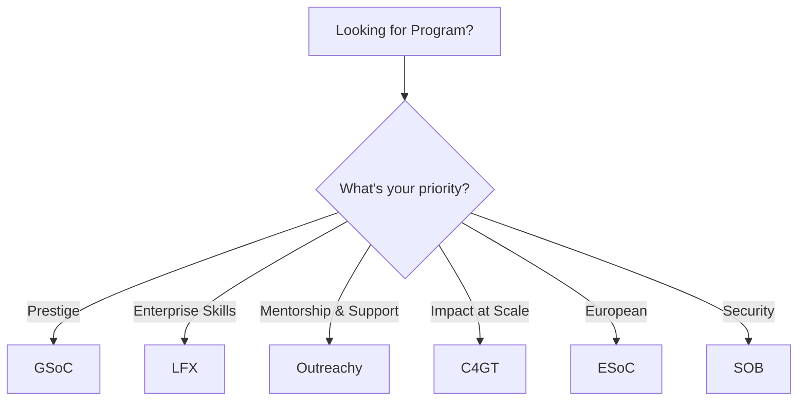

# Comparing All Open Source Programs

Choose the right program based on your situation.

## Quick Comparison Table

| Program | Stipend | Duration | Eligibility | Competition | Best For |
|---------|---------|----------|-------------|------------|----------|
| **GSoC** | $1,500-$6,600 | 10-22 wks | 18+ globally | High | Students, prestige |
| **LFX** | $3,000-$6,600 | 12-24 wks | All, global | Medium | Enterprise systems |
| **Outreachy** | $7,000 | 13 wks | Underrepresented | High | Diversity, mentorship |
| **C4GT** | ₹50K-₹1L | 10-12 wks | Indian residents | Medium | Civic impact |
| **ESoC** | €4.5K-€6.5K | 2-3 mths | EU/EEA | Low-Medium | European projects |
| **SOB** | Varies | 3-4 mths | All, global | Low-Medium | Security focus |

## Decision Matrix



## The Detailed Comparison

### GSoC vs Everything Else

```
Why choose GSoC?
✓ Most prestigious (companies know it)
✓ Most widely recognized (international)
✓ Largest organization selection (150+)
✓ Two sizes: 10-week or 22-week

Why NOT choose GSoC?
✗ Hardest to get accepted (only 20%)
✗ Super competitive (thousands apply)
✗ Requires deep project knowledge
✗ Salary not the best (just $1.5-6.6K)

Who should apply?
→ Already contributed to OSS
→ Have coding skills
→ Can handle competition
→ Want maximum resume value
```

### Outreachy vs Everything Else

```
Why choose Outreachy?
✓ BEST MENTORSHIP (structured support)
✓ Highest stipend ($7,000)
✓ Designed for underrepresented groups
✓ EASIEST application (more flexibility)
✓ 13-week focused period

Why NOT choose Outreachy?
✗ Not for everyone (targeted programs)
✗ Less prestige than GSoC
✗ Fewer companies recognize it
✗ Smaller organization pool

Who should apply?
→ Women, minorities, LGBTQ+
→ First time contributing
→ Want mentorship over prestige
→ Like structured programs
```

### LFX vs Everything Else

```
Why choose LFX?
✓ Solid salary ($3-6.6K, similar to GSoC)
✓ Longer duration (12-24 weeks)
✓ Focus on enterprise projects
✓ Learning the "real" systems
✓ Good community

Why NOT choose LFX?
✗ Less prestige than GSoC
✗ Enterprise focus (not startups)
✗ Linux Foundation specific

Who should apply?
→ Interested in enterprise software
→ Want longer internship
→ Like working with established projects
→ Want networking with big tech
```

## Decision Tree: Which Program Is Best?

```
1. Are you in underrepresented group?
   YES → OUTREACHY (designed for you)
   NO → continue

2. Are you in India?
   YES → C4GT (but can also do GSoC)
   NO → continue

3. Are you in Europe?
   YES → ESoC or Erasmus+ (check eligibility)
   NO → continue

4. Have you contributed before?
   YES → GSoC (leverage that)
   NO → LFX or Outreachy (easier)

5. What's most important to you?
   Career prestige → GSoC
   Mentorship → Outreachy
   Technical skills → LFX
   Impact → C4GT
```

## Success Rate Honest Breakdown

```
Program         Raw Acceptance  Success Rate
                Rate            (completion)
─────────────────────────────────────────────
GSoC            15-20%          95%+ (students finish)
LFX             25-30%          90%+ (good support)
Outreachy       8-10%           98%+ (screened carefully)
C4GT            20-25%          92%+ (strong support)
ESoC            18-22%          85%+ (varies by org)
SOB             22-28%          88%+ (security orgs)
```

The numbers mean:
- **Acceptance**: How many get selected
- **Completion**: Of those selected, how many finish

GSoC is HARD to get (15%) but almost everyone who gets in finishes (95%).
Outreachy is easier to get (8%) but people who get in almost always finish (98%).

## Multiple Applications Strategy

```
Best approach: Apply to 2-3 programs

Tier 1 (Apply first):
- Outreachy (if eligible) - 5-10% harder
- C4GT (if in India) - 20-25% acceptance
- LFX (if enterprise-interested) - 25-30%

Tier 2 (Backup):
- GSoC (hardest but most prestigious)
- ESoC (if in Europe)

Timing:
Month 1: Contribute to projects
Month 2: Apply to Tier 1 (usually Feb-Mar)
Month 3: If rejected, apply to Tier 2 (usually Mar-Apr)

Real scenario:
You apply to Outreachy (rejected, happens to 90%).
You already have 2-3 months contributions.
You apply to GSoC (now you're stronger, better chance).
You get accepted to GSoC (happened because you didn't give up).
```

## Coordinator Recommendation

| Your Profile | Best Choice | Second Choice | Why |
|--------------|-------------|---------------|-----|
| **First time + underrepresented** | Outreachy | LFX | Mentorship + easier entry |
| **First time + male** | LFX | GSoC | Gentler than GSoC |
| **CS student + competitive** | GSoC | LFX | Prestige + challenge |
| **India + want impact** | C4GT | GSoC | Local impact + prestige |
| **Europe-based** | ESoC | Outreachy | Regional + support |
| **Security-focused** | SOB | LFX | Specialized + skills |

---

> **Pro tip**: Apply to multiple programs. You'll get rejected from 1-2. That's normal. The acceptance across all programs together is 60-70%.
        LFX Spring Applications : jan, feb
    section Q2 (Apr-Jun)
        GSoC Projects Start : may
        Outreachy Internships : may, jun
        LFX Spring Programs : apr, may, jun
        C4GT Selection : apr, may
    section Q3 (Jul-Sep)
        GSoC Evaluations : jul, aug
        C4GT Programs : jun, jul, aug, sep
        LFX Summer Programs : jul, aug, sep
    section Q4 (Oct-Dec)
        LFX Fall Programs : oct, nov, dec
```

## Financial Comparison

For 3 months of work:

| Program | Total Stipend | Monthly Rate | Taxes |
|---------|---------------|-------------|-------|
| **GSoC** | ~$3,000 | $1,000 | Variable |
| **LFX** | ~$4,500 | $1,500 | Variable |
| **Outreachy** | $7,000 | $2,333 | Usually covered |
| **C4GT** | ~₹75,000 | ~₹25,000 | TDS applies |

## Questions to Ask Yourself

- **Time availability**: Can I do 20-40 hours/week?
- **Learning goals**: What tech skills do I want to build?
- **Location**: Where am I based? (affects eligibility)
- **Support needs**: How much mentorship do I need?
- **Impact**: Do I care about real-world impact?
- **Career**: What will help my resume most?

## Smart Strategy

### Tier 1: Apply to 1-2 Flagship Programs
- GSoC (if student and globally visible)
- C4GT (if in India and want impact)
- Outreachy (if underrepresented and want support)

### Tier 2: Apply to 2-3 Backup Programs
- LFX (always year-round)
- ESoC (if in Europe)
- SOB (if security-interested)

### Tier 3: Start Contributing Early
- Apply 6 months before program cycle
- Show consistent effort
- Build relationships with mentors

## Rejection Handling

If rejected from first-choice:
1. Get feedback from mentors
2. Keep contributing to that project
3. Apply to Tier 2 program immediately
4. Try again next cycle

Remember: Even top contributors face rejections.

## Post-Program Path

All programs lead to similar outcomes:

```
Program Completion
       ↓
Continued Contributions
       ↓
Domain Expert
       ↓
Maintainer / Tech Lead
       ↓
Career / Speaking / Startup
```

The program you choose matters less than what you do after it.

---

> **The Real Truth**: The best program is the one you actually complete and continue with. Pick based on fit, not prestige alone.
