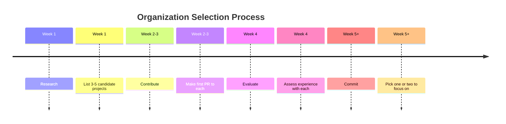

import { Callout, Cards, Card, Steps, Tabs } from 'nextra/components'

# Choosing the Right Organization

Not all open source projects are equal. Learn to evaluate organizations.

## Why This Matters

Choosing the right project is literally the difference between:

```
WRONG PROJECT (3 months):
- Join toxic community
- Waste time on hostile PRs
- Get discouraged and quit
- Tell others to avoid it
- Skill building: 10%

RIGHT PROJECT (3 months):
- Join welcoming community
- PRs merged smoothly
- Feel valued and motivated
- Keep contributing for 2+ years
- Skill building: 80%

Same 3 months, WILDLY different outcomes based on one decision.
```

## Why This Matters

```
Wrong project choice = 
  Wasted time + Bad experience + Discouragement

Right project choice = 
  Great learning + Real impact + Career boost
```

## The Evaluation Framework

### 1. Project Health

- Is the project actively maintained?
- How responsive are maintainers?
- What's the code quality like?
- Are there clear guidelines?

### 2. Community Fit

- Is it welcoming to newcomers?
- Do people help each other?
- What's the communication style?
- Are there red flags?

### 3. Learning Opportunity

- What will you learn?
- Does the codebase teach you new patterns?
- Will it advance your career?
- Does it match your goals?

### 4. Impact Potential

- Does your work matter?
- Who benefits from this project?
- Will it look good on your resume?
- Does it align with your values?

## Evaluation Timeline



## Red vs Green Signals

| Signal | Green | Red |
|--------|-------|-----|
| **Maintenance** | Weekly commits | 6+ months inactive |
| **Responses** | Within 2 days | Weeks or never |
| **Code Quality** | Well tested | No tests |
| **Community** | Welcoming | Hostile |
| **Direction** | Clear roadmap | Unclear |

## Section Map

In this section, we'll cover:

1. [Signals of Healthy Organizations](healthy-signals)
2. [Evaluating Code Quality](code-quality)
3. [Mentor Availability](mentor-availability)
4. [Activity Metrics That Matter](activity-metrics)
5. [Red Flags You Should Ignore](red-flags)
6. [When to Leave an Organization](when-to-leave)

## Quick Checklist

Before committing to a project:


- [ ] **Active maintenance**: Recent commits and releases
- [ ] **Clear communication**: README and CONTRIBUTING guides
- [ ] **Welcoming community**: Good-first-issues or beginner help
- [ ] **Code quality**: Tests and clear architecture
- [ ] **Good vibes**: Positive community tone
- [ ] **Right level**: Not too easy, not impossible


## The Truth About Selection

```
30% of your contribution experience 
= Project choice

70% of your contribution experience 
= Your effort and attitude
```

Even a good project can feel bad if you're not trying.
Even a difficult project can be great if you're committed.

---

> **Pick thoughtfully, commit fully, and don't give up after one bad experience.**
