import { Callout, Cards, Card, Steps, Tabs } from 'nextra/components'

# Asking Questions the Right Way

The way you ask questions determines whether you get help or get ignored.

## Why Questions Matter


## The Good Question Formula

```
Good Question = 
    Context + 
    What You Tried + 
    Specific Ask + 
    Minimal Reproducible Example
```

## Before You Ask

### The Research Checklist


**Time investment:** 15-30 minutes of research before asking.

### What to Search

```bash
# In GitHub issues
is:issue "exact error message"

# In closed issues (often has solutions!)
is:issue is:closed "your problem"

# With your specific scenario
is:issue "feature name" + "your situation"
```

## Bad vs Good Questions

### ❌ Bad Questions

**Example 1: Too Vague**
```
"It doesn't work. How to fix?"
```
Missing: What doesn't work? What error? What did you try?

**Example 2: No Context**
```
"I get an error when I run the app"
```
Missing: What error? Which command? What's your environment?

**Example 3: Demanding**
```
"Fix this ASAP. I need it for my project."
```
Problem: You're not entitled to their time.

**Example 4: Already Answered**
```
"How do I install this?"
```
When: The README has installation instructions.

### ✅ Good Questions

**Example 1: Clear and Specific**
```
Title: [Bug] Authentication fails with special characters in password

**Environment:**
- OS: Ubuntu 22.04
- Node: 18.17.0
- Package version: 2.3.1

**What I'm trying to do:**
Log in with a password containing # character

**What happens:**
Error: "Invalid credentials" even with correct password

**What I expected:**
Successful login

**Steps to reproduce:**
1. Create account with password: Test#123
2. Try to log in
3. Get error on valid credentials

**What I've tried:**
- URL encoding the password
- Using different special characters
- Checked issue #234 (different problem)

**Relevant code:**
```javascript
const response = await auth.login(email, password);
```

**Error log:**
```
Error: AUTH_FAILED at line 45
```
```

**Example 2: Question About Approach**
```
Title: Best approach for implementing feature X?

I'm working on issue #456 and have two ideas:

**Option A:** Modify existing UserService
- Pros: Reuses existing code
- Cons: Might affect other features

**Option B:** Create new dedicated service
- Pros: Isolated changes
- Cons: Some code duplication

I'm leaning toward Option A because [reason].

Does this align with the project's architecture? 
Any guidance on the preferred approach?
```

## The Question Template

```markdown
## Summary
[One sentence describing your question/problem]

## Context
- What I'm trying to do: [goal]
- What I've read: [docs, issues checked]
- Related to issue: #[number]

## Environment (if applicable)
- OS: 
- Language/Runtime version:
- Package version:

## What I've Tried
1. [First attempt]
2. [Second attempt]
3. [Third attempt]

## Specific Question
[Your actual question]

## Additional Context
[Screenshots, error logs, code snippets]
```

## Where to Ask

### Question Type → Channel


| Question Type | Best Channel |
|---------------|--------------|
| Bug report | GitHub Issues |
| Feature request | GitHub Issues/Discussions |
| Usage question | Discord/Slack/Discussions |
| PR-specific | PR comments |
| Architecture | GitHub Discussions |
| Quick clarification | Discord/Slack |

## Timing Your Questions

```mermaid
gantt
    title Best Times to Ask (UTC)
    dateFormat HH:mm
    section Americas
    Active     :06:00, 12h
    section Europe
    Active     :08:00, 10h
    section Asia
    Active     :00:00, 10h
```



### Tips for Timing

- **Weekdays > Weekends** for business-backed projects
- **Check maintainer timezones** from their profile
- **Batch your questions** instead of asking one by one
- **Be patient** - 24-48 hours is normal response time

## Following Up

### ✅ Good Follow-ups

```
After 3 days:
"Hi, just following up on this. Is there any additional 
context I can provide? Happy to help troubleshoot."

After resolution:
"Thanks for the help! The issue was [X]. I'm updating 
the docs to help others who hit this."
```

### ❌ Bad Follow-ups

```
After 1 hour:
"Hello???"

After 1 day:
"Why isn't anyone responding? This is urgent!"

Multiple messages:
"bump"
"anyone?"
"hello?"
```

## Question Etiquette

### DO:

- ✅ Research before asking
- ✅ Be specific and provide context
- ✅ Show what you've tried
- ✅ Be patient and respectful
- ✅ Thank helpers
- ✅ Share your solution for others

### DON'T:

- ❌ Demand immediate answers
- ❌ Ask the same question in multiple channels
- ❌ Get defensive when corrected
- ❌ Ghost after getting help
- ❌ Ask in DMs without permission
- ❌ Expect maintainers to do your work

## When You Get an Answer

### If It Solves Your Problem

```
"Thanks @maintainer! That solved it. For anyone else hitting 
this, the issue was [X] and the fix is [Y]."
```

### If It Partially Helps

```
"Thanks for the pointer! I tried [their suggestion] and got 
further, but now I'm seeing [new issue]. Should I open a 
separate issue for this?"
```

### If You Disagree

```
"Thanks for the explanation. I see your point about [X]. 
I was thinking [alternative approach] because [reason]. 
Would that also be acceptable, or is there a reason to 
prefer your suggested approach?"
```

## Building Relationships Through Questions

Good questions can build your reputation:


## Special Scenarios

### Asking for Mentorship

```
Subject: Request for guidance on first contribution

Hi @maintainer,

I'm new to open source and excited to contribute to [Project].
I've been following the repo for [time] and have:
- Set up my local environment
- Read through CONTRIBUTING.md
- Looked at issues #X, #Y, #Z

Would it be okay if I asked occasional questions while 
working on my first contribution? I'll do my research 
first and keep questions specific.

Thanks for maintaining this awesome project!
```

### Asking About Issue Scope

```
Hi, I'm interested in working on this issue.

Before I start, I want to make sure I understand the scope:

1. Should the solution also handle [edge case]?
2. Do you want tests included in the same PR?
3. Any specific approach you'd prefer?

Happy to discuss and provide a small proposal before coding.
```

### Asking When Stuck

```
I've been working on issue #123 and hit a wall.

**What I'm trying to do:**
[Specific goal]

**Where I'm stuck:**
I can't figure out how [specific component] connects to 
[other component]. Looking at [file], I see [observation], 
but I'm not sure if [uncertainty].

**What I've tried:**
- Followed the flow from [entry point]
- Added logs at [locations]
- Read [related docs/code]

Any pointers on how these pieces fit together?
```

## Quick Reference: Question Quality Checklist

Before posting, verify:

- [ ] Searched existing issues/discussions
- [ ] Read relevant documentation
- [ ] Included environment details
- [ ] Showed what I tried
- [ ] Made a specific ask
- [ ] Provided reproducible example
- [ ] Used appropriate channel
- [ ] Proofread for clarity

## Next Steps

Now that you know how to ask questions:

➡️ [Claiming an Issue →](claiming-issues)

---

> **Remember:** Every great contributor started by asking questions. The quality of your questions shows the quality of your thinking. Make them count.
