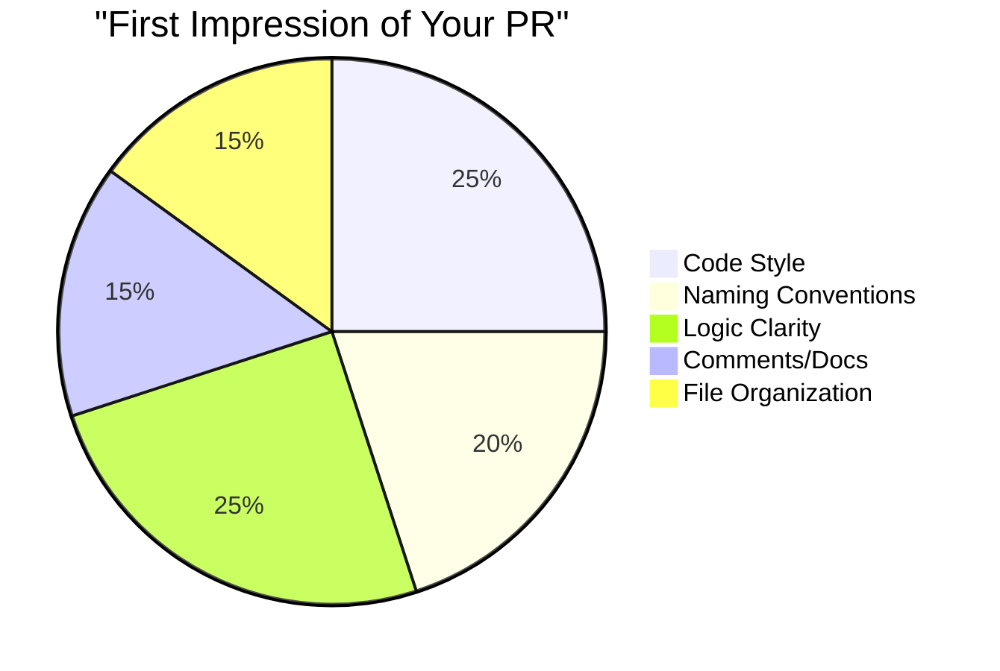
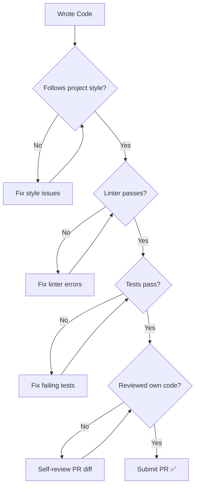
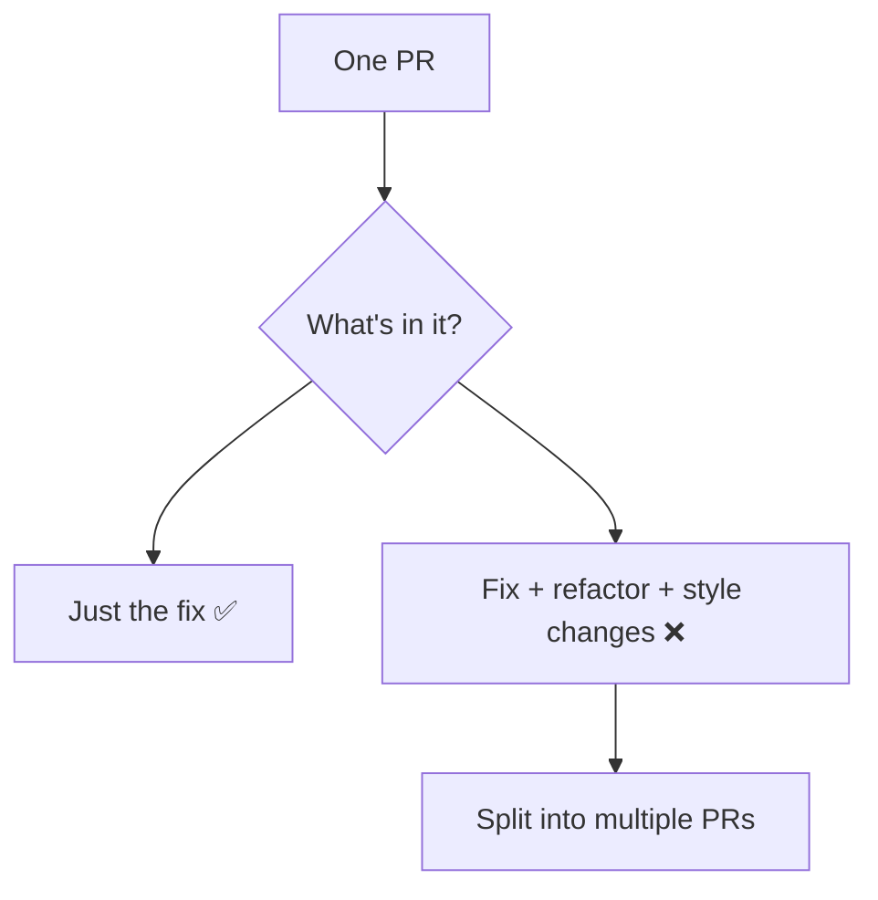
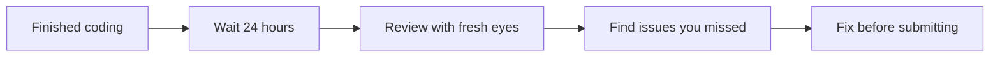

import { Callout, Cards, Card, Steps, Tabs } from 'nextra/components'

# Writing Clean Code

Maintainers see hundreds of PRs. Clean code gets merged. Messy code gets ignored.

## What Maintainers See



## The Clean Code Principles

### 1. Follow Existing Conventions

**Rule #1:** Match the codebase style, not your preference.

```javascript
// ❌ Your style (doesn't match project)
const getUserData = async(userId) => {
    return await fetchUser(userId)
}

// ✅ Project style (matches existing code)
async function getUserData(userId) {
    return await fetchUser(userId);
}
```

### 2. Meaningful Names

```javascript
// ❌ Bad names
const d = new Date();
const u = getUser();
const arr = items.filter(x => x.active);

// ✅ Good names  
const currentDate = new Date();
const authenticatedUser = getUser();
const activeItems = items.filter(item => item.active);
```

### 3. Small, Focused Functions

```javascript
// ❌ One giant function
function processOrder(order) {
    // validate... (20 lines)
    // calculate totals... (30 lines)
    // apply discounts... (25 lines)
    // process payment... (40 lines)
    // send emails... (15 lines)
}

// ✅ Small, focused functions
function processOrder(order) {
    validateOrder(order);
    const totals = calculateTotals(order);
    const finalAmount = applyDiscounts(totals, order.discountCode);
    await processPayment(order.paymentMethod, finalAmount);
    await sendConfirmationEmail(order.customer.email, order);
}
```

### 4. Self-Documenting Code

```javascript
// ❌ Needs comments to understand
// Check if user can access
if (u.r === 'a' || u.r === 'm' || (u.r === 'u' && u.verified)) {
    // allow
}

// ✅ Self-explanatory
const isAdmin = user.role === 'admin';
const isModerator = user.role === 'moderator';
const isVerifiedUser = user.role === 'user' && user.isVerified;

if (isAdmin || isModerator || isVerifiedUser) {
    allowAccess();
}
```

## Code Quality Checklist

### Before Submitting PR



## Style Guide Compliance

### Finding the Style Guide

```bash
# Check these files/folders
.eslintrc / .eslintrc.js / .eslintrc.json    # JavaScript
.prettierrc / .prettierrc.json                # Formatting
pyproject.toml / setup.cfg                    # Python
.editorconfig                                 # Editor settings
CONTRIBUTING.md                               # May contain style rules
```

### Running Style Checks

```bash
# JavaScript/TypeScript
npm run lint
npm run lint:fix    # Auto-fix

# Python
flake8 .
black --check .
black .             # Auto-fix

# Go
go fmt ./...
golint ./...
```

## Common Style Elements

### Indentation

| Project Uses | You Should Use |
|-------------|----------------|
| 2 spaces | 2 spaces |
| 4 spaces | 4 spaces |
| Tabs | Tabs |

**Never mix!**

### Naming Conventions

| Language | Variables | Functions | Classes |
|----------|-----------|-----------|---------|
| JavaScript | `camelCase` | `camelCase` | `PascalCase` |
| Python | `snake_case` | `snake_case` | `PascalCase` |
| Go | `camelCase` | `CamelCase/camelCase` | `PascalCase` |
| Java | `camelCase` | `camelCase` | `PascalCase` |

### Quotes

```javascript
// If project uses single quotes
const name = 'John';

// If project uses double quotes  
const name = "John";

// If project uses template literals where appropriate
const greeting = `Hello, ${name}`;
```

## Writing Readable Code

### Vertical Spacing

```javascript
// ❌ No breathing room
function processUser(user){
    const validated=validateUser(user);
    if(!validated){return null;}
    const enriched=enrichUserData(validated);
    return saveUser(enriched);
}

// ✅ Logical grouping
function processUser(user) {
    const validated = validateUser(user);
    
    if (!validated) {
        return null;
    }
    
    const enriched = enrichUserData(validated);
    
    return saveUser(enriched);
}
```

### Line Length

```javascript
// ❌ Too long
const userDisplayName = user.firstName && user.lastName ? `${user.firstName} ${user.lastName}` : user.username || user.email || 'Anonymous User';

// ✅ Broken up
const userDisplayName = user.firstName && user.lastName
    ? `${user.firstName} ${user.lastName}`
    : user.username || user.email || 'Anonymous User';
```

### Early Returns

```javascript
// ❌ Nested conditions
function getDiscount(user) {
    if (user) {
        if (user.isPremium) {
            if (user.yearsActive > 2) {
                return 0.2;
            } else {
                return 0.1;
            }
        } else {
            return 0.05;
        }
    } else {
        return 0;
    }
}

// ✅ Early returns
function getDiscount(user) {
    if (!user) return 0;
    if (!user.isPremium) return 0.05;
    if (user.yearsActive <= 2) return 0.1;
    return 0.2;
}
```

## Comments: When and How

### Good Comments

```javascript
// ✅ Explain WHY, not WHAT
// Using binary search here because the array is always sorted
// and can contain millions of items
const index = binarySearch(sortedItems, target);

// ✅ Clarify complex regex
// Matches: email@domain.com, user.name+tag@sub.domain.co.uk
const emailRegex = /^[a-zA-Z0-9._%+-]+@[a-zA-Z0-9.-]+\.[a-zA-Z]{2,}$/;

// ✅ Document non-obvious behavior
// Note: This API returns 200 even on failures, check response.success
const response = await legacyApi.submit(data);
```

### Bad Comments

```javascript
// ❌ States the obvious
// Increment counter
counter++;

// ❌ Outdated comment (code changed, comment didn't)
// Returns user's full name
function getUserEmail(userId) { ... }

// ❌ Commented-out code
// function oldImplementation() { ... }
// Just delete it - git remembers
```

## PR-Specific Best Practices

### Keep Changes Focused



### Minimal Changes

```diff
// ❌ Changed unrelated lines
function getUser(id) {
-    const user = await db.findUser(id);
-    return user;
+  const userData = await db.findUser(id);
+  if (!userData) {
+    return null;
+  }
+  return userData;
}

// ✅ Only necessary changes
function getUser(id) {
    const user = await db.findUser(id);
+   if (!user) {
+       return null;
+   }
    return user;
}
```

### Don't Mix Formatting with Logic

```bash
# Bad: One commit with everything
"Fix bug and reformat file"

# Good: Separate concerns
Commit 1: "style: reformat file.js" 
Commit 2: "fix: handle null user case"
```

## Error Handling

### Proper Error Handling

```javascript
// ❌ Swallowing errors
try {
    await processOrder(order);
} catch (e) {
    // nothing
}

// ❌ Generic error
try {
    await processOrder(order);
} catch (e) {
    throw new Error('Something went wrong');
}

// ✅ Specific, useful error
try {
    await processOrder(order);
} catch (error) {
    if (error instanceof ValidationError) {
        throw new OrderValidationError(
            `Invalid order: ${error.message}`,
            { orderId: order.id, field: error.field }
        );
    }
    throw new OrderProcessingError(
        `Failed to process order ${order.id}`,
        { cause: error }
    );
}
```

## Code Review Ready Checklist

### Self-Review Before Submitting

- [ ] Read your own diff as if you're the reviewer
- [ ] No debug code (`console.log`, `print`, `TODO: remove`)
- [ ] No commented-out code
- [ ] All tests pass locally
- [ ] Linter passes with no warnings
- [ ] No unrelated changes
- [ ] Commit messages are meaningful
- [ ] New functions have appropriate documentation

### The "Sleep On It" Rule



## Quick Reference: Clean Code Rules

| Rule | Example |
|------|---------|
| Match existing style | Check codebase, not your habits |
| Use meaningful names | `userCount` not `uc` |
| Keep functions small | < 20 lines ideal |
| One function, one job | Don't mix concerns |
| Avoid deep nesting | Use early returns |
| Comment the why | Not the what |
| Delete dead code | Git remembers |
| Handle errors properly | Specific, not generic |
| Self-review | Before requesting review |

## Tools to Help

### Editor Extensions

| Editor | Extensions |
|--------|------------|
| VS Code | ESLint, Prettier, EditorConfig |
| Vim | ALE, coc.nvim |
| JetBrains | Built-in inspections |

### Git Hooks

```bash
# .husky/pre-commit
npm run lint
npm run test
```

This catches issues before you commit.

## Next Steps

Your code is clean! Now add tests:

➡️ [Adding Tests →](adding-tests)

---

> **Remember:** Clean code isn't about being perfect—it's about being considerate. You're writing code that someone else will read, review, and maintain.
