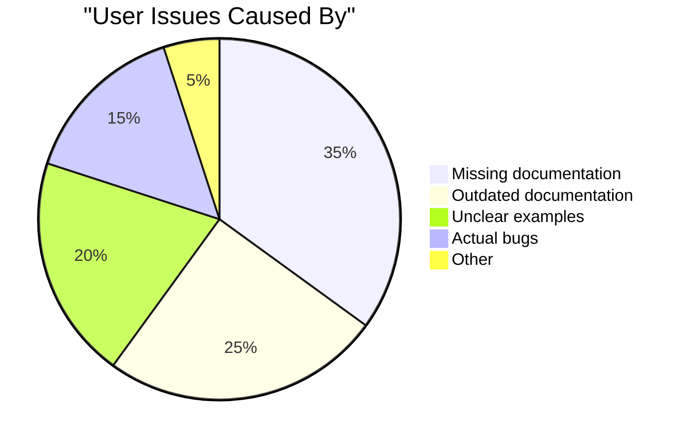
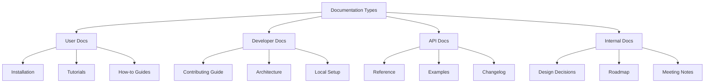
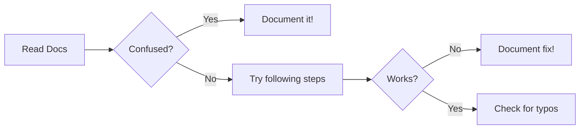
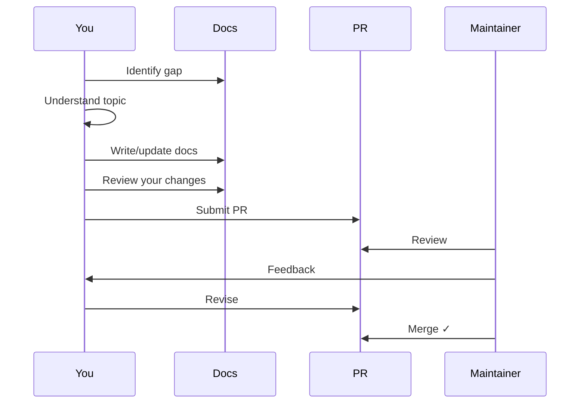
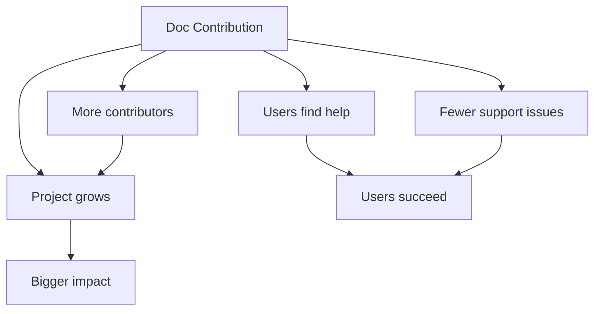

import { Callout, Cards, Card, Steps, Tabs } from 'nextra/components'

# Documentation Contributions

Documentation is the unsung hero of open source. It's often the easiest way to start contributing while making a huge impact.

## Why Docs Matter



**60%** of user issues stem from documentation problems!

## Types of Documentation



## Finding Doc Opportunities

### Look For These Labels

| Label | Opportunity |
|-------|-------------|
| `documentation` | Docs needed |
| `good first issue` + `docs` | Perfect for beginners |
| `help wanted` | Often includes docs |
| `needs-docs` | Feature lacks docs |

### Common Documentation Gaps

- [ ] Missing installation steps for certain OS
- [ ] Outdated screenshots
- [ ] Broken links
- [ ] Typos and grammar errors
- [ ] Missing examples
- [ ] Unclear error messages
- [ ] Missing troubleshooting guides
- [ ] Outdated version numbers

### Finding Gaps Yourself



## Documentation Workflow



## Writing Good Documentation

### The Golden Rule

> Write for someone who knows nothing about this project.

### Documentation Structure

```markdown
# Feature Name

One sentence explaining what this does.

## Overview

Brief explanation (2-3 sentences).

## Prerequisites

- What users need before starting
- Required dependencies
- Minimum versions

## Quick Start

Fastest way to get working.

## Detailed Usage

### Option 1: Common Case
Step-by-step with examples.

### Option 2: Advanced Case
For power users.

## Configuration

| Option | Default | Description |
|--------|---------|-------------|
| `timeout` | `30s` | Request timeout |

## Troubleshooting

### Common Issue 1
Cause and solution.

### Common Issue 2
Cause and solution.

## Related

- Links to related docs
```

### Before and After

**❌ Bad Documentation:**

```markdown
# Auth

Use the auth function to authenticate.

    auth(credentials)

This will authenticate the user.
```

**✅ Good Documentation:**

```markdown
# Authentication

Authenticate users with the `auth()` function.

## Quick Start

```javascript
import { auth } from 'library';

const session = await auth({
    email: 'user@example.com',
    password: 'secure-password'
});

console.log(session.token); // JWT token
```

## Parameters

| Parameter | Type | Required | Description |
|-----------|------|----------|-------------|
| `email` | string | Yes | User's email address |
| `password` | string | Yes | User's password |
| `remember` | boolean | No | Keep session active (default: false) |

## Returns

Returns a `Session` object:

```javascript
{
    token: 'eyJhbG...',     // JWT authentication token
    userId: '123',           // User's unique ID
    expiresAt: 1234567890   // Token expiration timestamp
}
```

## Errors

| Error | Cause | Solution |
|-------|-------|----------|
| `InvalidCredentials` | Wrong email/password | Verify credentials |
| `AccountLocked` | Too many failed attempts | Wait 15 minutes |

## Example: Full Implementation

```javascript
import { auth, AuthError } from 'library';

async function login(email, password) {
    try {
        const session = await auth({ email, password });
        localStorage.setItem('token', session.token);
        return session;
    } catch (error) {
        if (error instanceof AuthError) {
            console.error('Login failed:', error.message);
        }
        throw error;
    }
}
```
```

### Key Principles

| Principle | Description |
|-----------|-------------|
| **Concise** | No unnecessary words |
| **Complete** | All needed information |
| **Correct** | Accurate and tested |
| **Current** | Up to date |
| **Consistent** | Same style throughout |

## Writing Code Examples

### Good Examples

```javascript
// ✅ Shows real use case
const user = await getUser('user-123');
console.log(`Welcome, ${user.name}!`);

// ❌ Too abstract
const x = await fn(a);
console.log(x);
```

### Example Best Practices

1. **Use realistic values** (not `foo`, `bar`, `test`)
2. **Show complete snippets** that can be copy-pasted
3. **Include imports** when relevant
4. **Add comments** explaining non-obvious parts
5. **Show expected output** when helpful

## Common Documentation Formats

### Markdown Essentials

```markdown
# Heading 1
## Heading 2
### Heading 3

**bold** and *italic*

- Bullet point
- Another point

1. Numbered
2. List

`inline code`

    code block (4 spaces)

```language
fenced code block
```

> Blockquote

[Link text](url)


| Column 1 | Column 2 |
|----------|----------|
| Data | Data |
```

### Project-Specific Formats

| Format | Tools |
|--------|-------|
| Markdown | GitHub, GitLab, most projects |
| MDX | React projects, Docusaurus |
| reStructuredText | Python (Sphinx) |
| AsciiDoc | Some enterprise projects |
| YAML/JSON | API documentation |

## Types of Doc Contributions

### 1. Fixing Typos

Smallest but valuable!

```diff
- This function retuns a value
+ This function returns a value
```

**PR title:** `docs: fix typo in auth.md`

### 2. Improving Clarity

```diff
- Use the function to do stuff
+ Call `processData()` to validate and transform user input
```

### 3. Adding Examples

```diff
  ## Usage
  
  Call the function with your data.
  
+ ### Example
+ 
+ ```javascript
+ const result = processData({ name: 'John', age: 30 });
+ console.log(result); // { valid: true, processed: {...} }
+ ```
```

### 4. Adding Missing Sections

```diff
  ## Installation
  
  npm install library
  
+ ## Configuration
+ 
+ Create a config file in your project root:
+ 
+ ```javascript
+ // library.config.js
+ module.exports = {
+   option1: true,
+   option2: 'value'
+ };
+ ```
```

### 5. Updating Outdated Docs

```diff
- ## Requires Node.js 14+
+ ## Requires Node.js 18+
```

### 6. Adding Translations

Many projects need translations:

```
docs/
  en/
    getting-started.md
  es/           # Spanish
    getting-started.md
  zh/           # Chinese
    getting-started.md
```

## Documentation PR Checklist

Before submitting:

- [ ] Links work
- [ ] Code examples run
- [ ] Spelling/grammar checked
- [ ] Follows project style
- [ ] Screenshots current (if any)
- [ ] No broken images
- [ ] Table formatting correct
- [ ] Preview renders correctly

## PR Message Template

```markdown
## Description

[What docs are you changing and why]

## Type of Change

- [ ] Fix typo/grammar
- [ ] Improve clarity
- [ ] Add missing content
- [ ] Update outdated content
- [ ] Add examples
- [ ] Other: [describe]

## Checklist

- [ ] I've read the contributing guide
- [ ] I've previewed my changes
- [ ] Links are working
- [ ] Code examples are correct
```

## Documentation Tools

### Spell Checking

```bash
# npm
npm install -g cspell
cspell "docs/**/*.md"

# VSCode extension: Code Spell Checker
```

### Link Checking

```bash
# Check for broken links
npm install -g markdown-link-check
find docs -name "*.md" -exec markdown-link-check {} \;
```

### Previewing

```bash
# For markdown
npm install -g markdown-preview

# For Docusaurus
npm run start

# For MkDocs
mkdocs serve
```

## Impact of Doc Contributions



### Real Impact Stats

| Metric | Impact |
|--------|--------|
| Good README | 50%+ more stars |
| Clear setup guide | 70% less setup issues |
| API examples | 40% faster adoption |
| Troubleshooting docs | 60% fewer support requests |

## Documentation Issues to Look For

### Perfect First Contributions

1. **Typos** - Easy fix, immediate merge
2. **Broken links** - Quick to fix and verify
3. **Outdated versions** - Check current versions
4. **Missing OS instructions** - Add Windows/Mac/Linux
5. **Screenshot updates** - Take new screenshots

### Medium Contributions

1. **Add code examples** - For existing features
2. **Improve explanations** - Make unclear docs clearer
3. **Add FAQ entries** - Based on common issues
4. **Create troubleshooting guide** - Document error fixes

### Large Contributions

1. **Write tutorials** - Step-by-step guides
2. **Create architecture docs** - System overview
3. **Add API documentation** - Full reference
4. **Translate docs** - New language support

## Building a Portfolio

Documentation contributions showcase:

- ✅ **Communication skills** - Can explain complex topics
- ✅ **User empathy** - Understand beginner perspective
- ✅ **Attention to detail** - Catch errors others miss
- ✅ **Technical understanding** - Must understand to document

### Highlighting Doc Work

```markdown
## Open Source Contributions

**Documentation Lead** - [Project Name]
- Rewrote getting started guide, reducing setup issues by 40%
- Added 15 code examples to API documentation
- Translated documentation to Spanish (3,000+ words)
```

## Quick Reference

### Doc PR Titles

```
docs: fix typo in README
docs: add installation example for Windows
docs(api): add authentication examples
docs: update Node.js version requirement
docs(contributing): clarify PR process
```

### Finding Doc Issues

```
# GitHub search
repo:org/repo is:issue is:open label:documentation
repo:org/repo is:issue is:open label:good-first-issue label:docs
```

## Next Steps

You've completed the First Contribution section! Move on to advanced topics:

➡️ [Issues & Pull Requests →](/docs/issues-prs)

---

> **Pro tip:** Many of the best contributors started with documentation. It's not "lesser" work—it's essential work that maintainers deeply appreciate.
