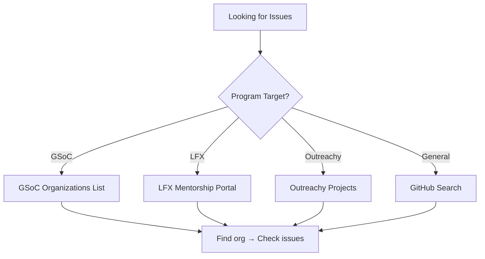
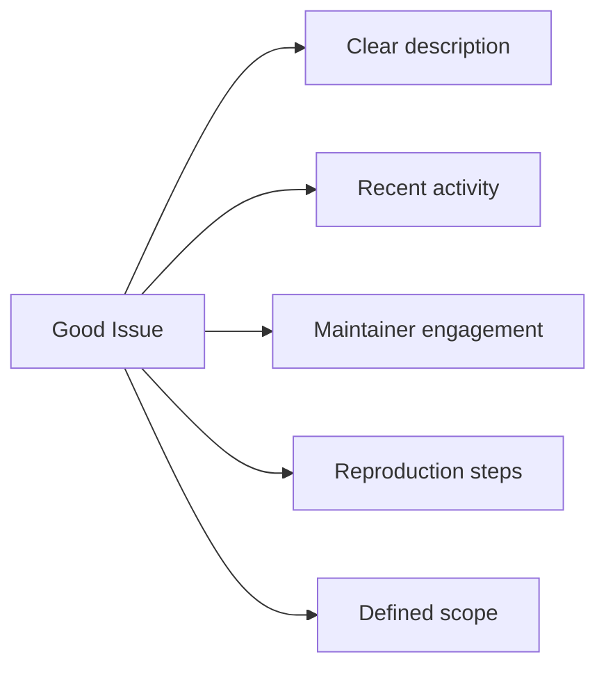
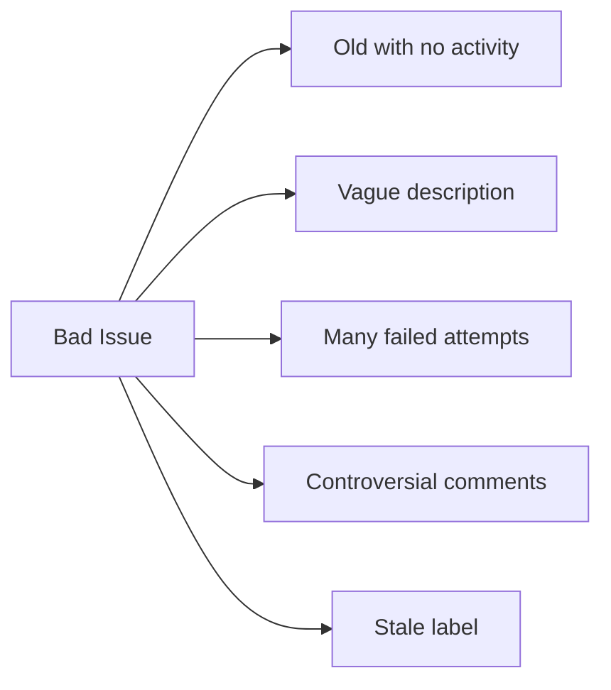
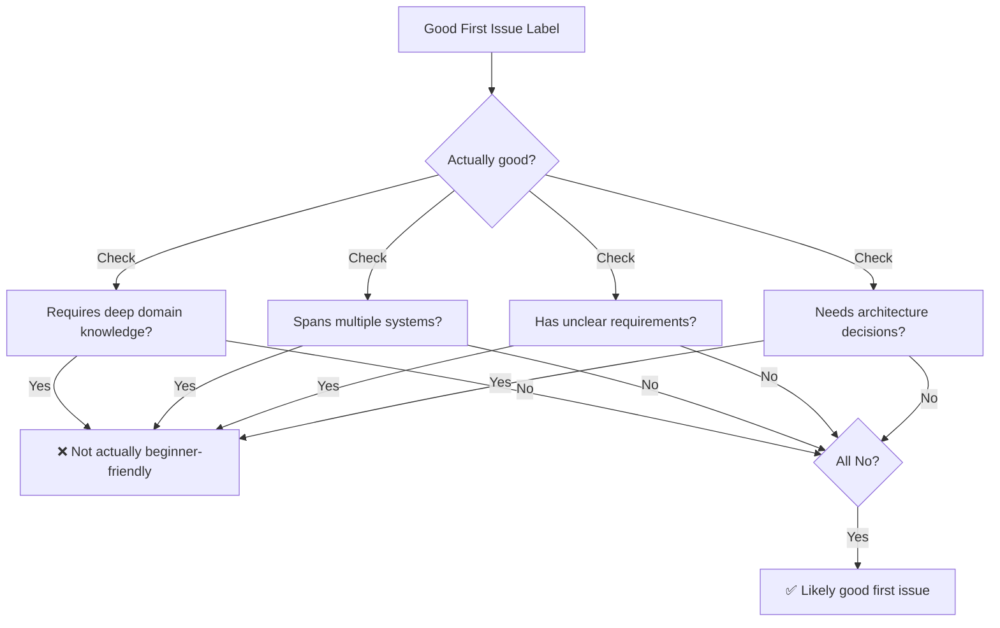
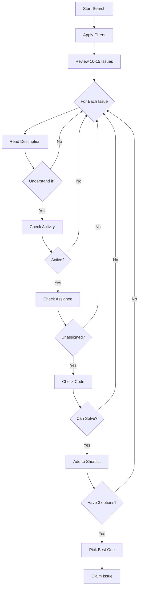

import { Callout, Cards, Card, Steps, Tabs } from 'nextra/components'

# Finding Good First Issues

Not all "good first issues" are actually good. Learn to find the real opportunities.

## Where to Find Issues

### 1. GitHub Labels

Most projects use labels to mark beginner-friendly issues:

| Label | Meaning |
|-------|---------|
| `good first issue` | Official GitHub label for beginners |
| `help wanted` | Maintainers actively seeking help |
| `beginner-friendly` | Custom label, same meaning |
| `easy` | Low complexity |
| `documentation` | Doc-related (often good for starters) |
| `hacktoberfest` | Valid for Hacktoberfest |

### 2. Search Queries

```
# On GitHub, use these searches:

# All good first issues in a language
label:"good first issue" language:javascript

# Good first issues with no assignee
label:"good first issue" no:assignee

# Recent good first issues (last 7 days)
label:"good first issue" created:>2024-01-01

# In specific organization
org:facebook label:"good first issue"
```

### 3. Dedicated Platforms

| Platform | URL | Best For |
|----------|-----|----------|
| Good First Issues | goodfirstissues.com | Curated beginner issues |
| Up For Grabs | up-for-grabs.net | Variety of projects |
| First Timers Only | firsttimersonly.com | First contribution ever |
| CodeTriage | codetriage.com | Helping with triage |
| Awesome for Beginners | github.com/MunGell/awesome-for-beginners | Curated list |

### 4. Program-Specific Sources



## Evaluating Issue Quality

### ✅ Green Flags (Good Signs)



**Look for:**

| Signal | What It Means |
|--------|---------------|
| Clear description | Maintainer thought about it |
| Recent comments | Issue is still relevant |
| Maintainer responded | Someone cares about this |
| Labels are appropriate | Project is organized |
| Acceptance criteria | You know when you're done |
| Referenced in roadmap | Important to the project |

### ❌ Red Flags (Warning Signs)



**Avoid:**

| Signal | What It Means |
|--------|---------------|
| No activity for 6+ months | Likely abandoned |
| "Stale" or "wontfix" labels | Not a priority |
| Many attempted PRs, all closed | Unclear requirements |
| Heated discussions | Politics involved |
| Vague like "improve performance" | No clear direction |
| Assigned but inactive | Someone else has it |

## Issue Quality Assessment

### Quick Score Method

Rate each factor 1-5:

```
Issue Score = 
    Clarity (1-5) + 
    Recency (1-5) + 
    Maintainer Engagement (1-5) + 
    Scope Appropriateness (1-5) + 
    Learning Value (1-5)

Score > 20: Excellent issue
Score 15-20: Good issue
Score 10-15: Proceed with caution
Score < 10: Look elsewhere
```

### Example Evaluation

**Issue: "Fix broken pagination on user list"**

| Factor | Score | Reason |
|--------|-------|--------|
| Clarity | 4 | Clear what's broken |
| Recency | 5 | Opened 2 days ago |
| Maintainer | 5 | Maintainer commented "happy to help" |
| Scope | 4 | Well-defined, single component |
| Learning | 4 | Learn about pagination, API calls |
| **Total** | **22** | **Excellent issue!** |

## Fake "Good First Issues"

### Spotting Fake Ones

Some issues are labeled "good first issue" but aren't:



### Common Fake Patterns

**1. The Disguised Monster**
```
Title: "Simple UI fix"
Reality: Requires understanding entire state management system
```

**2. The Outdated Label**
```
Title: "Add basic feature" (labeled 2 years ago)
Reality: Codebase has completely changed
```

**3. The Scope Creep**
```
Title: "Fix small bug"
Comments: "Also need to refactor X, update Y, test Z..."
Reality: Not small anymore
```

**4. The Impossible Standard**
```
Title: "Improve performance"
Reality: No metrics, no baseline, how do you know when done?
```

## The Search Strategy

### Step 1: Choose Your Criteria

```bash
# Your filters
Language: JavaScript
Difficulty: Beginner
Time: 4-8 hours
Type: Bug fix or documentation
Project: Active (commits in last month)
```

### Step 2: GitHub Search

```
label:"good first issue" language:javascript created:>2024-01-01 comments:>2
```

### Step 3: Filter Results

For each result, check:
- [ ] Last commit to repo < 30 days
- [ ] Issue has maintainer comment
- [ ] Issue is unassigned
- [ ] Issue has clear requirements
- [ ] Project has CONTRIBUTING.md

### Step 4: Deep Dive on Top 3

For your top candidates:
1. Read entire issue thread
2. Check related code files
3. Look at similar merged PRs
4. Evaluate if you can solve it

## Issue Hunting Workflow



## Projects Known for Good First Issues

### Frontend
- React - Large but well-documented
- Vue.js - Welcoming community
- Angular - Structured contribution process
- Next.js - Active maintainers

### Backend
- Node.js - Many entry points
- Django - Great documentation
- Express.js - Simple codebase
- FastAPI - Modern, clean code

### Tools & Infrastructure
- VS Code - Massive but organized
- Kubernetes - Well-labeled issues
- Docker - Clear contribution guides

## Time Invested Wisely

| Activity | Good Time Investment | Bad Time Investment |
|----------|---------------------|---------------------|
| Finding issue | 1-2 hours | 5+ hours |
| Reading issue | 30 min | 5 min (too quick) |
| Checking codebase | 1 hour | Skip entirely |
| Asking questions | As needed | Never (stuck for days) |

## Pro Tips

### 1. Follow Before Contributing

```
Week 1: Star repo, watch issues
Week 2: Read issues, understand patterns
Week 3: Pick an issue and contribute
```

### 2. Start with What You Know

If you know React → Find React issues
If you know Python → Find Python issues
If you know testing → Add tests

### 3. Look at Closed PRs First

```bash
# See what gets merged
# Check merged PRs from new contributors
# Understand the review process
```

### 4. Check the "Pulse"

On GitHub, check Insights → Pulse:
- Recent commits
- Open/closed issues ratio
- PR merge rate

## Next Steps

Found some potential issues? Learn how to pick the best one:

➡️ [Picking Issues That Get Merged →](picking-issues)

---

> **Pro Tip:** The best issues aren't always labeled. Sometimes a recent bug report with maintainer interest is better than a stale "good first issue."
