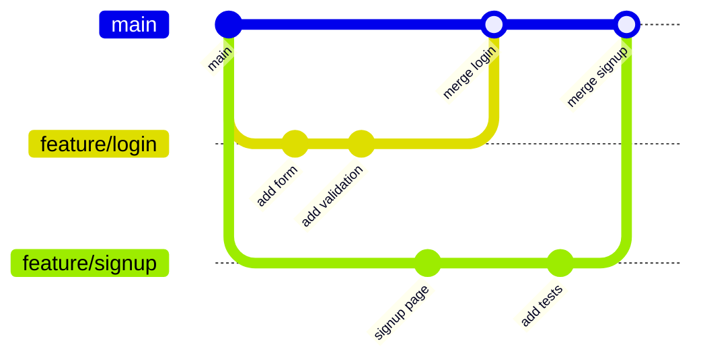
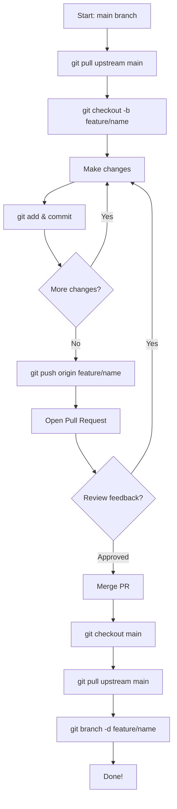
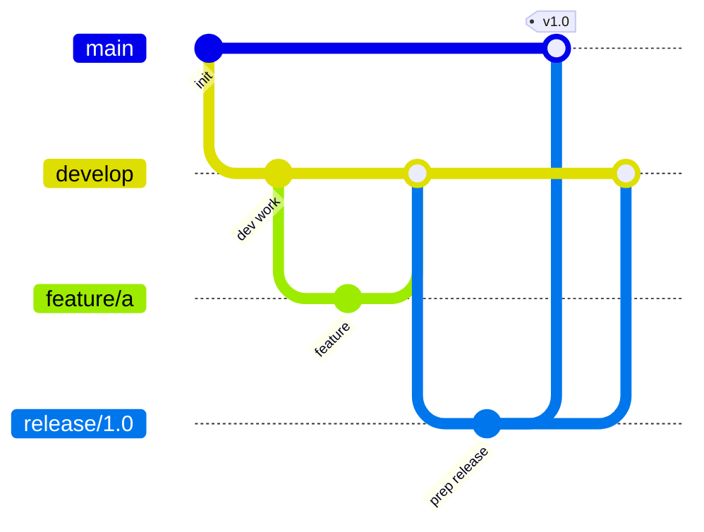
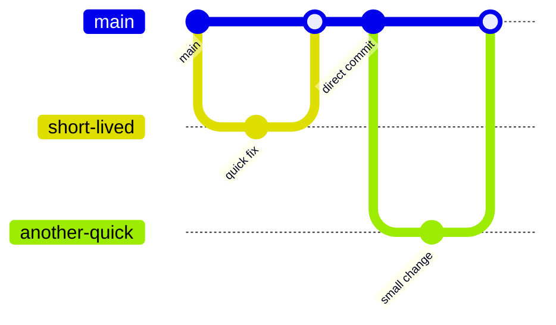
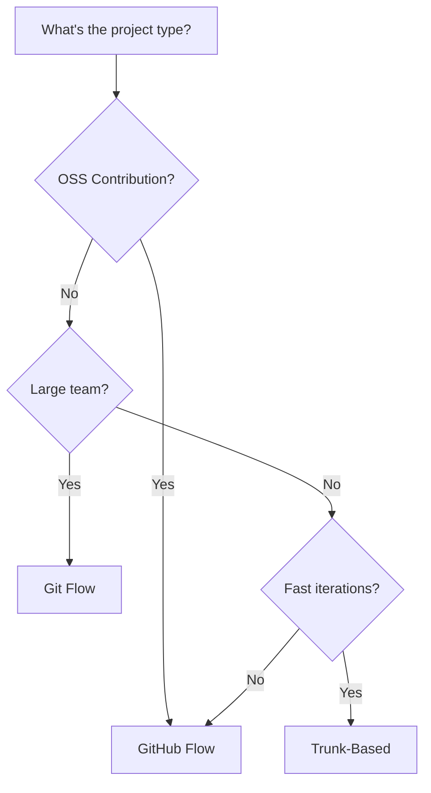
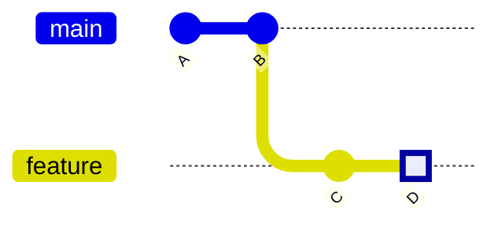
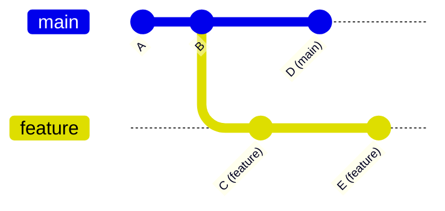

import { Callout, Cards, Card, Steps, Tabs } from 'nextra/components'

# Branching Strategy

Branches are how you organize your work. Poor branching = rejected PRs.

## Why Branches Matter



Branches let you:
- Work on features independently
- Keep `main` stable
- Submit clean PRs
- Collaborate without conflicts

## The Golden Rules

| Rule | Why |
|------|-----|
| Never commit directly to `main` | Keep it deployable |
| One branch = one feature | Clean PRs |
| Branch from latest `main` | Avoid conflicts |
| Delete merged branches | Stay organized |

## Branch Naming Conventions

### Standard Format

```
<type>/<short-description>
```

### Types

| Type | Use For | Example |
|------|---------|---------|
| `feature/` | New functionality | `feature/user-auth` |
| `fix/` | Bug fixes | `fix/login-crash` |
| `docs/` | Documentation | `docs/api-readme` |
| `refactor/` | Code improvements | `refactor/cleanup-utils` |
| `test/` | Adding tests | `test/auth-unit-tests` |
| `chore/` | Maintenance | `chore/update-deps` |

### Good vs Bad Names

| ❌ Bad | ✅ Good |
|--------|---------|
| `my-branch` | `feature/add-login` |
| `fix` | `fix/resolve-signup-error` |
| `test123` | `test/user-service-unit` |
| `john-work` | `docs/update-contributing` |
| `asdf` | `refactor/simplify-auth-flow` |

## Branch Workflow

### Creating a Branch

```bash
# Ensure you're on main and updated
git checkout main
git pull upstream main

# Create and switch to new branch
git checkout -b feature/my-feature

# Verify you're on the new branch
git branch
```

### The Complete Flow



## Branching Models

### 1. GitHub Flow (Recommended for OSS)

```mermaid
gitGraph
    commit id: "stable"
    branch feature-1
    commit id: "work"
    commit id: "more work"
    checkout main
    merge feature-1 id: "PR merged"
    branch feature-2
    commit id: "new feature"
    checkout main
    merge feature-2 id: "PR merged"
```

**Rules:**
- `main` is always deployable
- Branch off `main` for any work
- Open PR when ready
- Merge after review
- Deploy from `main`

### 2. Git Flow (For Larger Projects)



**Branches:**
- `main` - Production code
- `develop` - Integration branch
- `feature/*` - New features
- `release/*` - Release preparation
- `hotfix/*` - Emergency fixes

### 3. Trunk-Based Development



**Rules:**
- Very short-lived branches (< 1 day)
- Frequent integration
- Feature flags for incomplete features

## Choosing Your Strategy



**For open source contributions:** Use **GitHub Flow**. It's what most projects expect.

## Working with Branches

### Listing Branches

```bash
# Local branches
git branch

# Remote branches
git branch -r

# All branches
git branch -a

# With last commit info
git branch -v
```

### Switching Branches

```bash
# Switch to existing branch
git checkout branch-name

# Or using newer syntax
git switch branch-name

# Create and switch
git checkout -b new-branch
git switch -c new-branch
```

### Deleting Branches

```bash
# Delete local branch (safe - won't delete unmerged)
git branch -d branch-name

# Force delete local branch
git branch -D branch-name

# Delete remote branch
git push origin --delete branch-name
```

### Renaming Branches

```bash
# Rename current branch
git branch -m new-name

# Rename specific branch
git branch -m old-name new-name

# Update remote after rename
git push origin -u new-name
git push origin --delete old-name
```

## Branch Visualization

### Understanding HEAD



```
HEAD → feature → D
         ↓
main → B
```

`HEAD` points to your current position.

### Branch Divergence



When branches diverge, you'll need to merge or rebase.

## Common Scenarios

### Scenario 1: Starting a New Feature

```bash
# 1. Update main
git checkout main
git pull upstream main

# 2. Create feature branch
git checkout -b feature/awesome-thing

# 3. Work on it
# ... edit files ...
git add .
git commit -m "feat: add awesome thing"

# 4. Push to your fork
git push origin feature/awesome-thing

# 5. Open PR on GitHub
```

### Scenario 2: Updating Your Branch

```bash
# Your branch is behind main
git checkout main
git pull upstream main
git checkout feature/your-branch
git rebase main

# If conflicts, resolve them, then:
git add .
git rebase --continue

# Force push (only your branch!)
git push origin feature/your-branch --force
```

### Scenario 3: Wrong Branch!

```bash
# Made commits on wrong branch
git log  # Note the commit hashes

# Switch to correct branch
git checkout correct-branch

# Cherry-pick the commits
git cherry-pick abc123

# Remove from wrong branch
git checkout wrong-branch
git reset --hard HEAD~1  # Removes last commit
```

### Scenario 4: Branch Cleanup

```bash
# After PR is merged
git checkout main
git pull upstream main
git branch -d feature/merged-branch

# Clean up remote tracking
git fetch --prune

# Delete all merged branches
git branch --merged | grep -v main | xargs git branch -d
```

## Branch Protection (For Maintainers)

Projects often protect `main`:

| Protection | What It Does |
|------------|--------------|
| Require PR | No direct commits |
| Require reviews | Must have approval |
| Require CI pass | Tests must pass |
| No force push | Prevent history rewrite |

As a contributor, you'll always use PRs.

## Best Practices Checklist

- [ ] Always branch from updated `main`
- [ ] Use descriptive branch names
- [ ] One feature per branch
- [ ] Keep branches short-lived
- [ ] Delete branches after merge
- [ ] Never force push `main`
- [ ] Pull before starting new work

## Quick Reference

```bash
# Create branch
git checkout -b type/description

# List branches
git branch -a

# Switch branch
git checkout branch-name

# Delete branch
git branch -d branch-name

# Update branch from main
git checkout your-branch
git rebase main

# Push branch
git push origin branch-name
```

## Troubleshooting

### "Branch already exists"
```bash
# Delete and recreate
git branch -D branch-name
git checkout -b branch-name
```

### "Cannot delete branch - not fully merged"
```bash
# If you're sure, force delete
git branch -D branch-name
```

### "Your branch is behind"
```bash
git pull origin branch-name
# Or rebase from main
git rebase main
```

## Next Steps

Now that you understand branching:

➡️ [Commit Messages →](commits)

---

> **Pro Tip:** A good branch name tells the story of what you're working on without needing to open the PR.
