import { Callout, Cards, Card, Steps, Tabs } from 'nextra/components'

# When Not to Force Push

Force push is a **destructive operation**. It overwrites history. One wrong force push can destroy your teammates' work.

## What Force Push Does


Commit C is **gone**. Anyone who had C will have problems.

## The Danger Zone

### Never Force Push To:

| Branch | Why Not |
|--------|---------|
| `main` / `master` | Production code, everyone depends on it |
| `develop` | Integration branch, shared by team |
| Release branches | Tagged for deployment |
| Any shared branch | Others have pulled it |

### Safe To Force Push:

| Branch | Why OK |
|--------|--------|
| Your feature branch | Only you use it |
| Branches with open PR | You own the PR |
| Clearly marked personal branches | `username/feature` pattern |

## Decision Flowchart

```mermaid
flowchart TD
    A[Need to push after rewriting history] --> B{Is this main/master/develop?}
    B -->|Yes| C[❌ NEVER force push]
    B -->|No| D{Is this a shared branch?}
    D -->|Yes| E{Do collaborators know?}
    E -->|No| F[❌ Don't force push]
    E -->|Yes| G{Have they backed up?}
    G -->|No| F
    G -->|Yes| H[⚠️ Proceed with caution]
    D -->|No| I{Is this YOUR branch?}
    I -->|Yes| J[✅ Safe to force push]
    I -->|No| K[❌ Don't force push]
```



## Safe Force Push: --force-with-lease

Always use `--force-with-lease` instead of `--force`:

```bash
# ❌ Dangerous - overwrites blindly
git push --force origin branch-name

# ✅ Safe - checks if remote changed
git push --force-with-lease origin branch-name
```

### How It Works


### The Difference

| Command | Checks Remote | Overwrites Others' Work |
|---------|---------------|------------------------|
| `--force` | ❌ No | ⚠️ Yes, always |
| `--force-with-lease` | ✅ Yes | ❌ No, fails if changed |

## Scenarios Where Force Push Causes Problems

### Scenario 1: Overwriting Teammate's Commit


You force push, overwriting C:

```
Teammate: "Where did my commit go?!"
```

### Scenario 2: Breaking Everyone's Local


### Scenario 3: Lost Work

```bash
# You have:    A -- B -- C
# Remote has:  A -- B -- C -- D (colleague's work)
# You rebase:  A -- B -- C' (rewritten)
# You force push

# Result: D is GONE
```

## Acceptable Force Push Scenarios

### 1. Your Own Feature Branch (PR Open)

```bash
# Reviewer asks for changes, you squash
git rebase -i HEAD~3
git push --force-with-lease origin feature/your-branch

# This updates your PR - perfectly fine
```

### 2. After Interactive Rebase (Pre-Review)

```bash
# Clean up commits before requesting review
git rebase -i main
git push --force-with-lease origin feature/my-work
```

### 3. Syncing with Upstream

```bash
# Your feature branch is behind
git fetch upstream
git rebase upstream/main
git push --force-with-lease origin feature/my-branch
```

## What To Do Instead of Force Push

### For Shared Branches: Revert

```bash
# Instead of rewriting history, add a revert commit
git revert abc123
git push origin main  # Normal push

# History is preserved, mistake is undone
```


### For Merging Latest Changes: Merge

```bash
# Instead of rebasing shared branch
git checkout main
git merge feature-branch
git push origin main  # Normal push
```

### For Fixing Last Commit (Not Pushed)

```bash
# Safe - hasn't been pushed yet
git commit --amend
git push origin branch  # Normal push works
```

## Recovery: After Bad Force Push

### If You Force Pushed Your Branch

```bash
# Find the old commit
git reflog

# Output:
# abc123 HEAD@{0}: push --force
# def456 HEAD@{1}: rebase
# ghi789 HEAD@{2}: commit (before rebase)

# Reset to old state
git reset --hard ghi789
git push --force-with-lease origin branch
```

### If Someone Force Pushed Shared Branch

```bash
# Fetch latest
git fetch origin

# Your local diverged
git status
# Your branch and 'origin/main' have diverged

# Option 1: Accept their version
git reset --hard origin/main

# Option 2: Keep your commits
git rebase origin/main
```

## Protecting Branches

### GitHub Branch Protection

Maintainers can prevent force push:

```
Repository Settings → Branches → Add Rule
- Branch name pattern: main
- ✅ Require pull request before merging
- ✅ Do not allow force pushes
```

### What It Looks Like

```bash
git push --force origin main
# ! [remote rejected] main -> main (protected branch hook declined)
```

## Git Aliases for Safety

Add to `~/.gitconfig`:

```ini
[alias]
    # Make force-with-lease the default
    pushf = push --force-with-lease
    
    # Remind yourself of the danger
    forcepush = !echo 'Are you sure? Use pushf instead' && exit 1
```

## The Force Push Checklist

Before force pushing, verify:

- [ ] This is MY branch (not shared)
- [ ] OR everyone affected has been notified
- [ ] I'm using `--force-with-lease`
- [ ] I've fetched recent changes first
- [ ] I have the reflog if I need to recover
- [ ] This is NOT main/master/develop

## Quick Reference

| Want To | Safe Method | Dangerous Method |
|---------|-------------|------------------|
| Update after rebase | `--force-with-lease` | `--force` |
| Undo a commit | `git revert` | Force push |
| Sync with upstream | Merge or rebase + lease | Force push |
| Fix shared branch | Revert commit | Force push |
| Fix own PR | `--force-with-lease` | `--force` |

## Communication Template

If you MUST force push a shared branch:

```
⚠️ FORCE PUSH ALERT ⚠️

I need to force push to branch: feature/shared-work
Reason: [explain why]
Time: [when you'll do it]

Before I push:
1. Push any uncommitted changes
2. Back up your local branch: git branch backup-$(date +%Y%m%d)

After I push:
1. Run: git fetch origin
2. Run: git reset --hard origin/feature/shared-work

Questions? Reply before [time].
```

## Summary

```mermaid
flowchart TD
    A[Want to Force Push?] --> B{main/develop?}
    B -->|Yes| C[❌ NEVER]
    B -->|No| D{Your branch only?}
    D -->|Yes| E[✅ Use --force-with-lease]
    D -->|No| F{Everyone notified & backed up?}
    F -->|Yes| G[⚠️ Use --force-with-lease, be careful]
    F -->|No| H[❌ Don't do it]
```



## Section Complete! 🎉

You've completed the **Git & GitHub Essentials** section. You now understand:

- ✅ Git basics
- ✅ Branching strategies
- ✅ Commit messages
- ✅ Fork syncing
- ✅ Conflict resolution
- ✅ History rewriting
- ✅ Safe force pushing

## Next Section

Ready to make your first contribution?

➡️ [Making Your First Contribution →](../first-contribution/index)

---

> **Final Thought:** Force push is like a power tool—extremely useful in the right hands, dangerous in the wrong ones. Default to `--force-with-lease` and communicate with your team.
