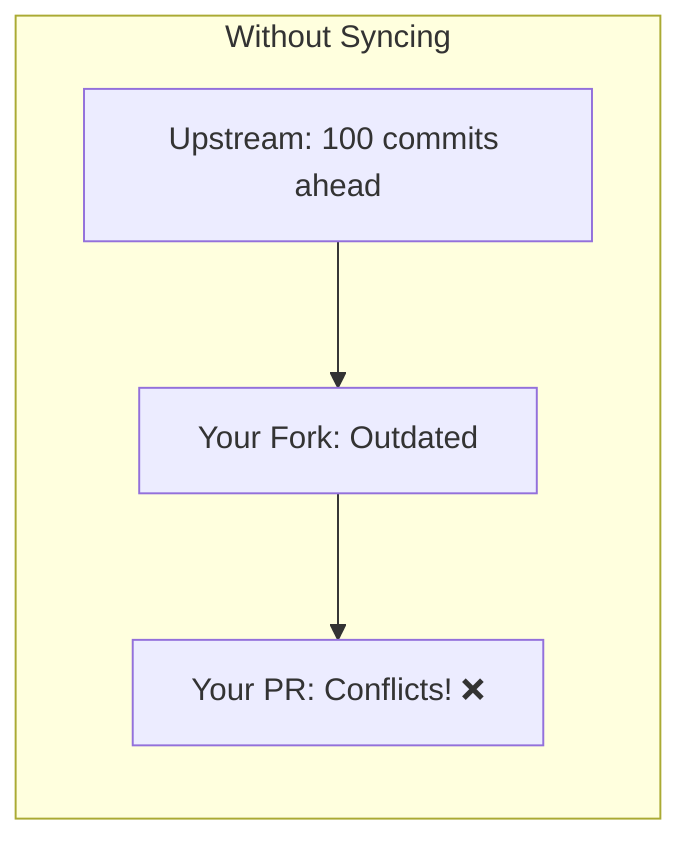
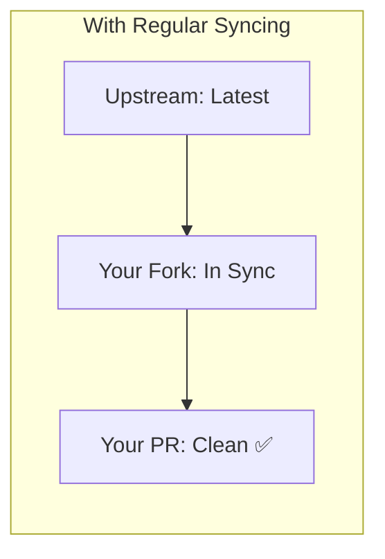
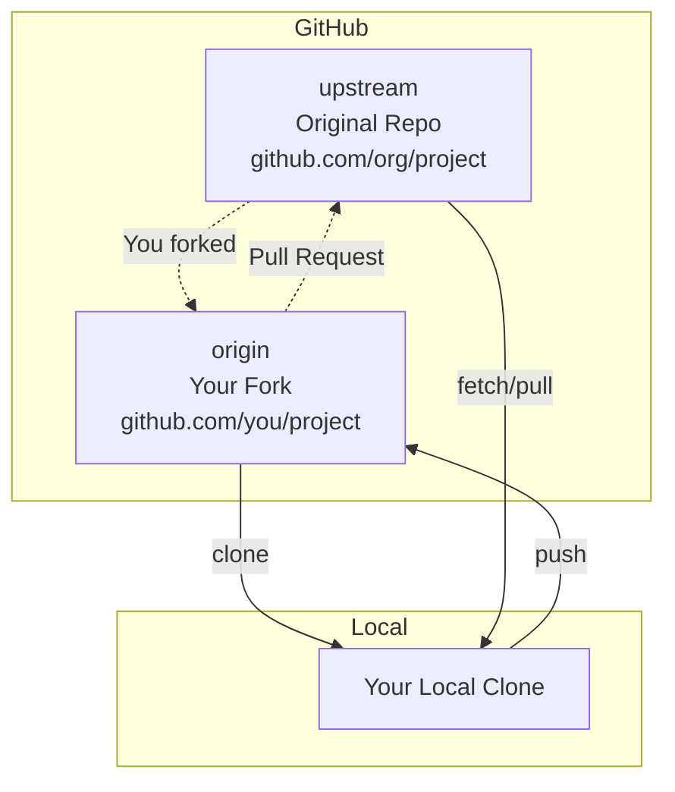
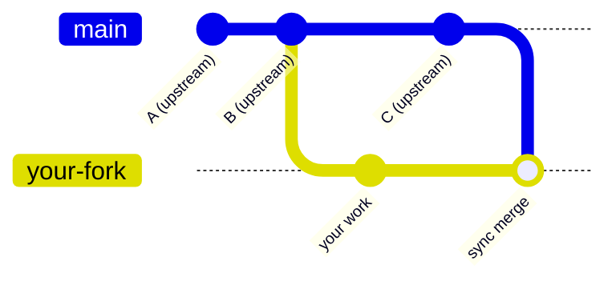
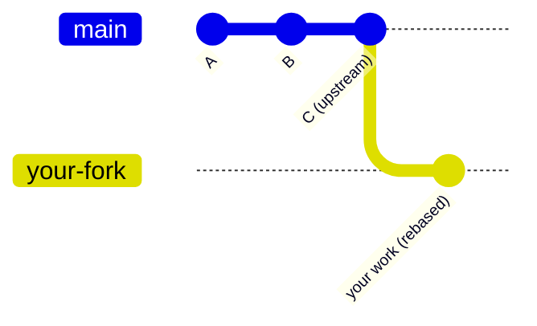
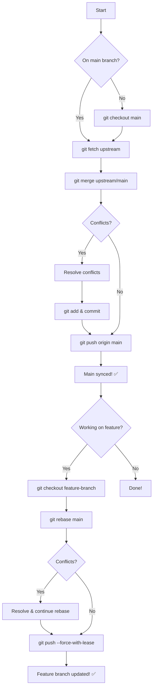
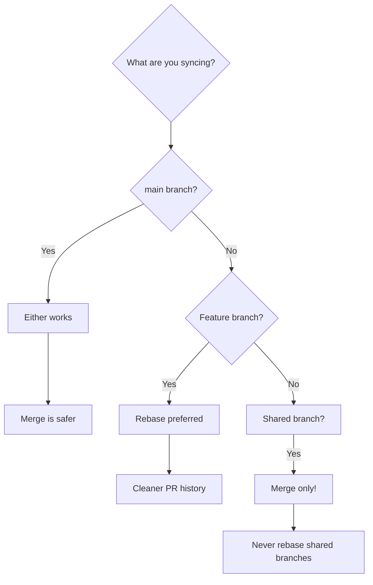

import { Callout, Cards, Card, Steps, Tabs } from 'nextra/components'

# Syncing Fork with Upstream

Your fork gets **stale**. The original repository keeps evolving. Syncing prevents merge conflicts and keeps your PRs clean.

## Why Syncing Matters





## Understanding Remotes



| Remote | Points To | Purpose |
|--------|-----------|---------|
| `origin` | Your fork on GitHub | Push your changes |
| `upstream` | Original repository | Get latest changes |

## Initial Setup

### 1. Check Current Remotes

```bash
git remote -v
```

**Expected output:**
```
origin    https://github.com/YOU/project.git (fetch)
origin    https://github.com/YOU/project.git (push)
```

### 2. Add Upstream Remote

```bash
git remote add upstream https://github.com/ORIGINAL-OWNER/project.git
```

### 3. Verify Both Remotes

```bash
git remote -v
```

**Expected output:**
```
origin    https://github.com/YOU/project.git (fetch)
origin    https://github.com/YOU/project.git (push)
upstream  https://github.com/ORIGINAL/project.git (fetch)
upstream  https://github.com/ORIGINAL/project.git (push)
```

## Syncing Methods

### Method 1: Merge (Recommended for Beginners)

```bash
# 1. Fetch upstream changes
git fetch upstream

# 2. Switch to main branch
git checkout main

# 3. Merge upstream changes
git merge upstream/main

# 4. Push to your fork
git push origin main
```

**Visual:**



### Method 2: Rebase (Cleaner History)

```bash
# 1. Fetch upstream changes
git fetch upstream

# 2. Switch to main branch
git checkout main

# 3. Rebase on upstream
git rebase upstream/main

# 4. Push to your fork (may need force)
git push origin main --force-with-lease
```

**Visual:**



### Method 3: GitHub UI (Easiest)

1. Go to your fork on GitHub
2. Click "Sync fork" button
3. Click "Update branch"

> **Note:** You'll still need to `git pull` locally after.

## Complete Sync Workflow



## Syncing Your Feature Branch

After syncing main, update your feature branch:

```bash
# 1. Make sure main is synced first
git checkout main
git fetch upstream
git merge upstream/main
git push origin main

# 2. Update your feature branch
git checkout feature/your-branch
git rebase main

# 3. If conflicts, resolve them
# ... fix files ...
git add .
git rebase --continue

# 4. Push updated branch
git push origin feature/your-branch --force-with-lease
```

## When to Sync

| Situation | Action |
|-----------|--------|
| Starting new feature | Sync first |
| Before creating PR | Sync branch |
| PR has conflicts | Sync and rebase |
| Daily when actively contributing | Sync main |
| Before reviewing others' PRs | Sync main |

## Handling Sync Conflicts

### During Merge

```bash
git merge upstream/main
# CONFLICT in file.js

# 1. Open conflicted files
# 2. Look for conflict markers
<<<<<<< HEAD
your code
=======
upstream code
>>>>>>> upstream/main

# 3. Resolve by keeping correct code
# 4. Remove conflict markers
# 5. Stage and commit
git add file.js
git commit -m "merge: sync with upstream"
```

### During Rebase

```bash
git rebase upstream/main
# CONFLICT in file.js

# 1. Resolve conflict
# 2. Stage resolved files
git add file.js

# 3. Continue rebase
git rebase --continue

# 4. If more conflicts, repeat
# 5. When done, force push
git push --force-with-lease origin feature-branch
```

## Sync Cheat Sheet

### Quick Sync Commands

```bash
# Sync main (do this regularly)
git checkout main && git fetch upstream && git merge upstream/main && git push origin main

# Sync feature branch (before PR)
git checkout feature-branch && git rebase main && git push --force-with-lease origin feature-branch
```

### Aliases for Convenience

Add to `~/.gitconfig`:

```ini
[alias]
    sync = !git checkout main && git fetch upstream && git merge upstream/main && git push origin main
    update-branch = !git fetch upstream && git rebase upstream/main
```

Then use:
```bash
git sync
git update-branch
```

## Common Scenarios

### Scenario 1: Starting Fresh Work

```bash
# Always start from synced main
git checkout main
git fetch upstream
git merge upstream/main
git push origin main

# Now create your branch
git checkout -b feature/new-thing
```

### Scenario 2: PR Shows Conflicts

```bash
# GitHub says "This branch has conflicts"
git checkout main
git fetch upstream
git merge upstream/main
git push origin main

git checkout your-pr-branch
git rebase main
# Resolve conflicts...
git push --force-with-lease origin your-pr-branch
```

### Scenario 3: Behind by Many Commits

```bash
# Fork is 50 commits behind
git checkout main
git fetch upstream
git reset --hard upstream/main  # Nuclear option - loses local main changes
git push origin main --force
```

### Scenario 4: Sync Without Local Clone

Use GitHub's web interface:
1. Go to your fork
2. Click "Sync fork"
3. Click "Update branch"

## Merge vs Rebase: When to Use



| Method | Use When | Pros | Cons |
|--------|----------|------|------|
| **Merge** | Syncing main | Safe, simple | Merge commits |
| **Rebase** | Feature branches | Clean history | Requires force push |

## Troubleshooting

### "fatal: 'upstream' does not appear to be a git repository"

```bash
# You haven't added upstream
git remote add upstream https://github.com/ORIGINAL/repo.git
```

### "Your branch is ahead of 'origin/main'"

```bash
# Local is ahead - just push
git push origin main
```

### "Your branch and 'upstream/main' have diverged"

```bash
# Need to merge or rebase
git fetch upstream
git merge upstream/main
# Or
git rebase upstream/main
```

### "! [rejected] main -> main (non-fast-forward)"

```bash
# Your main has commits upstream doesn't
# Option 1: Merge
git pull origin main
git push origin main

# Option 2: Reset to upstream (loses local commits)
git reset --hard upstream/main
git push --force origin main
```

## Automation Options

### GitHub Actions

Create `.github/workflows/sync.yml` in your fork:

```yaml
name: Sync Fork

on:
  schedule:
    - cron: '0 0 * * *'  # Daily
  workflow_dispatch:

jobs:
  sync:
    runs-on: ubuntu-latest
    steps:
      - uses: actions/checkout@v3
        with:
          ref: main
      - name: Sync Fork
        uses: aormsby/Fork-Sync-With-Upstream-action@v3
        with:
          upstream_sync_repo: ORIGINAL/repo
          upstream_sync_branch: main
          target_sync_branch: main
```

### Pre-push Hook

Create `.git/hooks/pre-push`:

```bash
#!/bin/bash
# Warn if pushing to outdated branch
git fetch upstream
LOCAL=$(git rev-parse HEAD)
UPSTREAM=$(git rev-parse upstream/main)
if [ $LOCAL != $UPSTREAM ]; then
    echo "Warning: Your branch may be behind upstream"
    read -p "Continue? (y/n) " -n 1 -r
    echo
    if [[ ! $REPLY =~ ^[Yy]$ ]]; then
        exit 1
    fi
fi
```

## Best Practices

- ✅ Sync main at least weekly
- ✅ Always sync before creating new branches
- ✅ Sync before submitting PRs
- ✅ Use rebase for feature branches
- ✅ Use `--force-with-lease` not `--force`

- ❌ Don't let fork get too far behind
- ❌ Don't rebase shared/public branches
- ❌ Don't ignore conflict warnings

## Next Steps

Now that you can keep your fork synced:

➡️ [Resolving Merge Conflicts →](conflicts)

---

> **Pro Tip:** Set a calendar reminder to sync your active forks weekly. It takes 30 seconds and saves hours of conflict resolution.
