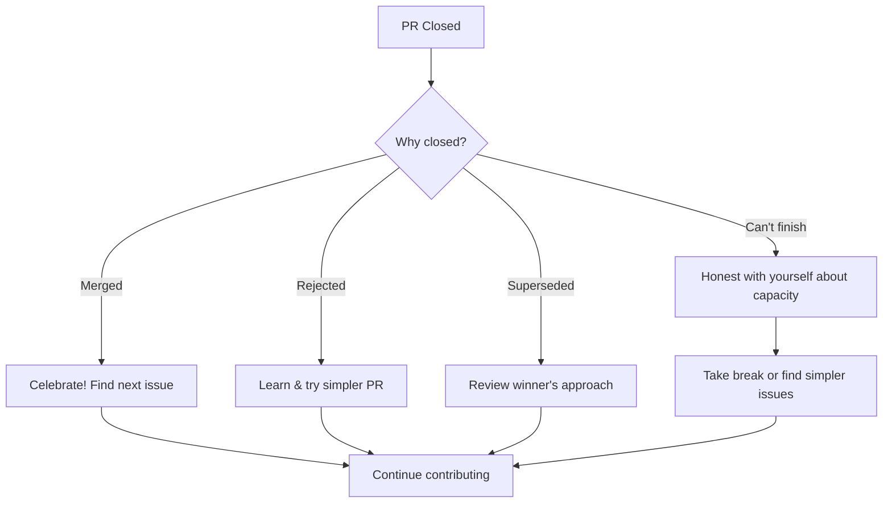

import { Callout, Cards, Card, Steps, Tabs } from 'nextra/components'

# Closing PRs the Right Way

<Callout type="info" emoji="ℹ️">
**Every PR Needs a Conclusion**

Whether merged, rejected, or abandoned—close the loop professionally.
</Callout>

## Why Closing Matters

```
┌─────────────────────────────────────────────────────────────────────────────┐
│                        OPEN PRS CREATE NOISE                                │
├─────────────────────────────────────────────────────────────────────────────┤
│                                                                             │
│  Your abandoned PRs:                                                        │
│  • Clutter project's PR list                                                │
│  • Waste maintainer attention                                               │
│  • Signal you're unreliable                                                 │
│  • Make you look unprofessional                                             │
│                                                                             │
│  Clean up your PRs → Build good reputation                                  │
│                                                                             │
└─────────────────────────────────────────────────────────────────────────────┘
```

---

## When to Close a PR

### Scenarios

<div className="grid grid-cols-1 md:grid-cols-2 gap-4 mt-4">
<div className="bg-emerald-500/10 border border-emerald-500/30 rounded-lg p-4">
<h4 className="font-semibold text-emerald-400 mb-2">Merged Successfully</h4>
<p className="text-sm text-neutral-300">PR was approved and merged by maintainer.</p>
</div>

<div className="bg-red-500/10 border border-red-500/30 rounded-lg p-4">
<h4 className="font-semibold text-red-400 mb-2">Rejected/Won't Merge</h4>
<p className="text-sm text-neutral-300">Maintainer closed it or said it won't be accepted.</p>
</div>

<div className="bg-amber-500/10 border border-amber-500/30 rounded-lg p-4">
<h4 className="font-semibold text-amber-400 mb-2">You Can't Continue</h4>
<p className="text-sm text-neutral-300">Life happened, you don't have time anymore.</p>
</div>

<div className="bg-blue-500/10 border border-blue-500/30 rounded-lg p-4">
<h4 className="font-semibold text-blue-400 mb-2">Superseded by Another</h4>
<p className="text-sm text-neutral-300">Someone else's PR solved it first/better.</p>
</div>
</div>

---

## How to Close: By Scenario

### 1. After Successful Merge

```markdown
[Maintainer merged your PR]

Optional comment:
"Thank you for merging! Excited to see this live. 
Let me know if any follow-up work is needed."

Or:
[Just leave it—no comment needed after merge]
```

<Callout type="success" emoji="✅">
**After Merge**

- Delete your feature branch (GitHub prompts you)
- Update your fork's main branch
- Look for next contribution
</Callout>

### 2. Maintainer Rejected/Closed

```markdown
[Maintainer closed without merging]

Your comment before closing:
"Understood. Thanks for reviewing and providing feedback. 
I learned from this attempt."

[Accept the closure, don't reopen]
```

**When already closed by maintainer:**
- No action needed
- Don't reopen unless explicitly invited to

### 3. You Can't Continue

```markdown
You realize you can't complete the work

Your comment:
"I need to close this PR as I don't have capacity to finish it right now.

Current state:
- ✅ Basic implementation done
- ❌ Tests incomplete
- ❌ Needs performance optimization

If someone wants to take over, feel free to use this as a starting point.

Apologies for not finishing—learned a lot from what I did complete!"
```

<Callout type="warning" emoji="⚠️">
**Be Honest**

Maintainers respect honesty. Don't ghost—just say you can't continue.
</Callout>

### 4. Duplicate/Superseded

```markdown
Someone else's PR merged first

Your comment:
"Closing as #456 addresses this issue. Great work @other-contributor!"

Or:

"Closing in favor of #456 which has a better implementation. 
Happy to review that PR if helpful!"
```

### 5. Stale/Abandoned by You

```markdown
PR sat untouched for weeks/months

Your comment:
"Closing due to inactivity. This became stale and the codebase has likely moved on.

Thanks for the initial feedback! If this issue is still relevant, 
I can revisit with a fresh approach."
```

---

## Closing Checklist

Before closing an unmerged PR:


  <ChecklistItem checked={false}>Left a comment explaining why you're closing</ChecklistItem>
  <ChecklistItem checked={false}>Thanked reviewers for their time</ChecklistItem>
  <ChecklistItem checked={false}>No bitter or passive-aggressive language</ChecklistItem>
  <ChecklistItem checked={false}>Indicated if someone else can take over</ChecklistItem>
  <ChecklistItem checked={false}>Deleted feature branch if applicable</ChecklistItem>


---

## What NOT to Do

### ❌ Ghost the PR

```markdown
Bad:
[PR sits open with requested changes]
[You never respond]
[Maintainer has to close it eventually]
```

**Impact:** Maintainers remember this. Harder to get reviews next time.

### ❌ Bitter Closing

```markdown
Bad:
"Closing because maintainers don't appreciate good work"
"Whatever, wasted my time"
"This project is badly managed"
"Fine, I'll fork it"
```

**Impact:** Burned bridge. You won't be welcomed back.

### ❌ Leave It Open Forever

```markdown
Bad:
[PR open for 6 months]
[Stale, conflicts with main]
[No activity, no plan to finish]
```

**Impact:** Clutters project, wastes maintainer attention.

---

## Cleanup After Closing

### Local Cleanup

```bash
# Delete local feature branch
git checkout main
git branch -D feature-branch-name

# Update your fork
git pull upstream main
git push origin main

# Optionally delete remote branch
git push origin --delete feature-branch-name
```

### GitHub Cleanup

1. **Delete Branch** - Click "Delete branch" button on closed PR
2. **Clear Notifications** - Unsubscribe from PR if no longer relevant
3. **Update Fork** - Sync fork to match upstream

---

## Patterns for Different Scenarios

### Pattern 1: Life Got in the Way

```markdown
"I need to close this PR. Work got busy and I won't have time to address 
the feedback in a reasonable timeframe.

Thank you for the thorough review—I learned a lot from it. If someone else 
wants to take this over, feel free!

Apologies for not completing this."
```

### Pattern 2: Realized It's Too Complex

```markdown
"Closing this PR. As I dug deeper, I realized this change is more complex 
than I initially thought:
- Requires refactoring 3 other modules
- Needs database migration
- Affects 5 other features

This is beyond my current skill level. Hope someone more experienced 
can tackle it!"
```

### Pattern 3: Project Direction Changed

```markdown
"Closing as I see the project is moving in a different direction 
(discussion in #789).

This approach doesn't align with the new architecture. Makes sense!

Thanks for the feedback along the way."
```

### Pattern 4: Found Better Solution

```markdown
"Closing this PR. After the review feedback, I researched more and found 
library X solves this better than my custom implementation.

Opening new PR using library X instead. Much cleaner!"
```

---

## Reopening a Closed PR

### When It's Acceptable

- Maintainer explicitly invites you to reopen
- Original concerns addressed
- Substantial time passed and priorities changed

### How to Request Reopening

```markdown
"Hi @maintainer,

I closed this PR 3 months ago due to [reason]. 

Since then:
- I've addressed all the original feedback
- Added comprehensive tests
- Updated to work with latest main

Would you be open to me reopening this, or should I submit a fresh PR?

Thanks!"
```

<Callout type="warning" emoji="⚠️">
**Usually Better to Start Fresh**

If a PR was closed for fundamental reasons, opening a new PR with improved approach is better than reopening the old one.
</Callout>

---

## Learning from Closed PRs

### Post-Close Reflection

```markdown
## What Went Wrong

PR: #123 - Add feature X
Status: Closed unmerged
Reason: Scope too large, approach not aligned

Lessons learned:
1. Should have discussed approach BEFORE coding
2. Started with too big a change
3. Didn't read roadmap carefully

Next time:
- Open issue for discussion first
- Start with smaller scope
- Check project roadmap and priorities
```

### Track Your Close Rate

| Outcome | Count | Percentage |
|---------|-------|------------|
| Merged | 12 | 60% |
| Closed by maintainer | 4 | 20% |
| Closed by me (can't finish) | 3 | 15% |
| Closed by me (wrong approach) | 1 | 5% |

**Goal:** Increasing merge percentage over time

---

## The Professional Closure

```
┌─────────────────────────────────────────────────────────────────────────────┐
│                       CLOSING PR PROFESSIONALLY                             │
├─────────────────────────────────────────────────────────────────────────────┤
│                                                                             │
│  ✅ Clear explanation of why closing                                        │
│  ✅ Thank reviewers for their time                                          │
│  ✅ Professional tone (even if frustrated)                                  │
│  ✅ Offer to help if someone takes over                                     │
│  ✅ Clean up branches after closing                                         │
│  ✅ Learn from what happened                                                │
│                                                                             │
│  ❌ Ghost the PR                                                            │
│  ❌ Blame maintainers                                                       │
│  ❌ Leave bitter comments                                                   │
│  ❌ Clutter project with stale PRs                                          │
│                                                                             │
└─────────────────────────────────────────────────────────────────────────────┘
```

---

## Special Case: Bot Auto-Closes

Some projects use bots to auto-close stale PRs.

### If Bot Closes Your PR

```markdown
[Bot] "This PR has been inactive for 30 days. Closing."

If you want to continue:
"@maintainer, I'm still working on this. Can we reopen? 
I'll have updates by Friday."

If you don't:
"Understood. I don't have capacity to finish this right now. 
Thanks for the initial review!"
```

---

## After Closing: Moving Forward



---

## Next Steps

<Cards>
<Card title="Open Source Programs" href="/programs">
Explore [programs that can accelerate your journey](/docs/programs).
</Card>

<Card title="Choosing Organizations" href="/choosing-org">
Learn [how to evaluate projects](/docs/choosing-org) before investing time.
</Card>
</Cards>
