import { Callout, Cards, Card, Steps, Tabs } from 'nextra/components'

# Responding to Code Reviews

<Callout type="success" emoji="✅">
**Code Review is a Gift**

Every code review is free mentorship. Treat it that way.
</Callout>

## The Review Reality

```
┌─────────────────────────────────────────────────────────────────────────────┐
│                    WHAT CODE REVIEWS REALLY ARE                             │
├─────────────────────────────────────────────────────────────────────────────┤
│                                                                             │
│  What beginners think:   "They're judging ME"                               │
│  What it actually is:    "They're improving the CODE"                       │
│                                                                             │
│  Your response matters MORE than your initial submission.                   │
│                                                                             │
└─────────────────────────────────────────────────────────────────────────────┘
```

---

## Types of Feedback

### 1. **Blocking** (Must Fix)

```markdown
Reviewer: "This will cause a race condition in production."

❌ Bad response: "Works on my machine"
✅ Good response: "You're right! Fixed in abc123. Added test to prevent this."
```

### 2. **Suggestions** (Nice to Have)

```markdown
Reviewer: "Consider extracting this into a helper function"

❌ Bad: "Not necessary"
✅ Good: "Great idea! Done in xyz789"
✅ Also good: "I kept it inline because this logic is used only once here,
             but happy to extract if you feel strongly"
```

### 3. **Questions** (Clarification)

```markdown
Reviewer: "Why did you choose approach A over B?"

❌ Bad: "Because it's better"
✅ Good: "I chose A because of X constraint. B would require Y which adds 
         complexity. Happy to reconsider if you see an issue with A"
```

### 4. **Nits** (Minor Style)

```markdown
Reviewer: "nit: missing comma here"

❌ Bad: "It's optional in JS"
✅ Good: "Fixed! Thanks for catching that"
```

---

## Response Timeline

```mermaid
gantt
    title Ideal Response Timeline
    dateFormat  HH:mm
    section Review Received
    Review posted           :milestone, m1, 09:00, 0h
    section Your Response
    Acknowledge within 24h  :active, a1, 09:00, 24h
    section Implementation
    Fix simple items (1-2 days)    :a2, after a1, 48h
    Complex changes (3-5 days)     :a3, after a2, 72h
    section Follow-up
    Respond to follow-up (24h)     :a4, after a3, 24h
```



<Callout type="warning" emoji="⚠️">
**Don't Disappear**

If you can't respond within 48 hours, leave a comment: "Traveling this week, will address feedback by Friday."
</Callout>

---

## The Response Framework

### Step 1: Thank the Reviewer

Always start with gratitude:

```markdown
✅ Good openings:
- "Thanks for the detailed review!"
- "Great catches, appreciate your time"
- "Thanks for the feedback—addressing these now"

❌ Avoid:
- Starting with defensive explanations
- No acknowledgment
```

### Step 2: Address Each Comment

```markdown
Reviewer: "This function is doing too much"

Your response:
"You're absolutely right. I've split it into three functions:
- validateInput() for validation
- processData() for business logic  
- formatOutput() for formatting

Changes in commit abc1234. Does this look better?"
```

### Step 3: Ask for Clarification (If Needed)

```markdown
Reviewer: "The naming here is confusing"

Your response:
"Thanks for pointing this out. Which variable names specifically? 
I'm thinking:
- `userData` → `authenticatedUser`
- `data` → `requestPayload`

Would that address your concern?"
```

### Step 4: Push Changes

```markdown
After addressing feedback:

"All feedback addressed:
✅ Fixed race condition (commit abc1234)
✅ Extracted helper function (commit def5678)
✅ Added error handling (commit ghi9012)
✅ Updated tests accordingly

Please take another look when you have time. Thanks!"
```

---

## Handling Different Feedback Tones

### Harsh but Valid

```markdown
Reviewer: "This is completely wrong. You clearly didn't read the docs."

❌ Bad: "That's rude"
✅ Good: "You're right, I missed that in the docs. Fixed now. 
         Which section should I review more carefully?"
```

<Callout type="info" emoji="ℹ️">
**Separate Tone from Content**

Focus on WHAT they're saying, not HOW they're saying it. Maintainers are often stressed and terse.
</Callout>

### Vague Feedback

```markdown
Reviewer: "This doesn't feel right"

❌ Bad: "Can you be more specific?"
✅ Good: "I want to make sure I address your concern. Is it:
         - The approach itself?
         - The implementation details?
         - Performance implications?
         - Something else?
         
         Happy to explain my reasoning or change direction."
```

### Conflicting Feedback

```markdown
Reviewer A: "Extract this into a separate file"
Reviewer B: "Keep this in the same file for cohesion"

Your response:
"@reviewerA and @reviewerB have different preferences here. 
I'm inclined toward [choice] because [reason]. 
Can you two align on the preferred approach? Happy to go either way."
```

---

## Disagreeing Professionally

Sometimes you'll disagree. That's okay.

### The DEAR Framework

**D**escribe - State the feedback objectively
**E**xplain - Your reasoning
**A**sk - For their perspective
**R**espect - Their final decision

```markdown
Example:

"Thanks for suggesting we use Library X instead of Y.

I chose Y because:
1. It's 10x smaller (5KB vs 50KB)
2. Active maintenance (updated last week vs 2 years)
3. Better TypeScript support

That said, I might be missing context about X's benefits for this project. 
Is there a specific advantage you see that outweighs these factors?

Of course, if you prefer X for project consistency, I'm happy to switch."
```

<Callout type="warning" emoji="⚠️">
**Remember: They Have Veto Power**

If a maintainer insists after your explanation, implement their suggestion. Save your energy for important battles.
</Callout>

---

## Common Response Patterns

### Pattern 1: Simple Fix

```markdown
Reviewer: "Missing semicolon on line 45"

Response: "Fixed in abc1234. Thanks!"
```

### Pattern 2: Needs Discussion

```markdown
Reviewer: "Why not use approach B?"

Response: "I considered B but went with A because [reasons].

Trade-offs:
- A: Pros X, Cons Y
- B: Pros Z, Cons W

Given [project constraints], A seemed better fit. But if you see 
issues with this reasoning, I can switch to B."
```

### Pattern 3: Will Fix Later

```markdown
Reviewer: "We should also refactor module X while we're here"

Response: "Great point! That's a bigger change though. Would you prefer:
1. I do it in this PR (delays merge by ~3 days)
2. I create a follow-up issue and tackle separately

I'm leaning toward option 2 to keep this PR focused, but happy to do 1 
if you think it's important to couple these changes."
```

### Pattern 4: Already Fixed

```markdown
Reviewer: "This needs error handling"

Response: "Good catch! I actually added that in commit def5678 
(lines 45-52). Does that address your concern?"
```

### Pattern 5: Out of Scope

```markdown
Reviewer: "This entire approach should be redesigned"

Response: "I think you're right that the overall architecture could be improved. 

This PR specifically addresses issue #123 within the current architecture. 

Would you prefer:
1. I open a separate issue for the architecture discussion
2. I pause this PR and tackle the redesign first
3. We merge this as-is and refactor in a follow-up

What do you think?"
```

---

## The Edit-Push Cycle

```mermaid
graph TD
    A[Review Received] --> B{Simple changes?}
    B -->|Yes| C[Fix all at once]
    B -->|No| D[Fix in logical groups]
    C --> E[Push commits]
    D --> E
    E --> F[Comment on PR]
    F --> G{Review approved?}
    G -->|No| A
    G -->|Yes| H[Merged! 🎉]
```



### Commit Strategy

```bash
# Option 1: Separate commits per concern
git commit -m "fix: address race condition from review"
git commit -m "refactor: extract helper as suggested"
git commit -m "test: add edge cases requested"

# Option 2: Single commit (for very small changes)
git commit -m "fix: address review feedback

- Fix race condition in auth flow
- Extract validateUser helper
- Add edge case tests"
```

<Callout type="tip" emoji="💡">
**Commit Granularity**

Separate commits help reviewers see what changed between review rounds.
</Callout>

---

## Responding to Specific Comment Types

### Testing Requests

```markdown
Reviewer: "Can you add tests for the error case?"

Response: "Added three test cases in test/auth.test.js:
- Invalid token → 401
- Expired token → 403  
- Missing token → 400

All passing. Commit: abc1234"
```

### Performance Concerns

```markdown
Reviewer: "This might be slow with large datasets"

Response: "Good point. I ran benchmarks:
- 100 items: 5ms
- 1,000 items: 48ms
- 10,000 items: 450ms

For our use case (max 1000 items), this should be fine. 
But if you expect larger datasets, I can optimize with [approach]."
```

### Security Questions

```markdown
Reviewer: "Is this input sanitized?"

Response: "Yes, sanitized on line 67 using escapeHtml().
Also added a test to verify XSS prevention (line 120).

Let me know if you'd like additional sanitization."
```

---

## The Approval Dance

### After First Approval

```markdown
Maintainer A: "LGTM! ✅"

[But there are 2 other reviewers]

Your response: "Thanks @maintainerA! 
Waiting for @maintainerB and @maintainerC to review as well."
```

### After All Approvals

```markdown
All reviewers approved

Your response (optional): "Thank you all for the thorough review! 
Learned a lot from your feedback."

[Wait for maintainer to merge—don't merge your own PR unless told to]
```

---

## Mistakes to Avoid

### ❌ Arguing Instead of Listening

```markdown
Bad:
"No, you're wrong. My way is better because [5 paragraphs]"

Good:
"I understand your concern. I chose this approach because [brief reason]. 
What issues do you see with it?"
```

### ❌ Defending Without Action

```markdown
Bad:
"I disagree but I'll change it"

Good:
"I see your point. Changed to your suggestion in commit abc1234"
```

### ❌ Over-Explaining

```markdown
Bad:
[10 paragraphs explaining every decision]

Good:
"Changed as suggested. Happy to explain the reasoning if helpful."
```

### ❌ Getting Personal

```markdown
Bad:
"You always criticize my PRs"

Good:
"Thanks for the feedback. I'll address these points."
```

---

## When Reviews Stall

### No Response for 1 Week

```markdown
Polite ping:

"Hi @reviewer, just checking if you had a chance to look at the updates. 
No rush—just want to make sure this is on your radar. Thanks!"
```

### No Response for 2 Weeks

```markdown
Tag project lead:

"Hi @maintainer, this PR has been waiting for review for 2 weeks. 
Could someone take a look, or should I close and revisit later?"
```

### Abandoned PR

After 1 month of silence, it's okay to close:

```markdown
"Closing this PR due to inactivity. Happy to reopen if there's renewed 
interest. Thanks for the initial feedback!"
```

---

## Success Metrics

```
┌─────────────────────────────────────────────────────────────────────────────┐
│                         GOOD REVIEW RESPONSES                               │
├─────────────────────────────────────────────────────────────────────────────┤
│                                                                             │
│  ✅ Response within 24-48 hours                                             │
│  ✅ Gracious and professional tone                                          │
│  ✅ All feedback addressed or discussed                                     │
│  ✅ Changes pushed promptly                                                 │
│  ✅ Commits are logical and clean                                           │
│  ✅ No defensive or argumentative language                                  │
│  ✅ Questions asked for genuine understanding                               │
│                                                                             │
└─────────────────────────────────────────────────────────────────────────────┘
```

<Callout type="success" emoji="✅">
**Build a Reputation**

Respond well to reviews → Reviewers look forward to your PRs → Faster merges → More contributions
</Callout>

---

## Next Steps

<Cards>
<Card title="Handling Rejection">
Learn [how to handle rejection](/docs/issues-prs/handling-rejection) without burning bridges.
</Card>

<Card title="Iterating on Feedback">
Master [iterative improvements](/docs/issues-prs/iterating-feedback) efficiently.
</Card>
</Cards>
