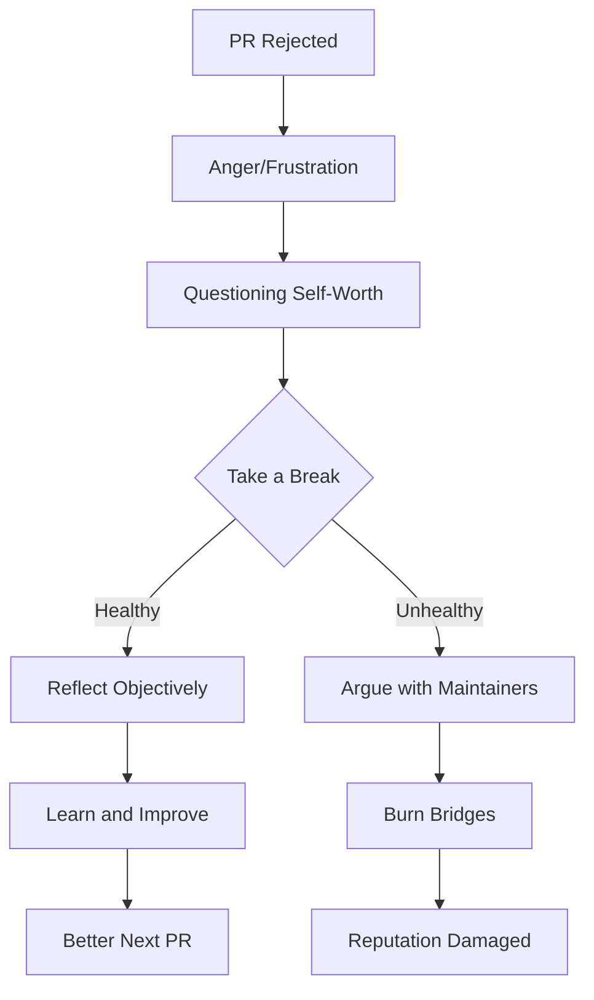
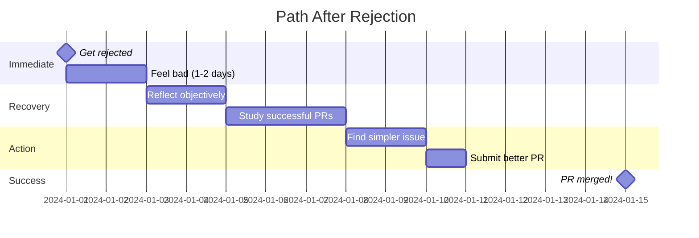
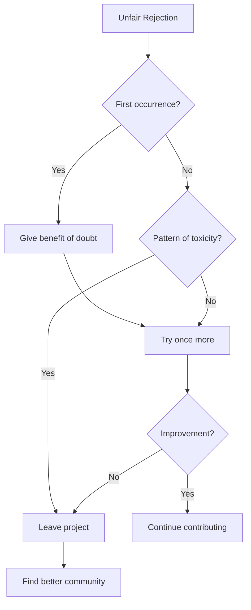

import { Callout, Cards, Card, Steps, Tabs } from 'nextra/components'

# Handling Rejection

<Callout type="warning" emoji="⚠️">
**This Will Happen to You**

Every successful contributor has had PRs rejected. It's not about avoiding rejection—it's about handling it professionally.
</Callout>

## The Rejection Reality

```
┌─────────────────────────────────────────────────────────────────────────────┐
│                        REJECTION STATISTICS                                 │
├─────────────────────────────────────────────────────────────────────────────┤
│                                                                             │
│  Your first 10 PRs:        ~40% will be rejected or need major rework      │
│  Your next 20 PRs:         ~25% rejection rate                             │
│  Experienced contributors: ~10-15% rejection rate                           │
│                                                                             │
│  Even Linus Torvalds gets patches rejected sometimes.                       │
│                                                                             │
└─────────────────────────────────────────────────────────────────────────────┘
```

---

## Why PRs Get Rejected

### Common Reasons

<Cards>
<Card title="Out of Scope" href="#">
Your solution doesn't align with project goals or roadmap.
</Card>

<Card title="Quality Issues" href="#">
Code doesn't meet project standards, lacks tests, or has bugs.
</Card>

<Card title="Duplicate Work" href="#">
Someone else solved it first, or solution already exists.
</Card>

<Card title="Timing" href="#">
Maintainers are busy, undergoing refactor, or feature freeze.
</Card>
</Cards>

---

## Types of Rejection

### 1. Soft Close (Most Common)

```markdown
Maintainer: "Thanks for the PR! Unfortunately, we're not taking this direction 
right now. Appreciate your effort though."

What it means:
- Nothing personal
- Just doesn't fit
- Door might open later
```

**How to respond:**

```markdown
✅ Good response:
"Thanks for considering it! I understand. Let me know if there's a different 
approach that would work better for the project."

❌ Bad response:
"Why not? This is clearly better than the current implementation."
```

### 2. Needs Major Rework

```markdown
Maintainer: "This needs significant changes: different architecture, 
refactored tests, updated docs. Might be easier to start fresh."

What it means:
- Core approach needs changing
- Not worth iterating on current version
```

**How to respond:**

```markdown
✅ Good response:
"Got it. Should I:
1. Close this and open new PR with revised approach?
2. Discuss the architecture first in an issue?
3. Step back and let someone else tackle it?

What would be most helpful?"

❌ Bad response:
"I already spent 20 hours on this!"
```

### 3. Hard No

```markdown
Maintainer: "We won't add this feature. It goes against our design philosophy."

What it means:
- Project direction is different
- Feature won't be accepted (ever)
```

**How to respond:**

```markdown
✅ Good response:
"Understood. Thanks for clarifying the project's direction."

[Then move on]

❌ Bad response:
"But look at all these stars on my fork!"
```

### 4. Radio Silence → Close

```markdown
[Your PR sits for 2 months]
[Then gets auto-closed by bot or maintainer]

What it means:
- Low priority
- Maintainers overwhelmed
- Probably not interested
```

**How to respond:**

```markdown
✅ Good response:
"Closing due to inactivity. Thanks for your time reviewing. 
Open to reopening if there's renewed interest."

❌ Bad response:
[Opening new PR with same code without discussion]
```

---

## The Emotional Response Cycle



<Callout type="info" emoji="ℹ️">
**Take 24 Hours**

If rejection stings, wait 24 hours before responding. Your first reaction is usually emotional, not professional.
</Callout>

---

## Professional Responses to Rejection

### Template 1: Gracious Exit

```markdown
"Thank you for reviewing this and for the feedback. I understand this doesn't 
fit the project's direction right now. 

I learned a lot from attempting this, so it was valuable regardless. 

Looking forward to contributing in other ways!"
```

### Template 2: Request for Learning

```markdown
"Thanks for closing this. I understand the decision.

To help me improve for future PRs: was the core issue:
- The approach itself?
- Implementation quality?
- Project priorities?

No worries if you're too busy to elaborate—I'll study other PRs to learn."
```

### Template 3: Alternative Proposal

```markdown
"I understand this approach doesn't work. 

Would the project be interested in a scaled-down version that:
- Only does X (not X, Y, Z)
- Focuses on the core use case
- Requires less maintenance

If not, no problem—happy to look for other issues to tackle."
```

### Template 4: Fork It

```markdown
"Got it! This feature is important for my use case, so I'll maintain a fork. 

If there's ever interest in merging something similar, I'm happy to adapt it."
```

---

## What NOT to Do

### ❌ Argue Endlessly

```markdown
Bad:
"But you NEED this feature because [10 paragraphs]"
"I spent WEEKS on this"
"Your project will fail without this"
"Other projects have this feature"
```

<Callout type="warning" emoji="⚠️">
**You Can't Force a Merge**

Maintainers have final say. Arguing rarely changes outcomes—it only damages relationships.
</Callout>

### ❌ Get Personal

```markdown
Bad:
"You obviously don't understand good code"
"This project is badly managed"
"Other maintainers would appreciate this"
"I'm never contributing here again"
```

### ❌ Passive Aggressive

```markdown
Bad:
"Fine, I'll just fork it since you don't want good contributions"
"Guess you don't actually want help"
"Thanks for wasting my time"
```

### ❌ Resubmit Without Changes

```markdown
Bad:
[PR closed]
[Open new PR with exact same code]
[Repeat]
```

---

## Learning from Rejection

### The Post-Mortem Process

<Steps>

### Wait 24 Hours

Let emotions settle before analysis.


### Review Feedback Objectively

What specifically was the issue? Not the tone, the CONTENT.


### Compare to Successful PRs

Look at recently merged PRs. What did they do differently?


### Identify Patterns

Is this your first rejection or fifth with similar feedback?


### Plan Improvements

What will you do differently next time?

</Steps>

### Rejection Analysis Template

```markdown
## What Happened
PR #123 rejected for [reason]

## Their Feedback
- Point 1
- Point 2
- Point 3

## My Mistakes
- Should have discussed approach first
- Didn't check roadmap
- Scope too large

## What I Learned
- Always open issue for discussion before big changes
- Read CONTRIBUTING guide more carefully
- Start smaller

## Next Time
- Smaller, focused PRs
- Get buy-in before coding
- Test the waters with maintainers first
```

---

## Bouncing Back

### Rejection → Success Timeline



### The Comeback Checklist


  <ChecklistItem checked={false}>Processed rejection emotionally (allowed yourself to feel bad)</ChecklistItem>
  <ChecklistItem checked={false}>Analyzed feedback objectively</ChecklistItem>
  <ChecklistItem checked={false}>Identified concrete improvements</ChecklistItem>
  <ChecklistItem checked={false}>Found simpler next contribution</ChecklistItem>
  <ChecklistItem checked={false}>Ready to try again</ChecklistItem>


---

## When Rejection is Unfair

Sometimes maintainers are wrong, rude, or unreasonable.

### Signs of Toxic Project

- Personal attacks in review
- Dismissive without explanation
- Moving goalposts repeatedly
- Favoritism toward certain contributors
- No response to polite follow-ups

### What to Do



<Callout type="warning" emoji="⚠️">
**Know When to Walk Away**

If a project consistently treats contributors poorly, your time is better spent elsewhere. There are thousands of projects that will appreciate you.
</Callout>

---

## Famous Rejection Stories

### Linus Torvalds

Gets kernel patches rejected regularly. His response? Improve the patch or move on.

### Guido van Rossum

Had PEPs (Python Enhancement Proposals) rejected as BDFL. Still contributed.

### The Point

**Everyone gets rejected. What separates successful contributors is how they respond.**

---

## Rejection as a Filter

```
┌─────────────────────────────────────────────────────────────────────────────┐
│                      REJECTION FILTERS MINDSET                              │
├─────────────────────────────────────────────────────────────────────────────┤
│                                                                             │
│  Bad mindset:  "I got rejected → I'm not good enough"                       │
│                                                                             │
│  Good mindset: "I got rejected → This approach/project wasn't right"        │
│                                                                             │
│  Better:       "I got rejected → Here's what I'll do differently"           │
│                                                                             │
│  Best:         "I got rejected → Great feedback for improvement"            │
│                                                                             │
└─────────────────────────────────────────────────────────────────────────────┘
```

---

## The Growth Metric

Track your rejection-to-merge ratio over time:

| Period | PRs Submitted | Merged | Rejected | Merge Rate |
|--------|---------------|--------|----------|------------|
| Month 1 | 5 | 2 | 3 | 40% |
| Month 3 | 10 | 6 | 4 | 60% |
| Month 6 | 15 | 12 | 3 | 80% |
| Year 1 | 50 | 43 | 7 | 86% |

**Goal:** Increasing merge rate over time, not zero rejections.

---

## Quick Reference: Response Guide

```
┌─────────────────────────────────────────────────────────────────────────────┐
│                     REJECTION → RESPONSE MAP                                │
├─────────────────────────────────────────────────────────────────────────────┤
│                                                                             │
│  Rejection Type         How to Respond                                      │
│  ═══════════════        ═══════════════                                     │
│                                                                             │
│  Out of scope          → Thank them, ask about alternatives                 │
│  Needs rework          → Ask for guidance, offer to revise                  │
│  Hard no               → Thank them, move on gracefully                     │
│  Radio silence         → Wait 2 weeks, then close yourself                  │
│  Rude rejection        → Stay professional, consider leaving                │
│  Duplicate work        → Congratulate other contributor                     │
│  Timing issues         → Ask if you should revisit later                    │
│                                                                             │
└─────────────────────────────────────────────────────────────────────────────┘
```

---

## Next Steps

<Cards>
<Card title="Iterating on Feedback" href="/issues-prs/iterating-feedback">
Learn [how to improve](/docs/issues-prs/iterating-feedback) based on feedback.
</Card>

<Card title="Closing PRs Properly" href="/issues-prs/closing-prs">
See [how to close PRs](/docs/issues-prs/closing-prs) the right way.
</Card>
</Cards>
