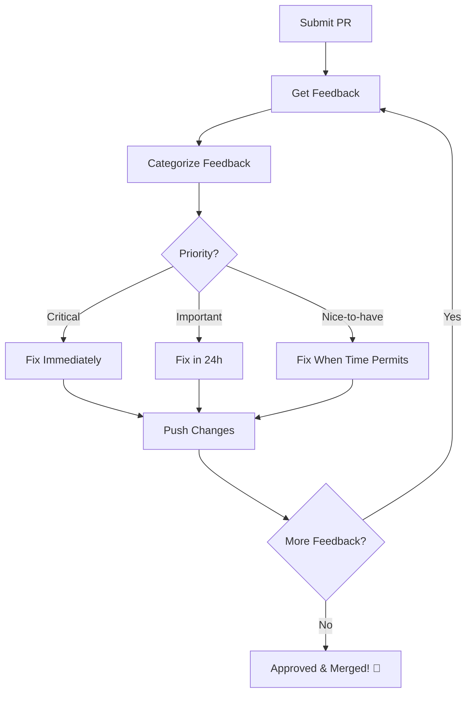
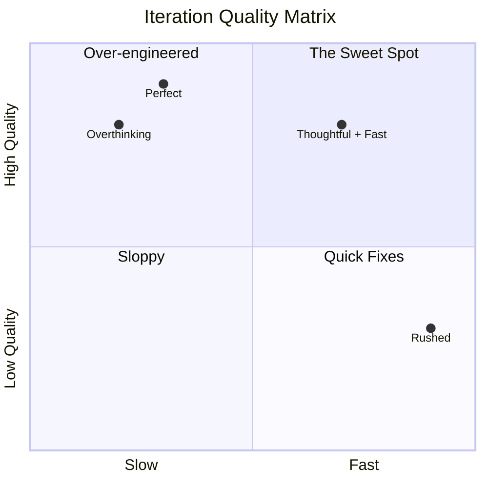

import { Callout, Cards, Card, Steps, Tabs } from 'nextra/components'

# Iterating on Feedback

<Callout type="success" emoji="✅">
**Iteration is Where Learning Happens**

The real skill isn't writing perfect code the first time—it's improving quickly based on feedback.
</Callout>

## The Iteration Mindset

```
┌─────────────────────────────────────────────────────────────────────────────┐
│                          ITERATION VS PERFECTION                            │
├─────────────────────────────────────────────────────────────────────────────┤
│                                                                             │
│  Perfectionists:  Write for weeks → Submit → Wait for one verdict           │
│  Iterators:       Submit early → Get feedback → Improve → Repeat            │
│                                                                             │
│  Perfectionists get 1 shot.                                                 │
│  Iterators get 5 chances to get it right.                                   │
│                                                                             │
└─────────────────────────────────────────────────────────────────────────────┘
```

---

## The Feedback Loop



---

## Categorizing Feedback

### Priority Matrix

| Priority | Type | Response Time | Example |
|----------|------|---------------|---------|
| P0 - Critical | Blocking bugs, security | Immediate | Memory leak, SQL injection |
| P1 - Important | Functionality issues | 24 hours | Missing error handling |
| P2 - Moderate | Code quality | 1-2 days | Naming, structure |
| P3 - Low | Style, nits | When convenient | Spacing, comments |

### Quick Categorization

```markdown
Review received with 10 comments:

P0: 2 comments  ⚠️  Drop everything, fix now
P1: 4 comments  📋  Fix today
P2: 3 comments  📝  Fix this week  
P3: 1 comment   💅  Fix when done with above
```

---

## Efficient Iteration Strategy

### The Batch Approach

<Steps>

### Read All Feedback First

Don't fix as you read. Get the full picture.


### Group Similar Issues

Bundle related fixes into logical commits.


### Fix High Priority First

P0 and P1 before moving to P2 and P3.


### Push Once Per Group

Not after every single fix.


### Comment on All Changes

Explain what you fixed and where.

</Steps>

### Example Flow

```bash
# Review received: 8 comments

# Group 1: Security issues (P0)
git commit -m "fix: prevent XSS in user input"

# Group 2: Logic bugs (P1)
git commit -m "fix: handle null user edge case"
git commit -m "fix: correct pagination offset calculation"

# Group 3: Code quality (P2)
git commit -m "refactor: extract validation logic to helper"
git commit -m "refactor: improve variable naming for clarity"

# Group 4: Style (P3)
git commit -m "style: fix formatting and add missing commas"

# Push all at once
git push origin feature-branch

# Comment on PR
"All feedback addressed:
✅ Fixed XSS vulnerability (commit abc1234)
✅ Added null checks (commit def5678)
✅ Fixed pagination bug (commit ghi9012)
✅ Refactored validation logic (commit jkl3456)
✅ Improved naming (commit mno7890)
✅ Fixed formatting (commit pqr1234)

Please review again when you have time!"
```

---

## Responding to Different Feedback Types

### 1. Request for Tests

```markdown
Feedback: "Can you add tests for the error cases?"

❌ Bad iteration:
[Adds minimal test, pushes]

✅ Good iteration:
[Adds comprehensive test suite]

Your response:
"Added test coverage for:
- Valid input (happy path)
- Null input handling
- Invalid format rejection
- Boundary conditions
- Error state handling

All tests passing. Coverage increased from 65% to 94% for this module.
See: test/validator.test.js (lines 45-120)"
```

### 2. Architecture Feedback

```markdown
Feedback: "This should use the existing UserService instead of direct DB access"

❌ Bad iteration:
"Changed to UserService but it doesn't work as well"

✅ Good iteration:
Your response:
"Refactored to use UserService as suggested. This actually improved the code:
- Removed duplicate validation logic
- Better error handling (inherited from UserService)
- Consistent with rest of codebase

Changes:
- Removed direct DB queries (lines 45-67)
- Added UserService.findByEmail() call (line 52)
- Updated tests to mock UserService

One question: UserService doesn't have a batch lookup method. 
Should I:
a) Add it to UserService (affects other parts)
b) Keep single lookups (simpler, slightly less performant)

Leaning toward (b) unless you see issues."
```

### 3. Performance Concerns

```markdown
Feedback: "This N+1 query will be slow"

✅ Good iteration:
Your response:
"Great catch! Fixed with eager loading.

Before:
- 1 query for users
- N queries for user details (one per user)
- 100 users = 101 queries

After:
- 1 query with JOIN
- 100 users = 1 query

Benchmarked:
- Before: 850ms for 100 users
- After: 45ms for 100 users

Commit: abc1234"
```

### 4. Edge Case Requests

```markdown
Feedback: "What happens if the array is empty?"

✅ Good iteration:
Your response:
"Good point! Added handling for:
- Empty array → early return with empty result
- Null/undefined → throw meaningful error
- Single element → optimized path (no iteration needed)

Added tests for all three cases. All passing."
```

---

## The Commit Message Strategy

### During Iterations

```bash
# Option 1: Descriptive commits (easier to review)
git commit -m "fix: address race condition from review"
git commit -m "test: add edge cases requested by reviewer"
git commit -m "refactor: use UserService as suggested"

# Option 2: Fix commits (for small changes)
git commit -m "fix: apply review feedback from @maintainer"

# Option 3: Squash later (if project prefers clean history)
# Work in multiple commits, squash before merge
git rebase -i HEAD~5  # Squash review feedback commits
```

### What Reviewers Prefer

```
┌─────────────────────────────────────────────────────────────────────────────┐
│                    COMMIT PREFERENCES BY PROJECT                            │
├─────────────────────────────────────────────────────────────────────────────┤
│                                                                             │
│  Clean history projects:  Squash all feedback into original commits         │
│  Transparent projects:    Keep feedback commits separate                    │
│  No preference:           Either works                                      │
│                                                                             │
│  Check CONTRIBUTING.md or ask if unsure.                                    │
│                                                                             │
└─────────────────────────────────────────────────────────────────────────────┘
```

---

## Speed vs Quality

### The Balance



**Target:** High quality + Reasonable speed

---

## Dealing with Expanding Scope

### Scope Creep During Review

```markdown
Original PR: Fix login bug

Review comment 1: "While you're here, refactor the auth module"
Review comment 2: "Also add OAuth support"
Review comment 3: "Update all related documentation"

Current scope: 10x larger than original
```

### How to Handle

```markdown
Your response:
"Thanks for the additional suggestions! To keep this PR focused, I propose:

This PR (current):
- Fix the login bug (original scope)
- Add tests for the bug fix

Follow-up work:
- #1: Refactor auth module (new issue)
- #2: Add OAuth support (new issue)  
- #3: Documentation update (new issue)

I'm happy to tackle these in order after this merges. Does that work?"
```

<Callout type="warning" emoji="⚠️">
**Push Back on Scope Creep**

Politely but firmly keep PRs focused. Expanding scope delays everything and increases merge risk.
</Callout>

---

## Iteration Anti-Patterns

### ❌ Trying to Please Everyone

```markdown
Reviewer A: "Use approach X"
Reviewer B: "Use approach Y"

Bad response:
[Tries to combine both, creates mess]

Good response:
"@reviewerA and @reviewerB suggest different approaches. 
Could you align on preference? Happy to implement either."
```

### ❌ Making Unrelated Changes

```markdown
Feedback: "Fix the typo on line 45"

Bad iteration:
- Fixes typo
- Also refactors unrelated function
- Updates styling in another file
- Changes config

Good iteration:
- Fixes typo
- Done
```

### ❌ Defensive Iteration

```markdown
Feedback: "This could be simplified"

Bad response:
"I simplified it but my original way was actually better because..."

Good response:
"Simplified as suggested. Let me know if you'd like it even more concise."
```

---

## When to Push Back

Sometimes feedback is wrong or impractical. It's okay to disagree respectfully.

### Valid Pushback Scenarios

1. **Contradicts Project Standards**
```markdown
Feedback: "Use var instead of const"

Response: "The style guide (section 3.2) requires const for immutable bindings. 
Should I follow the guide or make an exception here?"
```

2. **Performance Impact**
```markdown
Feedback: "Load all data upfront"

Response: "That would require loading 10MB on page load. 
Can we keep lazy loading? Or is the UX trade-off worth it for this use case?"
```

3. **Breaking Changes**
```markdown
Feedback: "Rename this public API method"

Response: "This is a public API with external users. Renaming would be breaking. 
Should we:
a) Deprecate old name, add new name
b) Keep existing name
c) Make breaking change in next major version"
```

---

## The Fast Iteration Checklist


  <ChecklistItem checked={false}>Read all feedback before fixing anything</ChecklistItem>
  <ChecklistItem checked={false}>Categorized by priority (P0-P3)</ChecklistItem>
  <ChecklistItem checked={false}>Grouped similar changes</ChecklistItem>
  <ChecklistItem checked={false}>Fixed critical issues first</ChecklistItem>
  <ChecklistItem checked={false}>Logical, reviewable commits</ChecklistItem>
  <ChecklistItem checked={false}>All changes tested</ChecklistItem>
  <ChecklistItem checked={false}>Left clear comment on PR explaining changes</ChecklistItem>
  <ChecklistItem checked={false}>Pushed within 24-48 hours</ChecklistItem>


---

## Iteration Velocity Targets

```
┌─────────────────────────────────────────────────────────────────────────────┐
│                        ITERATION SPEED GOALS                                │
├─────────────────────────────────────────────────────────────────────────────┤
│                                                                             │
│  Feedback Type         Target Response Time                                 │
│  ══════════════        ════════════════════                                 │
│                                                                             │
│  Critical bugs         Same day                                             │
│  Important changes     24 hours                                             │
│  Moderate refactors    1-2 days                                             │
│  Style/nits            When convenient (max 3 days)                         │
│  Architecture changes  2-3 days (needs thought)                             │
│                                                                             │
│  Consistently fast, quality iterations → Maintainer trust                   │
│                                                                             │
└─────────────────────────────────────────────────────────────────────────────┘
```

---

## Learning from Each Iteration

### Track Patterns

```markdown
## My Review Feedback Patterns

Common feedback I receive:
1. Need more tests (70% of PRs)
2. Variable naming unclear (50% of PRs)
3. Missing error handling (40% of PRs)

Action plan:
- Write tests FIRST before submitting
- Use more descriptive variable names
- Add try-catch blocks by default
```

### Improvement Over Time

| Month | Avg Iterations to Merge | Avg Time to Address Feedback |
|-------|-------------------------|------------------------------|
| 1 | 4.5 | 3 days |
| 2 | 3.2 | 2 days |
| 3 | 2.1 | 1 day |
| 6 | 1.4 | Same day |

**Goal:** Fewer iterations, faster responses

---

## Next Steps

<Cards>
<Card title="Closing PRs Properly">
Learn [how to close PRs](/docs/issues-prs/closing-prs) the right way.
</Card>

<Card title="Open Source Programs">
Explore [programs that can accelerate your journey](/docs/programs).
</Card>
</Cards>
