import { Callout, Cards, Card, Steps, Tabs } from 'nextra/components'

# Writing a High-Quality PR

<Callout type="warning" emoji="⚠️">
**First Impressions Matter**

Maintainers decide in the first 30 seconds whether your PR is worth their time. Make those seconds count.
</Callout>

## The 3-Second Test

When a maintainer opens your PR, they see:

```
┌─────────────────────────────────────────────────────────────────────────────┐
│                         WHAT MAINTAINERS SEE FIRST                          │
├─────────────────────────────────────────────────────────────────────────────┤
│                                                                             │
│  1. PR Title                        ← 3 seconds: Is this worth reading?    │
│  2. First 3 lines of description    ← 10 seconds: Is this complete?       │
│  3. Files changed count             ← 2 seconds: Is this focused?         │
│  4. CI status                       ← 1 second: Basic quality check       │
│                                                                             │
│  If ANY of these fail → PR closed or ignored                               │
│                                                                             │
└─────────────────────────────────────────────────────────────────────────────┘
```

---

## PR Title Standards

### The Format

```
type(scope): brief description

Examples:
✅ fix(auth): prevent token expiration race condition
✅ feat(api): add pagination to user list endpoint
✅ docs(readme): fix installation instructions
✅ test(auth): add unit tests for login flow
```

### Types

| Type | When to Use | Example |
|------|-------------|---------|
| `feat` | New feature | `feat(cart): add discount code support` |
| `fix` | Bug fix | `fix(login): resolve password validation` |
| `docs` | Documentation | `docs(api): update authentication guide` |
| `test` | Tests only | `test(utils): add edge case coverage` |
| `refactor` | Code improvement | `refactor(db): optimize query performance` |
| `style` | Formatting | `style(css): fix indentation in navbar` |
| `chore` | Maintenance | `chore(deps): update react to 18.2` |
| `perf` | Performance | `perf(api): reduce response time by 40%` |

### Title Quality Comparison

```mermaid
graph LR
    subgraph Bad["❌ Bad Titles"]
        A1["Update code"]
        A2["Fixed bug"]
        A3["Changes"]
    end
    
    subgraph Good["✅ Good Titles"]
        B1["fix(auth): prevent XSS in login form"]
        B2["feat(api): add rate limiting"]
        B3["docs(guide): clarify setup steps"]
    end
    
    Bad -.->|Rejected| X[🗑️]
    Good -.->|Reviewed| Y[✅]
```



---

## PR Description Structure

### The Template

```markdown
## Problem
Brief explanation of what issue this PR solves.

Fixes #123

## Solution
How this PR addresses the problem. Key technical decisions.

## Changes
- Changed X to handle Y
- Added Z for better performance
- Removed deprecated W

## Testing
- [ ] Unit tests pass
- [ ] Integration tests pass
- [ ] Manually tested scenarios A, B, C

## Screenshots (if UI changes)
Before: [image]
After: [image]

## Checklist
- [ ] Code follows project style
- [ ] Tests added/updated
- [ ] Documentation updated
- [ ] No breaking changes
```

### Real Example: Good PR

```markdown
## Problem
Users lose form data when session expires (#456)

## Solution
Implemented client-side form state persistence using localStorage.
Falls back gracefully if localStorage is unavailable.

## Changes
- Added `FormPersistence` utility class
- Hooked into form `onChange` events
- Auto-restore on mount if data exists
- Clear storage on successful submit

## Testing
- [x] Unit tests for FormPersistence class
- [x] Integration test for auto-restore
- [x] Manual testing:
  - Fill form → refresh → data restored ✅
  - Submit form → data cleared ✅
  - Private browsing → graceful fallback ✅

## Breaking Changes
None

## Additional Notes
Considered IndexedDB but localStorage sufficient for form sizes < 5MB
```

---

## Code Quality Checklist

### Before Submitting


  <ChecklistItem checked={false}>Code runs locally without errors</ChecklistItem>
  <ChecklistItem checked={false}>All tests pass</ChecklistItem>
  <ChecklistItem checked={false}>No console.log() or debug statements</ChecklistItem>
  <ChecklistItem checked={false}>No commented-out code</ChecklistItem>
  <ChecklistItem checked={false}>Code follows project style guide</ChecklistItem>
  <ChecklistItem checked={false}>No unnecessary dependencies added</ChecklistItem>
  <ChecklistItem checked={false}>Error handling implemented</ChecklistItem>
  <ChecklistItem checked={false}>Edge cases considered</ChecklistItem>


### Self-Review

<Steps>

### Read Your Own Code

Go through every changed file. Would YOU approve this?


### Check the Diff

No accidental whitespace changes, formatting differences, or unrelated files.


### Run Linters

Fix all linting errors before submitting.


### Test Edge Cases

What happens with empty input? Null values? Huge datasets?

</Steps>

---

## PR Size Guidelines

```
┌─────────────────────────────────────────────────────────────────────────────┐
│                           PR SIZE CHART                                     │
├─────────────────────────────────────────────────────────────────────────────┤
│                                                                             │
│  Lines Changed        Merge Probability    Review Time                      │
│  ══════════════       ═════════════════    ═══════════                      │
│                                                                             │
│  1-50                 95%                  < 30 mins                        │
│  51-200               80%                  1-2 hours                        │
│  201-500              50%                  4-8 hours                        │
│  501-1000             25%                  1-2 days                         │
│  1000+                10%                  Weeks (if ever)                  │
│                                                                             │
│  Sweet spot: 50-200 lines                                                   │
│                                                                             │
└─────────────────────────────────────────────────────────────────────────────┘
```

<Callout type="info" emoji="ℹ️">
**Break Large Changes into Smaller PRs**

Instead of one 800-line PR, submit four 200-line PRs that build on each other.
</Callout>

---

## Common PR Mistakes

### 🚫 Mistake 1: Too Many Changes

```diff
❌ BAD PR:
Files changed: 47
- Added feature X
- Fixed bugs Y, Z
- Refactored module A
- Updated documentation
- Changed config files
```

```diff
✅ GOOD PR:
Files changed: 5
- Added feature X with tests
- Updated relevant documentation
```

### 🚫 Mistake 2: No Context

```markdown
❌ BAD:
## Description
Fixed the bug

## Changes
Changed some files
```

```markdown
✅ GOOD:
## Problem
Users couldn't log in with emails containing + character (#789)

## Solution
Updated email validation regex to include RFC 5322 compliant characters

## Changes
- Modified `validateEmail()` in auth/validation.js
- Added test cases for edge case emails
- Updated email regex pattern

## Testing
- [x] Test suite passes
- [x] Tested with email: user+tag@example.com ✅
```

### 🚫 Mistake 3: Failing CI

<Callout type="warning" emoji="⚠️">
**Never Submit with Broken CI**

If your PR has failing tests or linting errors on GitHub, maintainers won't even look at it. Fix CI first.
</Callout>

### 🚫 Mistake 4: Merge Conflicts

```
┌─────────────────────────────────────────────────────────────────────────────┐
│  PR with Conflicts                                                          │
│  ══════════════════                                                         │
│                                                                             │
│  [!] This branch has conflicts that must be resolved                        │
│                                                                             │
│  Maintainer's reaction: "Come back when it's ready"                         │
│                                                                             │
└─────────────────────────────────────────────────────────────────────────────┘
```

---

## Draft vs Ready PRs

### When to Use Draft

- Still working on the implementation
- Want early feedback on approach
- CI not passing yet
- Not ready for full review

### Draft PR Title

```markdown
[WIP] feat(api): add GraphQL support

## Status
🚧 Work in Progress

Seeking feedback on:
- [ ] GraphQL schema design
- [ ] Authentication approach

TODO:
- [ ] Add remaining mutations
- [ ] Write tests
- [ ] Update docs
```

---

## Linking Issues

Always link to the issue your PR addresses:

```markdown
✅ Fixes #123
✅ Closes #123
✅ Resolves #123

⚠️ Related to #123
⚠️ Part of #123

❌ Fixes issue with login
❌ Addresses the bug
```

**GitHub keywords that auto-close issues:**
- `fix`, `fixes`, `fixed`
- `close`, `closes`, `closed`
- `resolve`, `resolves`, `resolved`

---

## Screenshots for UI Changes

### Always Include

<Cards>
<Card title="Before State">
Show what it looked like before your changes.
</Card>

<Card title="After State">
Show your implementation.
</Card>

<Card title="Different States">
Loading, error, empty, populated states.
</Card>

<Card title="Responsive Views">
Desktop, tablet, mobile if applicable.
</Card>
</Cards>

### Screenshot Template

```markdown
## Screenshots

### Before


### After


### Mobile View


### Edge Cases
- Empty state: 
- Error state: 
- Loading state: 
```

---

## The Perfect PR Checklist


  <ChecklistItem checked={false}>Clear, descriptive title following conventions</ChecklistItem>
  <ChecklistItem checked={false}>Comprehensive description with problem/solution</ChecklistItem>
  <ChecklistItem checked={false}>Links to related issue(s)</ChecklistItem>
  <ChecklistItem checked={false}>Code is self-reviewed</ChecklistItem>
  <ChecklistItem checked={false}>Tests added/updated and passing</ChecklistItem>
  <ChecklistItem checked={false}>Documentation updated if needed</ChecklistItem>
  <ChecklistItem checked={false}>No merge conflicts</ChecklistItem>
  <ChecklistItem checked={false}>CI passing (all green)</ChecklistItem>
  <ChecklistItem checked={false}>Focused scope (< 200 lines if possible)</ChecklistItem>
  <ChecklistItem checked={false}>Screenshots for UI changes</ChecklistItem>
  <ChecklistItem checked={false}>Breaking changes documented</ChecklistItem>
  <ChecklistItem checked={false}>No debugging code or comments</ChecklistItem>


---

## After Submitting

### Don't Just Walk Away

1. **Monitor for feedback** - Check daily
2. **Respond within 24 hours** - Show you're engaged
3. **Keep it updated** - Rebase if main moves forward
4. **Be patient** - Reviews take time

### If No Response After 1 Week

```markdown
Polite ping:

"Hi @maintainer, 

Just checking if you've had a chance to review this PR. 
Happy to make any changes needed. No rush!

Thanks!"
```

<Callout type="info" emoji="ℹ️">
**Patience Wins**

Good PRs sometimes sit for weeks. Don't take it personally—maintainers are busy.
</Callout>

---

## Example: Stellar PR

```markdown
feat(api): add rate limiting to authentication endpoints

## Problem
Authentication endpoints are vulnerable to brute force attacks (#891)

## Solution
Implemented sliding window rate limiting using Redis:
- 5 attempts per IP per minute
- 20 attempts per IP per hour
- Configurable via environment variables

## Changes
- Added `RateLimiter` middleware
- Updated auth routes to use rate limiter
- Added Redis dependency for distributed rate limiting
- Created unit and integration tests

## Technical Decisions
- Chose sliding window over fixed window for fairness
- Used Redis for distributed systems (multiple server instances)
- Made limits configurable for different deployment environments

## Testing
- [x] Unit tests for RateLimiter class (100% coverage)
- [x] Integration tests for auth endpoints
- [x] Load tested with 1000 concurrent requests
- [x] Verified rate limit headers in response

Manual testing:
- Exceeded rate limit → 429 response ✅
- Rate limit resets after window → 200 response ✅
- Multiple IPs → independent limits ✅

## Breaking Changes
None. Rate limiting is opt-in via `ENABLE_RATE_LIMIT` env var.

## Performance Impact
- < 1ms latency per request
- Redis memory: ~1KB per IP address
- Tested with 10,000 unique IPs

## Documentation
- Updated API docs with rate limit headers
- Added rate limiting section to README
- Included configuration examples

## Screenshots
N/A (API change only)

## Checklist
- [x] Code follows project style guide
- [x] Tests pass locally
- [x] Documentation updated
- [x] No breaking changes
- [x] Security implications considered
```

---

## Next Steps

<Card title="Learn PR Templates">
See [PR Description Template](/docs/issues-prs/pr-template) for a reusable template.
</Card>
