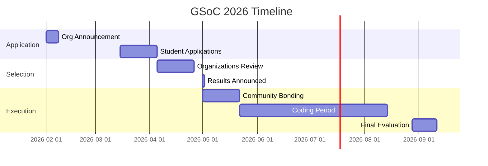
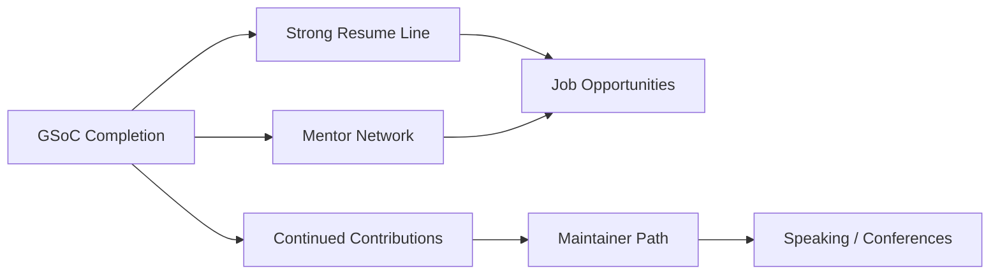

import { Callout, Cards, Card, Steps, Tabs } from 'nextra/components'

# Google Summer of Code (GSoC)

The most prestigious open source program. Here's what you need to know.

## Program Overview

<Cards>
<Card title="Duration">
10 weeks (Small) or 22 weeks (Large/Medium)
</Card>

<Card title="Stipend">
$1,500 - $6,600 based on project size and location
</Card>

<Card title="Eligibility">
18+ years old, any country (check sanctions)
</Card>

<Card title="Competition">
~15-20% acceptance rate globally
</Card>
</Cards>

## GSoC Reality Check

```
What students think:
"I'll get accepted first try, work on cool features,
and get a job offer immediately after"

What actually happens:
"I apply, get rejected. Reapply next year.
Get accepted. Work hard for 22 weeks.
Learn tons. Maybe get a job, maybe not.
But I'm now a known contributor."

Timeline reality:
Year 0: Learn and contribute (3-6 months prep)
Year 1: Apply and likely get rejected
Year 2: Get accepted
Year 2-3: Post-GSoC work and career benefits
```

## Timeline 2026



## What Google Looks For

### Organization Selection Criteria

Organizations selected by Google must have:
- Active community with responsive mentors
- Well-documented codebase
- History of welcoming new contributors
- Clear project ideas for contributors

### Student Selection Criteria

| Criterion | Weight | What It Means |
|-----------|--------|---------------|
| Prior Contributions | 40% | 2-3+ merged PRs before application |
| Proposal Quality | 30% | Clear, detailed, realistic plan |
| Technical Skills | 20% | Can actually execute the project |
| Communication | 10% | Active in community, responds quickly |

## The Application Process

<Steps>

### Research (Jan-Feb)
- Browse accepted organizations list
- Join 3-5 communities
- Read their GSoC idea lists
- Make first contributions

### Engage (Feb-Mar)
- Increase contribution frequency
- Discuss project ideas with mentors
- Ask about feasibility and scope
- Get feedback on approach

### Draft Proposal (Early Mar)
- Write first draft with all sections
- Share with mentors for feedback
- Study accepted proposals from past years
- Refine based on mentor input

### Submit (Mid-Mar)
- Final polish and proofread
- Submit through GSoC portal
- Stay active in community
- Be prepared for mentor questions

</Steps>

## Proposal Template

### Section 1: About Me

```markdown
## About Me

**Name**: [Your Name]
**Email**: [Email]
**GitHub**: [Profile]
**Timezone**: [UTC offset]
**University**: [If student]

### Background
- [Relevant technical experience]
- [Programming languages you know well]
- [Related projects you've built]

### Prior Contributions to [Organization]
- PR #123: [Brief description] - Merged
- PR #456: [Brief description] - Merged
- Issue #789: [Description] - Resolved

### Why This Project?
[Personal connection to the problem, learning goals, post-GSoC plans]
```

### Section 2: Project Details

```markdown
## Project: [Title]

### Problem Statement
[What problem does this solve? Who benefits? Why now?]

### Proposed Solution
[High-level approach, key technical decisions, architecture]

### Deliverables
1. **[Feature/Component 1]**
   - Implementation details
   - Acceptance criteria
   - Dependencies

2. **[Feature/Component 2]**
   - Implementation details
   - Acceptance criteria
   - Dependencies

[Continue for all major deliverables]

### Non-Goals
[What you're explicitly NOT doing to keep scope manageable]
```

### Section 3: Timeline

```markdown
## Timeline (22 weeks example)

### Community Bonding (3 weeks)
- Study existing codebase thoroughly
- Set up dev environment
- Create design document with mentor approval
- Write integration test framework

### Week 1-4: [Milestone 1]
- Implement [component A]
- Unit tests for [component A]
- Documentation for [component A]
- **Deliverable**: Working demo of [X]

### Week 5-8: [Milestone 2]
- Integrate [component A] with [component B]
- Handle edge cases [list main ones]
- Performance optimization
- **Deliverable**: Feature complete for [Y]

[Continue for all milestones]

### Buffer Week
- Address code review feedback
- Polish documentation
- Final testing and bug fixes
```

### Section 4: Technical Approach

```markdown
## Technical Approach

### Current Architecture
[Diagram or explanation of relevant parts]

### Proposed Changes
[What you'll modify/add with justification]

### Key Challenges
1. **[Challenge 1]**
   - Why it's hard
   - Your approach to solve it
   - Fallback plan

2. **[Challenge 2]**
   - Why it's hard
   - Your approach to solve it
   - Fallback plan

### Testing Strategy
- Unit tests for [components]
- Integration tests for [workflows]
- Manual testing checklist
```

## Common Mistakes

<Callout type="warning" emoji="⚠️">
**Proposal Killers**


### ❌ **Generic Proposals**
```
"I will implement the feature as described in the ideas page."
```
✅ **Instead**: Show you understand the problem deeply and have thought through implementation.

### ❌ **Unrealistic Timelines**
```
Week 1-2: Build entire backend
Week 3: Build entire frontend
Week 4: Deploy to production
```
✅ **Instead**: Break into small, testable milestones with buffer time.

### ❌ **Zero Prior Contributions**
```
"I'm very interested in this project and quick learner."
```
✅ **Instead**: Have 2-3 merged PRs before application deadline.

</Callout>

## Success Stories Pattern

Accepted students typically:

```
┌────────────────────────────────────────┐
│ SUCCESSFUL GSOC CONTRIBUTOR PROFILE    │
├────────────────────────────────────────┤
│                                        │
│ ✓ 3-5 merged PRs before application    │
│ ✓ Active in community for 2+ months    │
│ ✓ Proposal shows deep understanding    │
│ ✓ Realistic scope with clear timeline  │
│ ✓ Strong communication in discussions  │
│ ✓ Technical blog or portfolio          │
│                                        │
└────────────────────────────────────────┘
```

## During the Program

### Evaluation Criteria

| Phase | Evaluation Date | Pass Criteria |
|-------|----------------|---------------|
| Midterm | Week 6-7 | 50% deliverables complete, on schedule |
| Final | Week 12-13 | 90%+ deliverables complete, documented |

### Weekly Expectations


- [ ] **Blog post or update** on progress
- [ ] **At least one PR** submitted or merged
- [ ] **Active in community** channels
- [ ] **Sync with mentor** (async or call)
- [ ] **Update project board** or tracking doc


### Red Flags (Will Fail)

- Going silent for 1+ week without notice
- Missing midterm deliverables
- Not incorporating mentor feedback
- Poor code quality without improvement
- Zero documentation

## After GSoC

### Long-Term Benefits



### Continuing Engagement

- Stay active in the community
- Help new contributors
- Attend project meetups/conferences
- Apply for mentor role in future years

## Resources

<Cards>
<Card title="Official GSoC Website" href="https://summerofcode.withgoogle.com">
Rules, FAQs, and organization list
</Card>

<Card title="Writing Winning Proposals" href="/proposals">
Detailed proposal writing guide
</Card>

<Card title="Choosing Organizations" href="/choosing-org">
How to pick the right org for GSoC
</Card>
</Cards>

---

> **GSoC is a marathon, not a sprint.** Start contributing 6 months before applications. Build relationships. Show consistency. The stipend is nice, but the network and skills last forever.
