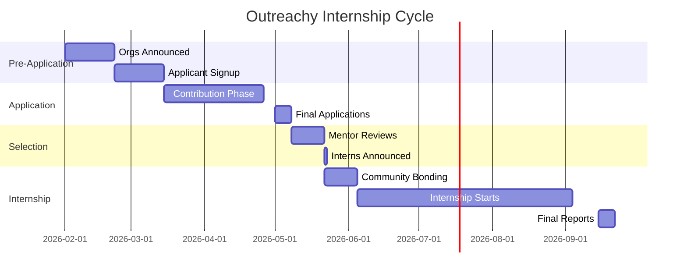
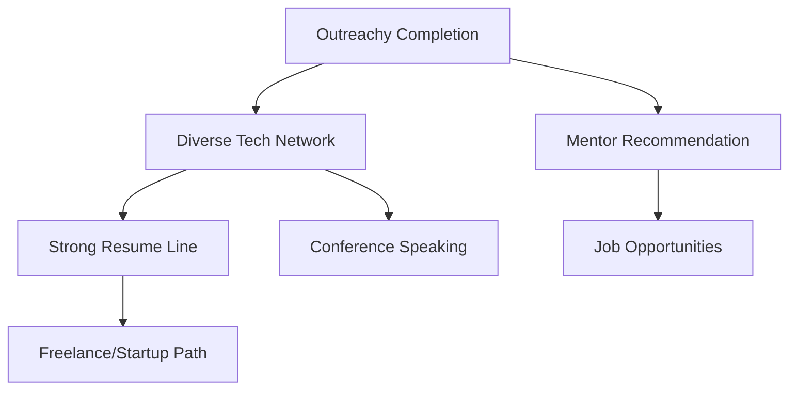

import { Callout, Cards, Card, Steps, Tabs } from 'nextra/components'

# Outreachy

Paid internships specifically for underrepresented groups in tech.

## Program Overview

<Cards>
<Card title="Focus" href="#">
Increasing diversity in open source through paid internships
</Card>

<Card title="Stipend" href="#">
$7,000 for 3-month internship (or equivalent in local currency)
</Card>

<Card title="Duration" href="#">
13 weeks with 2 weeks community bonding
</Card>

<Card title="Eligibility" href="#">
Underrepresented groups globally (women, non-binary, people of color, LGBTQ+, etc.)
</Card>
</Cards>

## Why Outreachy?

### Focused Support System

Outreachy goes beyond code:


- [ ] **Dedicated mentor** for 1-on-1 guidance
- [ ] **Community coordinators** supporting the program
- [ ] **Group chats** with other interns for peer support
- [ ] **Weekly chats** discussing non-technical issues
- [ ] **Career support** and networking opportunities


### Rigorous Selection

```
┌─────────────────────────────────────────┐
│      OUTREACHY SELECTION PROCESS        │
├─────────────────────────────────────────┤
│                                         │
│  Eligibility Check     ████████        │
│  Initial Screening     ██████          │
│  Contribution Period   ████████████    │
│  Final Selection       ██████          │
│                                         │
│  Acceptance Rate: 5-10%                 │
│  Very Competitive                       │
│                                         │
└─────────────────────────────────────────┘
```

## Selection Criteria

| Criteria | Weight | What Matters |
|----------|--------|-------------|
| **Alignment with Mission** | 30% | Do you fit Outreachy's diversity goals? |
| **Prior Contributions** | 25% | 2+ merged PRs in org |
| **Proposal Quality** | 25% | Clear, realistic plan |
| **Communication** | 20% | Active in community, responsive |

## Timeline (Typical)



## Proposal Template

Focus on impact and learning:

```markdown
## My Background

### About Me
- Your background and why Outreachy matters to you
- Experience in tech (or lack thereof - that's okay!)
- What you're hoping to learn

### Experience
- Prior open source contributions
- Relevant projects or coursework
- Learning style and how you prefer support

## Understanding the Project

### Problem Statement
[What will you be working on?]

### Why This Project?
[Why does it align with your goals?]

## Implementation Plan

### Weeks 1-2: Foundation
- Setup and learning
- Understanding existing code

### Weeks 3-6: Core Work
- Main implementation
- Testing and documentation

### Weeks 7-10: Polish
- Refinements based on feedback
- Performance and security improvements

### Weeks 11-13: Finalization
- Final documentation
- Deployment and handoff
```

## Strengths of Outreachy

### Support Beyond Money

Unlike other programs, Outreachy provides:

```
Code Quality        ████████  Pair programming, code reviews
Mentorship         ███████████  Dedicated mentor, regular check-ins
Community          ████████████  Active peer group and coordinators
Career Support     ██████████  CV review, interview prep
Diversity Focus    ████████████  Specifically for underrepresented people
```

### Network

Connection with:
- 1000+ alumni in tech industry
- Mentors at major companies
- Other interns in cohort
- Organizations in open source

## During the Internship

### Weekly Schedule


- [ ] **40-50 hours** of focused project work
- [ ] **1-2 hours** mentor sync (async-friendly)
- [ ] **Chat time** with cohort and coordinators
- [ ] **Blogging** about progress and learnings
- [ ] **Community participation** in org meetings


### Evaluation Metrics

| Checkpoint | Success Criteria |
|-----------|------------------|
| **Midterm (Week 6)** | 50% deliverables done, good communication |
| **Final (Week 13)** | 90%+ deliverables done, documented |

## After Outreachy

### Career Benefits



### Alumni Success Stories

- Many interns hired by tech companies
- Others became maintainers or started projects
- Strong network in open source community
- Career acceleration documented repeatedly

## Application Tips

### Stand Out

- Show genuine interest in open source
- Explain how Outreachy's support structure helps you
- Be honest about your background and challenges
- Show growth mindset and eagerness to learn

### Avoid Common Mistakes

- Don't minimize your contributions or abilities
- Don't apply just for money
- Don't generic proposals without customization
- Don't disappear during contribution period

## Resources

<Cards>
<Card title="Official Outreachy Website" href="https://www.outreachy.org">
Apply, browse projects, learn more
</Card>

<Card title="Proposal Writing" href="/proposals">
Create compelling internship proposals
</Card>

<Card title="Communication Tips" href="/communication">
How to engage effectively during selection
</Card>
</Cards>

---

> **Outreachy Reality**: Most rigorous selection process. Highly competitive. But extraordinary support system. If you're from an underrepresented group in tech, Outreachy is built for you.
